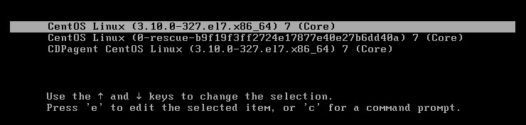

# Lab: Debug Boot Failure

## Single User Mode (Emergency Mode)
1. Press ```e``` key to edit the boot option when GRUB boot menu appear.
   - RH6: Add ```single``` in the end of kernel line.
   - RH7 (method 1): Add ``rd.break`` in the end of kernel line.
   - RH7 (method 2): Replace ```ro``` with ```rw init=/sysroot/bin/sh``` in the kernel line.
2. Re-mount root filesystem if it is in read-only mode:
   ```
   $ mount -o remount,rw /
   ``` 
3. In RH7, you have to ``touch /.autorelabel`` before you leave root filesystem in the single user mode.    

## Setup Serial Console
1. configure serial port


2. Edit the  ``kernel`` parameters of the ```/boot/grub/grub.conf```:
   - remove ``rhgb`` and ``quiet``
   - add ```console=tty0 console=ttyS0,38400```

```bash
#/boot/grub/grub.conf
default=0
timeout=5
splashimage=(hd0,0)/grub/splash.xpm.gz
hiddenmenu
title CentOS 6 (2.6.32-754.el6.x86_64)
	root (hd0,0)
	kernel /vmlinuz-2.6.32-754.el6.x86_64 ro root=/dev/mapper/vg_rh6-lv_root rd_NO_LUKS LANG=en_US.UTF-8 rd_LVM_LV=vg_rh6/lv_swap rd_NO_MD SYSFONT=latarcyrheb-sun16 crashkernel=auto rd_LVM_LV=vg_rh6/lv_root  KEYBOARDTYPE=pc KEYTABLE=us rd_NO_DM rhgb quiet console=tty0 console=ttyS0,38400
	initrd /initramfs-2.6.32-754.el6.x86_64.img
```
3. check [serial.txt](./serialRH6.txt)


## Setup Serial Console For RHEL 7

1. Add ```console=tty0 console=ttyS0,38400 rd.debug``` to the end of ```GRUB_CMDLINE_LINUX``` in ```/etc/default/grub```
2. For UEFI, run ```grub2-mkconfig -o /boot/efi/EFI/redhat/grub.cfg``` to rebuild ```grub2.conf```
3. For non-UEFI, run ```grub2-mkconfig -o /boot/grub2/grub.cfg``` to rebuild ```grub2.conf```

```bash
#/etc/default/grub
GRUB_TIMEOUT=5
GRUB_DISTRIBUTOR="$(sed 's, release .*$,,g' /etc/system-release)"
GRUB_DEFAULT=saved
GRUB_DISABLE_SUBMENU=true
GRUB_TERMINAL_OUTPUT="console"
GRUB_CMDLINE_LINUX="crashkernel=auto rd.lvm.lv=centos/root rd.lvm.lv=centos/swap rhgb quiet console=tty0 console=ttyS0,38400 rd.debug"
GRUB_DISABLE_RECOVERY="true"
```

- Boot messages in serial in RH7: [serial.txt](./serialRH7.txt)


## Boot Loader Issues

1. BIOS runs boot loader stage 1 in MBR
2. MBR loads stage 1.5
3. Stage 1.5 finds the boot partition, then loads the stage 2 in ```/boot```
4. Stage 2 loads the ```grub.conf```, then user can see the boot menu

## [14 Error messages reported by GRUB](https://www.gnu.org/software/grub/manual/legacy/Troubleshooting.html)


## Manual Booting with GRUB
1. Press ``c`` to drop to GRUB subsystem in the GRUB boot screen. You will see the ``grub>`` prompt.
2. Find the ``/boot`` partition, command: ``root`` or ``root (hd0,0)`` for the case that ``/boot`` is in the ``/dev/sda1``.
3. Specify the ``kernel`` parameters about the ``vmlinuz`` file and the root filesystem device.
4. Specify the ``initrd`` parameters about the ``initramfs`` file.
5. Run ``boot`` to reboot.

Exapmle:
- The ``/boot`` is the ``/dev/sda1``; the root device is the ``/dev/sda5``.
  ```
  $ cat /etc/fstab 
  /dev/sda5	 /  	ext4	defaults	1	1
  /dev/sda1	 /boot	ext4	defaults	1	2
  /dev/sda2	 /var	ext4	defaults	1	2
  /dev/sda3  swap   swap    defaults    0   0
  ```
- The ``grub.conf``:
  ```
  $ cat /boot/grub/grub.conf
  default=0
  title CentOS (2.6.32-71.el6.x86_64)
          root (hd0,0)
          kernel /vmlinuz-2.6.32-71.el6.x86_64 ro root=/dev/sda5
          initrd /initramfs-2.6.32-71.el6.x86_64.img     
  ``` 
- Manual boot in GRUB:
  
    

Common error:
- No root parameter causes kernel panic
 
 

- Wrong root parameter failure
 
   

- Correct root parameter (root path)


## Checking Boot Loaders
### 1. Stage 1 in MBR
```bash
$ dd if=/dev/sda of=mbr.bin bs=512 count=1
$ hexdump -C mbr.bin
```
### 2. Stage 1 in /boot/grub
```bash
$ hexdump -C /boot/grub/stage1
```

### 3. Stage 1.5 in /boot/grub
```bash
$ hexdump -C /boot/grub/e2fs_stage1_5 -n 95 -s 512
```

### 4. Stage 2 in /boot/grub
```bash
$ hexdump -C /boot/grub/stage2 -n 95 -s 512
```


## Find out the root device name
- Print block device attributes: ``blkid``
  ```
  $ blkid
  /dev/sda1: UUID="5c91a597-ebb5-4372-a6fb-10893d6a4baa" TYPE="xfs" 
  /dev/sda2: UUID="5f59355e-bf62-4b8a-80f7-9c46454bb764" TYPE="xfs" 
  /dev/sda3: UUID="20f0425b-2ae7-400a-938e-861d61bc60c6" TYPE="swap"
  ``` 
- Print filesystem information: ``/etc/fstab``
  ```
  $ cat /etc/fstab
  UUID=5f59355e-bf62-4b8a-80f7-9c46454bb764     /        xfs     defaults        0 0
  UUID=5c91a597-ebb5-4372-a6fb-10893d6a4baa     /boot    xfs     defaults        0 0
  UUID=20f0425b-2ae7-400a-938e-861d61bc60c6     swap     swap    defaults        0 0 
  ```
  In this case, the ``/dev/sda1`` is the ``/boot``, the ``/dev/sda2`` is the root ``/``.

- Report filesystem usage: ``df``
  ```
  $ df
  Filesystem     1K-blocks    Used Available Use% Mounted on
  /dev/sda2       16242688 5288892  10953796  33% /
  /dev/sda1         508580  171428    337152  34% /boot
  ```     

## Reinstall GRUB
```grub-install``` copies GRUB images into the ```/boot``` directory, and uses the grub shell to install ```./grub``` into the ```/boot```.
sector.

```bash
$ grub-install /dev/sda

Installation finished. No error reported.
This is the contents of the device map /boot/grub/device.map.
Check if this is correct or not. If any of the lines is incorrect,
fix it and re-run the script `grub-install`.

# this device map was generated by anaconda
(hd0)     /dev/sda
```

## Use GRUB Shell to Reinstall GRUB 
```bash
# Starts GRUB shell
$ grub

# Get root device for GRUB
grub> root (hd0,0)

root (hd0,0)
 Filesystem type is ext2fs, partition type 0x83

# Find the stage1 to verify the root path
grub> find /grub/stage1 	

find /grub/stage1
 (hd0,0)

# Install (stage 1) boot-loader into MBR, followed by stage 1.5 (e2fs_stage1_5).
grub> setup (hd0)

setup (hd0)
 Checking if "/boot/grub/stage1" exists... no
 Checking if "/grub/stage1" exists... yes
 Checking if "/grub/stage2" exists... yes
 Checking if "/grub/e2fs_stage1_5" exists... yes
 Running "embed /grub/e2fs_stage1_5 (hd0)"...  27 sectors are embedded.
succeeded
 Running "install /grub/stage1 (hd0) (hd0)1+27 p (hd0,0)/grub/stage2 /grub/grub.conf"... succeeded
Done.
```


## GRUB 2 Command Example: ls
- Lists the attached storage devices along with its partitions.
- Lists any particular partition's filesystem.
- List the conations of the partition and directories.


## Manual Booting with GRUB 2 on BIOS
### The root device and the grub2.cfg

```
$ blkid
/dev/sda1: UUID="d34983cf-cc74-445b-9444-0ef17a891e4d" TYPE="xfs" 
/dev/sda2: UUID="f6ceba51-e039-4a12-88b3-49528b3fc9d9" TYPE="swap" 
/dev/sda3: UUID="29a1e3d5-42ae-419c-b5ac-295ca4854081" TYPE="xfs" 
/dev/sda5: UUID="1061852b-a3a9-45b0-b298-ebf8ba0bddf1" TYPE="xfs"
```
```
$ cat /etc/fstab
/dev/sda5	                                /	    xfs	    defaults	0	0
/dev/sda3	                                /app	xfs	    defaults	0	0
/dev/sda1	                                /boot	xfs 	defaults	0	0
UUID=f6ceba51-e039-4a12-88b3-49528b3fc9d9   swap    swap    defaults    0   0
```
```
$ cat /boot/grub2/grub.cfg
menuentry 'CentOS Linux (3.10.0-327.el7.x86_64) 7 (Core)' ... {
	load_video
	set gfxpayload=keep
	insmod gzio
	insmod part_msdos
	insmod xfs
	set root='hd0,msdos1'
    ...
    linux16 /vmlinuz-3.10.0-327.el7.x86_64 root=UUID=1061852b-a3a9-45b0-b298-ebf8ba0bddf1 rootfstype=xfs ro ... 
	initrd16 /initramfs-3.10.0-327.el7.x86_64.img
}    
```    
### Booting procedures in GRUB 2 on BIOS
1. Choose the kernel from the GRUB 2 boot menu. And press ``c`` to the ``grub>`` prompt.
   
2. Set the ``/boot`` partition, the for kernel (``vmlinuz``) and the initrd (``initramfs``) files in the ``grub>`` prompt.
   1. ``set root=(hd0,msdos1)``
      - The ``/boot`` partition is the ``/dev/sda1``.
      - The ``hd0`` is the ``/dev/sda``; the ``msdos1`` is the first partition (``/dev/sda1``).
   2. ``linux16 /vmlinuz-3.10.0-327.el7.x86_64 ro root=/dev/sda5``
      - The ``root`` device is the ``/dev/sda5``. 
   3. ``initrd16 /initramfs-3.10.0-327.el7.x86_64.img``
      - The kernel version (``3.10.0-327.el7.x86_64``) of ``vmlinuz`` and ``initramfs`` files are the same.
    
 


## Manual Booting with GRUB 2 on UEFI
### The root device and the grub2.cfg
```
$ blkid
/dev/sr0: UUID="2015-12-09-23-14-10-00" LABEL="CentOS 7 x86_64" TYPE="iso9660" PTTYPE="dos" 
/dev/sda1: SEC_TYPE="msdos" UUID="1E1A-A31A" TYPE="vfat" PARTLABEL="EFI System Partition" PARTUUID="babe9ef5-b6df-4cc1-a29b-5f1fd77d6f0b" 
/dev/sda2: UUID="cbaf6878-247f-47aa-a2a4-af36eb55b143" TYPE="xfs" PARTUUID="5d19f200-4db2-49b2-99fa-84930b703ebe" 
/dev/sda3: UUID="f1zuKP-mFGO-2WU2-tUUL-ja30-Onka-uLAwt6" TYPE="LVM2_member" PARTUUID="2bad62a6-735a-4d31-a4a4-f192427580a9" 
/dev/mapper/centos-swap: UUID="43d56629-ce67-4ff5-ae3f-36287ea228c4" TYPE="swap" 
/dev/dm-0: UUID="d2ab2e8b-67b1-44a5-8081-08c0ce139264" TYPE="xfs"
```
```
$ cat /etc/fstab
/dev/mapper/centos-root                     /           xfs     defaults        0 0
UUID=cbaf6878-247f-47aa-a2a4-af36eb55b143   /boot       xfs     defaults        0 0
UUID=1E1A-A31A                              /boot/efi   vfat    umask=0077,shortname=winnt 0 0
/dev/mapper/centos-swap                     swap        swap    defaults        0 0
```
```
$ df
Filesystem                 1K-blocks    Used Available Use% Mounted on
/dev/mapper/centos-root     14325760 4880320   9445440  35% /
/dev/sda2                     508588  182232    326356  36% /boot
/dev/sda1                     204580    9640    194940   5% /boot/efi
```
```
$ cat /boot/efi/EFI/centos/grub.cfg
menuentry 'CentOS Linux (3.10.0-327.el7.x86_64) 7 (Core)' ... {
	load_video
	set gfxpayload=keep
	insmod gzio
	insmod part_gpt
	insmod xfs
	set root='hd0,gpt2'
    ...
	linuxefi /vmlinuz-3.10.0-327.el7.x86_64 root=/dev/mapper/centos-root ro rd.lvm.lv=... 
	initrdefi /initramfs-3.10.0-327.el7.x86_64.img
}    
```

### Booting procedures in GRUB 2 on UEFI
1. Choose the kernel from the GRUB 2 boot menu. And press ``c`` to the ``grub>`` prompt.
2. Set the ``/boot`` partition, the for kernel (``vmlinuz``) and the initrd (``initramfs``) files in the ``grub>`` prompt.
   1. ``set root=(hd0,gpt2)``
      - The ``/boot`` partition is the ``/dev/sda2``.
      - The ``hd0`` is the ``/dev/sda``; the ``gpt2`` is the second partition (``/dev/sda2``).
   2. ``linuxefi /vmlinuz-3.10.0-327.el7.x86_64 ro root=/dev/mapper/centos-root``
      - The LVM ``root`` device is the ``/dev/mapper/centos-root``. 
   3. ``initrdefi /initramfs-3.10.0-327.el7.x86_64.img``
      - The kernel version (``3.10.0-327.el7.x86_64``) of ``vmlinuz`` and ``initramfs`` files are the same.
    


## Reinstall GRUB 2 in BIOS-based machine
1. ``grub2-install /dev/sda``
   - restore the missing files in the ``/boot/grub2``.  
2. ``grub2-mkconfig -o /boot/grub2/grub.cfg``
   - reconfigure the ``grub.cfg``. 

```bash
# The original files in the /boot/grub2
$ ls /boot/grub2
device.map  fonts  grub.cfg  grubenv  i386-pc  locale  themes

# Delete the /boot/grub2 to corrupt it
$ rm -rf /boot/grub2

# Use grub2-install to recover lost files in the /boot/grub2
$ grub2-install /dev/sda
Installing for i386-pc platform.
Installation finished. No error reported.

# The /boot/grub2 is recovered, but the grub.cfg not.
$ ls /boot/grub2/
fonts  grubenv  i386-pc  locale

# Use grub2-mkconfig to rebuild the grub.cfg
$ grub2-mkconfig -o /boot/grub2/grub.cfg
Generating grub configuration file ...
Found linux image: /boot/vmlinuz-3.10.0-327.el7.x86_64
Found initrd image: /boot/initramfs-3.10.0-327.el7.x86_64.img
Found linux image: /boot/vmlinuz-0-rescue-b9f19f3ff2724e17877e40e27b6dd40a
Found initrd image: /boot/initramfs-0-rescue-b9f19f3ff2724e17877e40e27b6dd40a.img
done
```

## Reinstall GRUB 2 in UEFI-base machine


