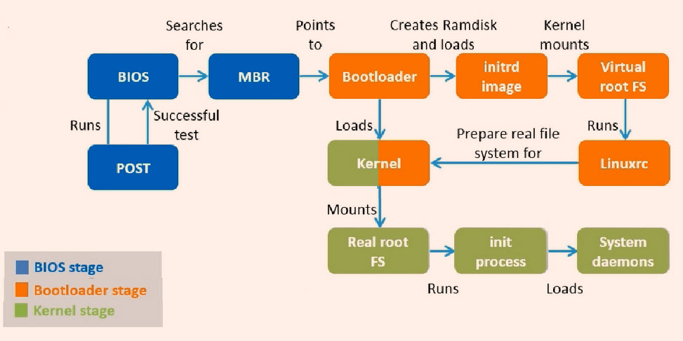

# Boot Sequences
Why do you need to know server's booting process?



1. Power On
2. BIOS (Basic Input Output System)
   1. CPU detect the BIOS at 0xFFFF0
   2. BIOS running its code (in the fresh memory)
   3. BIOS read configuration data from CMOS
   4. BIOS write date to RAM
      - ```dmidecode```
3. POST (Power On Self Test)
4. MBR (Master Boot Record)
5. Boot-loader
   - GRUB / GRUB 2
   - vmlinuz kernel
   - initrd / initramfs
     - ```lsinitrd```
6. Load kernel
7. init / systemd
8. Runlevel programs
   - ```runlevel```


## MBR (Master Boot Record)
* It is located in the first sector of the bootable disk. Typically /dev/hda, or /dev/sda
* MBR is less than 512 bytes in size. This has three components: 
  1. primary boot loader info in first 446 bytes 
  2. partition table info in next 64 bytes MBR validation check in last 2 bytes.
* It contains information about GRUB.
* MBR loads and executes the GRUB boot loader.


## GRUB (GNU Grand Unified Bootloader)
* GRUB displays a splash screen (``splash.xpm.gz``) for you:
  - to choose the kernel image to be executed,
  - to specific an instance kernel boot parameter.
  - to run GRUB commands.
* GRUB has the knowledge of the filesystem.
* Grub configuration file is ```/boot/grub[2]/grub.conf``` (```/etc/grub[2].conf``` is a link to this).
* GRUB loads and executes Kernel and initrd images.


## vmlinuz
* vmlinuz is a compressed and executable Linux kernel.
* A kernel is a program that constitutes the central core of a computer operating system. It is the first thing that is loaded into memory when a computer is booted up, and it remains in memory for the entire time that the computer is in operation.
* At the head of this kernel image (vmlinuz) is a routine that does some minimal amount of hardware setup and then decompresses the kernel contained within the kernel image and places it into high memory. If an initial RAM disk image (initrd) is present, this routine moves it into memory (or we can say extract the compressed ramdisk image in to the real memory) and notes it for later use. The routine then calls the kernel and the kernel boot begins.


## initrd (initial RAM disk)
* The initial RAM disk (initrd) is an initial root file system that is mounted prior to when the real rootfile system is available. The initrd is bound to the kernel and loaded as part of the kernel boot procedure. The kernel then mounts this initrd as part of the two-stage boot process to load the modules to make the real file systems available and get at the real root file system.
* The initrd contains a minimal set of directories and executables to achieve this, such as the insmod tool to install kernel modules into the kernel.
* The initrd image contains the necessary executables and system files to support the second-stage (```/boot/stage2```) boot of a Linux system.
* Decompress command: ```zcat initramfs-2.6.32-754.el6.x86_64.img | cpio -id```


## initramfs
* Decompress command: ```/usr/lib/dracut/skipcpio initramfs-3.10.0-957.el7.x86_64.img | gunzip -c | cpio -id```

## The /boot folder
- The ```vmlinuz``` file contain the actual Linux kernel, which is loaded and executed by grub. 
- The ```System.map``` file contains a list of kernel symbols and the addresses these symbols are located at. 
- The ```initrd.img``` / ```initramfs.img``` file is the initial ramdisk used to preload modules, and contains the drivers and supporting infrastructure (keyboard mappings, etc.) needed to manage your keyboard, serial devices and block storage early on in the boot process. 
- The ```config``` file contains a list of kernel configuration options, which is useful for understanding which features were compiled into the kernel, and which features were built as modules.


