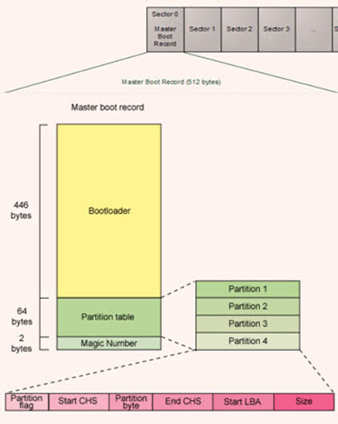
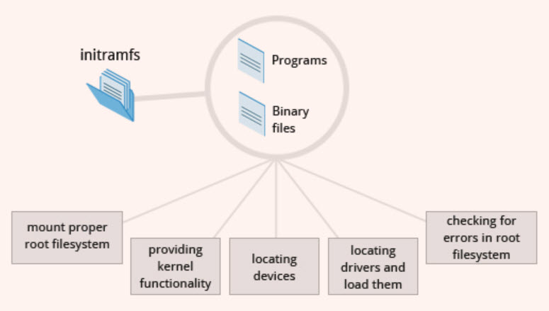
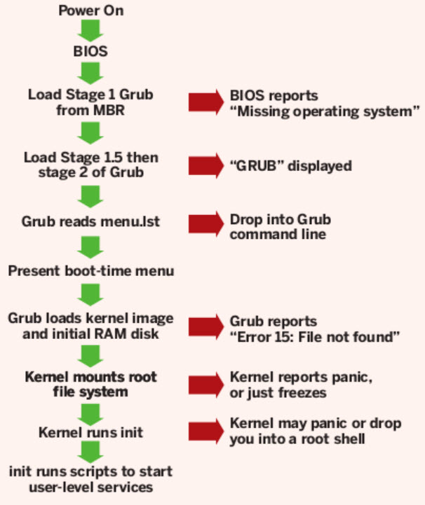

# Boot Sequences
Why do you need to know server's booting process?


1. Power On
2. BIOS (Basic Input Output System)
   1. CPU detect the BIOS at 0xFFFF0
   2. BIOS running its code (in the fresh memory)
   3. BIOS read configuration data from CMOS
   4. BIOS write date to RAM
      - ```dmidecode```
3. POST (Power On Self Test)
4. MBR (Master Boot Record)
   - First stage boot loader
5. Boot-loader
   - Second stage
   - GRUB / GRUB 2
   - vmlinuz kernel
   - initrd / initramfs
     - ```lsinitrd```
6. Load kernel
7. init / systemd
8. Runlevel programs
   - ```runlevel```


## BIOS (Basic Input Output System)
* Performs some system integrity checks.
* Searches, loads, and executes the boot loader program in MBR.


## MBR (Master Boot Record)
* It is located in the first sector of the bootable disk. Typically /dev/hda, or /dev/sda
* MBR is less than 512 bytes in size. This has three components: 
  1. primary boot loader (boot sector) in first 446 bytes 
  2. partition table info in next 64 bytes 
  3. MBR validation check (magic number) in last 2 bytes.
* It contains information about GRUB
* MBR loads and executes the GRUB boot loader.




## GRUB (GNU Grand Unified Bootloader)
* Boot loader loads the selected kernel image and passes control to it.
* GRUB displays a splash screen (``splash.xpm.gz``) for you:
  - to choose the kernel image to be executed,
  - to specific an instance kernel boot parameter.
  - to run GRUB commands.
* GRUB has the knowledge of the filesystem.
* Grub configuration file is ```/boot/grub[2]/grub.conf``` (```/etc/grub[2].conf``` is a link to this).
* GRUB loads and executes kernel and initrd images into memory.


## vmlinuz
* vmlinuz is a compressed and executable Linux kernel.
* A kernel is a program that constitutes the central core of a computer operating system. It is the first thing that is loaded into memory when a computer is booted up.
* At the head of this kernel image (vmlinuz) is a routine that does some minimal amount of hardware setup and then decompresses the kernel contained within the kernel image and places it into high memory. 
* If an initial RAM disk image (initrd) is present, this routine moves it into memory (or we can say extract the compressed ramdisk image in to the real memory) and notes it for later use. 
* The routine then calls the kernel and the kernel boot begins.
* Kernel mounts the root file system as specified in the ```root=``` in ```grub.conf```.
* Kernel runs ```/sbin/init```.


## initrd (initial RAM disk)
* The initial RAM disk (initrd) is an initial root file system that is mounted prior to when the real root file system is available. 
* The initrd is bound to the kernel and loaded as part of the kernel boot procedure. 
* The kernel then mounts this initrd as part of the two-stage boot process to load the modules to make the real file systems available and get at the real root file system.
* The initrd contains a minimal set of directories and executables to achieve this, such as the insmod tool to install kernel modules into the kernel.
* The initrd image contains the necessary executables and system files to support the second-stage (```/boot/stage2```) boot of a Linux system.
* Decompress command: ```zcat initramfs-2.6.32-754.el6.x86_64.img | cpio -id```




## initramfs
* Decompress command: ```/usr/lib/dracut/skipcpio initramfs-3.10.0-957.el7.x86_64.img | gunzip -c | cpio -id```


## The /boot folder
- The ```vmlinuz``` file contain the actual Linux kernel, which is loaded and executed by grub. 
- The ```System.map``` file contains a list of kernel symbols and the addresses these symbols are located at. It used for debugging. 
- The ```initrd.img``` / ```initramfs.img``` file is the initial ramdisk used to preload modules, and contains the drivers and supporting infrastructure (keyboard mappings, etc.) needed to manage your keyboard, serial devices and block storage early on in the boot process. 
- The ```config``` file contains a list of kernel configuration options, which is useful for understanding which features were compiled into the kernel, and which features were built as modules.


## Init
* Looks at the /etc/inittab file to decide the Linux run level.
* Following are the available run levels
  * 0 – halt
  * 1 – Single user mode
  * 2 – Multiuser, without NFS
  * 3 – Full multiuser mode
  * 4 – unused
  * 5 – X11
  * 6 – reboot


## Systemd


## Runlevel Programs
* Depending on your default init level setting, the system will execute the programs from one of the following directories:
  * Run level 0 – /etc/rc.d/rc0.d/
  * Run level 1 – /etc/rc.d/rc1.d/
  * Run level 2 – /etc/rc.d/rc2.d/
  * Run level 3 – /etc/rc.d/rc3.d/
  * Run level 4 – /etc/rc.d/rc4.d/
  * Run level 5 – /etc/rc.d/rc5.d/
  * Run level 6 – /etc/rc.d/rc6.d/
* Under the /etc/rc.d/rc*.d/ directories, you would see programs that start with S and K.
  * Programs starts with S are used during startup. S for startup.
  * Programs starts with K are used during shutdown. K for kill.
  * Those are the sequence number in which the programs should be started or killed.


## Login
* When you first login to Linux, ```/etc/profile``` is read and evaluated, after which the following files are searched (if they exist) in the listed order:
  1. ~/.bash_profile
  2. ~/.bash_login
  3. ~/.profile 
* The ```.bash_profile``` will collect the required customization parameters from ```.bashrc```.


# Linux boot sequence and failure symptom
