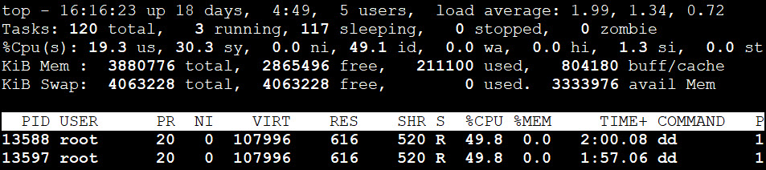

# Control Group - Cgroup - Resource Management

**cgroups** (control groups) is a Linux kernel feature which allow processes to be organized into hierarchical groups whose usage of various types of resources (CPU, memory, disk I/O, network,...) can then be limited and monitored. 


**cgroups** provides:
- **Resource limiting** - groups can be set to not exceed a configured memory limit, which also includes the file system cache.
- **Prioritization** - some groups may get a larger share of CPU utilization or disk I/O throughput.
- **Accounting** - measures a group's resource usage, which may be used, for example, for billing purposes.
- **Control** - freezing groups of processes, their checkpointing and restarting.

Available subsystem (resource controller):
```bash
$ more /proc/cgroups 
#subsys_name	hierarchy	  num_cgroups    enabled
cpuset	                2	            1	       1
cpu	                    3	            1	       1
cpuacct	                3	            1	       1
memory	                9	            1	       1
devices	                7	           24	       1
freezer	               10	            1	       1
net_cls	                5	            1	       1
blkio	                4	            1	       1
perf_event	            8	            1	       1
hugetlb	                6	            1	       1
pids	               11	            1	       1
net_prio	            5	            1	       1
```

- **cpuset** - assigns individual CPUs and memory nodes to tasks in a cgroup.
- **cpu** - uses the CPU scheduler to provide cgroup tasks access to the CPU.
- **cpuset** - creates automatic reports on CPU resources used by tasks in a cgroup.
- **memory** - sets limits on memory use by tasks in a cgroup.
- **devices** - allows or denies access to devices for tasks in a cgroup.
- **freezer** - suspends or resumes tasks in a cgroup.
- **net_cls** - tags network packets that allows traffic control.
- **blkio** - sets limits on input/output access to and from block devices.
- **perf_event** - enables monitoring cgroups with the perf tool.
- **hugetlb** - allows to use virtual memory pages of large sizes and to enforce resource limits on these pages.
- **pids** - limits the total process for a cgroup.
- **net_prio** - sets network interface priority.

**systemd** manage **cgroups**. **systemd** automatically creates a hierarchy of ***slice***, ***scope*** and ***service*** units to provide a unified structure for the cgroup tree. Use ```systemd-cgls```  and ```ps xawf -eo pid,user,command,cgroup```command to check **cgroups** tree.

### Show control group
```bash
$ systemd-cgls
$ systemd-cgtop
```


- **user.slice** — the default place for all user sessions.
- **system.slice** - the default place for all system services.

And ```systemd-cgtop``` command shows **cgroups** resource usage.

## Example of CPU resource allocation
1. Create systemd unit file for CPU stress tests.
```bash
# cat /etc/systemd/system/stress1.service
[Unit]
Description=Put some stress

[Service]
Type=Simple
CPUAffinity=1   # assign core 1 to service
ExecStart=/usr/bin/dd if=/dev/zero of=/dev/null
####
# cat /etc/systemd/system/stress2.service
[Unit]
Description=Put some stress

[Service]
Type=Simple
CPUAffinity=1   # assign core 1 to service
ExecStart=/usr/bin/dd if=/dev/zero of=/dev/null
```

2. Start these services (**system slice**) and check CPU usage.
```bash
$ systemctl daemon-reload
$ systemctl start stress1
$ systemctl start stress1
```
### Two processes get CPU 1 resource equally


3. Limits CPU usages (**CPUShares**) for the stress services by editing the unit files.
```bash
# cat /etc/systemd/system/stress1.service
[Unit]
Description=Put some stress

[Service]
CPUShares=512
Type=Simple
CPUAffinity=1
ExecStart=/usr/bin/dd if=/dev/zero of=/dev/null
####
# cat /etc/systemd/system/stress2.service
[Unit]
Description=Put some stress

[Service]
CPUShares=1024
Type=Simple
CPUAffinity=1
ExecStart=/usr/bin/dd if=/dev/zero of=/dev/null
# allow stress2 double to stress1 of the resource allocation  
```

4. Reload systemd and stress services
```bash
$ systemctl daemon-reload
$ systemctl restart stress1
$ systemctl restart stress2
```
### stress2 gets double the CPU 1 allocated to stress1 service

