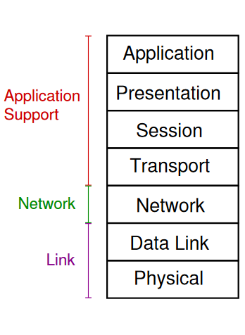

Please refer to textbook [chapter 2](https://github.com/cnchenpu/data-comm/blob/master/ppt/Ch2-Forouzan.ppt).

# Data Communications Across a Link
- Converting data (e.g. bits) into signals to be sent across the link (Physical layer)
- Ensuring link is ready for data transmission, reliable/efficient transmission of data (Data link layer)  

# Data Communications Across a Network
- Data traverses multiple links; each link may have its own Physical and Data Link layer protocols
- How do intermediate systems receive/send data?  
  - How to select which intermediate systems to send via? (Network layer)
- What happens if failures within intermediate systems?
- How to create applications without knowing the details of underlying network and technologies?  

# Layers
- Divide-and-Conquer: separate big and complex data communication tasks into smaller and simpler layers
- Independent: change/upgrade protocols without modifying the whole system
- Open: select implementations from different vendors
- Optimize each sub-layer, but more layer increase overheads
- Layers to support:
  - Communications accross a link
  - Communications accross a network
  - Applications to operate efficiently on end devices  

# OSI 7-layer Protocol Architecture
- Application Support
  - Application
    - Application specific functionality
  - Presentation
    - Converts data between different formats, encryption and decryption
  - Session
    - Maintains session between applications
  - Transport
    - Reliable data transfer between end devices
- Network
  - Network
    - Allow computers to communicate across different networks 
    - Provide routes, optionally performance enhancements
- Link
  - Data-Link
    - Transmit data across link in efficient, reliable way
    - Addressing of devices on links
  - Physical
    - Physical interface between transmission device and medium
    - How to send bits over medium  

# TCP/IP Protocol Architecture

# Encapsulation in TCP/IP

