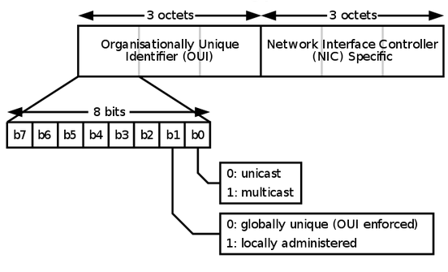
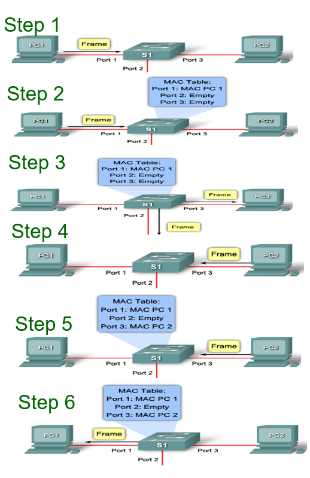
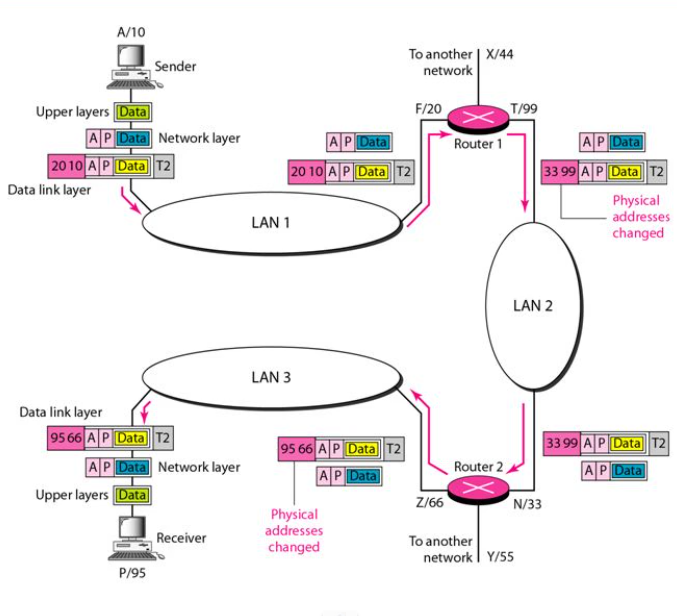

# Data-Link Layer
- node to node communication through links
  - point-to-point
  - broadcase
- controls how the media is used  
  - data link control
  - media access contorl

## Data-Link Layer Services
- Framing
  - encapsulate/decapsulate dtatgram before sending and after receiving it in nodes
- Error Contorl
  - detect the frame error
    - correct it at receiver
    - retransmit it by sender

## Link layer (MAC) Addressing
- Ethernet (48 bits, 6 bytes)  

- Unicase address
  - A3:34:45:11:92:F1
- Multicase address
  - A2:34:45:11:92:F1
- Broadcase address
  - FF:FF:FF:FF:FF:FF

## MAC addressing for interconnection
- Step 1. The switch receives a broadcast frame from PC 1 on Port 1.
- Step 2. The switch enters the source MAC address and the switch port that received the frame into the address table.
- Step 3. Because the destination address is a broadcast, the switch floods the frame to all ports, except the port on which it received the frame.
- Step 4. The destination device replies to the broadcast with a unicast frame addressed to PC 1.
- Step 5. The switch enters the source MAC address of PC 2 and the port number of the switch port that received the frame into the address table. The destination address of the frame and its associated port is found in the MAC address table.
- Step 6. The switch can now forward frames between source and destination devices without flooding.  
  

## MAC address table
- Switches use MAC addresses to direct network communications to the appropriate port toward the destination node.
  - For a switch to know which port to use to transmit a unicast frame, it must first learn which nodes exist on each of its ports.
  - A switch determines how to handle incoming data frames by using its MAC address table. 
  - A switch builds its MAC address table by recording the MAC addresses of the nodes connected to each of its ports. 
  - Once a MAC address for a specific node on a specific port is recorded in the address table, the switch then knows to send traffic destined for that specific node out the port.
  - When an incoming data frame is received by a switch and the destination MAC address is not in the table, the switch forwards the frame out all ports, except for the port on which it was received. 
  - When the destination node responds, the switch records the node's MAC address in the address table from the frame's source address field. 
  - In networks with multiple interconnected switches, the MAC address tables record multiple MAC addresses for the ports connecting the switches which reflect the node's beyond. 
  - Typically, switch ports used to interconnect two switches have multiple MAC addresses recorded in the MAC address table.

# Address Resolution Protocol (ARP)
- Mapping and IP address to a MAC address.
- Step 1: When a source device want to communicate with another device, source device checks its __ARP cache__ to find if it already has a resolved MAC Address of the destination device. If it is there, it will use that MAC Address for communication.
  - __arp -a__
- Step 2: If ARP resolution is not there in local cache, the source machine will generate an __ARP request__ message. The broadcase message has the destination device's IP address (target IP address).
- Step 3: The source broadcast the __ARP request__ message to the local network. 
- Step 4: Every device on the LAN receives the boradcase message and compares the target IP address and own IP address.
- Step 5: Only the device which has the target IP address will reply the request, other device will drop the request.
- Step 6: The destination device will update its __ARP cache__, since it need to contact the sender machine soon.
- Step 7: Destination device send the __ARP reply__ message. 
  - a unitcast, do not need be a broadcast
- Step 8: The source machine has destination's IP address for communication and will update its __ARP cache__ for further using.

> Question:
> Why not broadcase all frames, but use ARP to find the destination's IP first?

# Reverse ARP (RARP)
- Mapping MAC address to IP address.
- For host machine don't know their IP address, RARP enables them to request their IP address from the router/switch's ARP cache.

