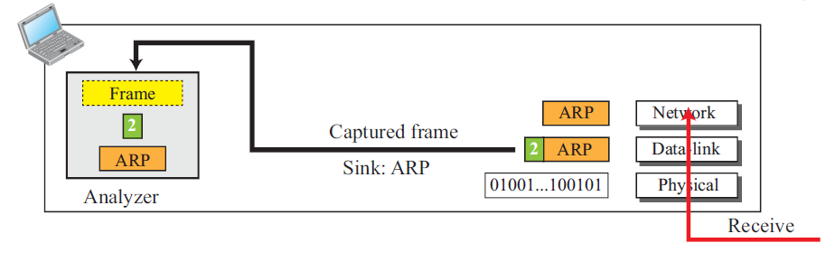
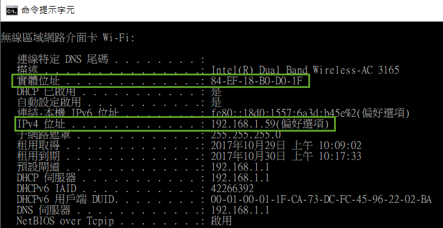
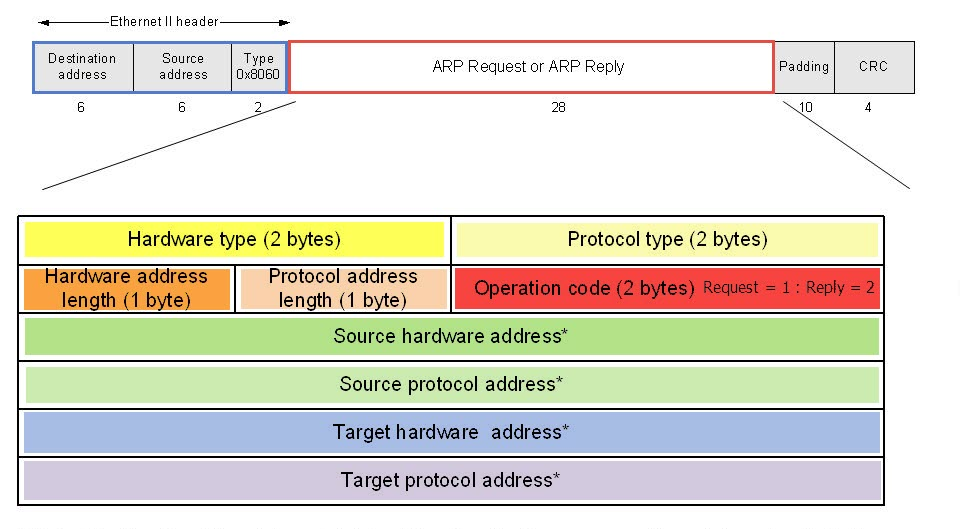
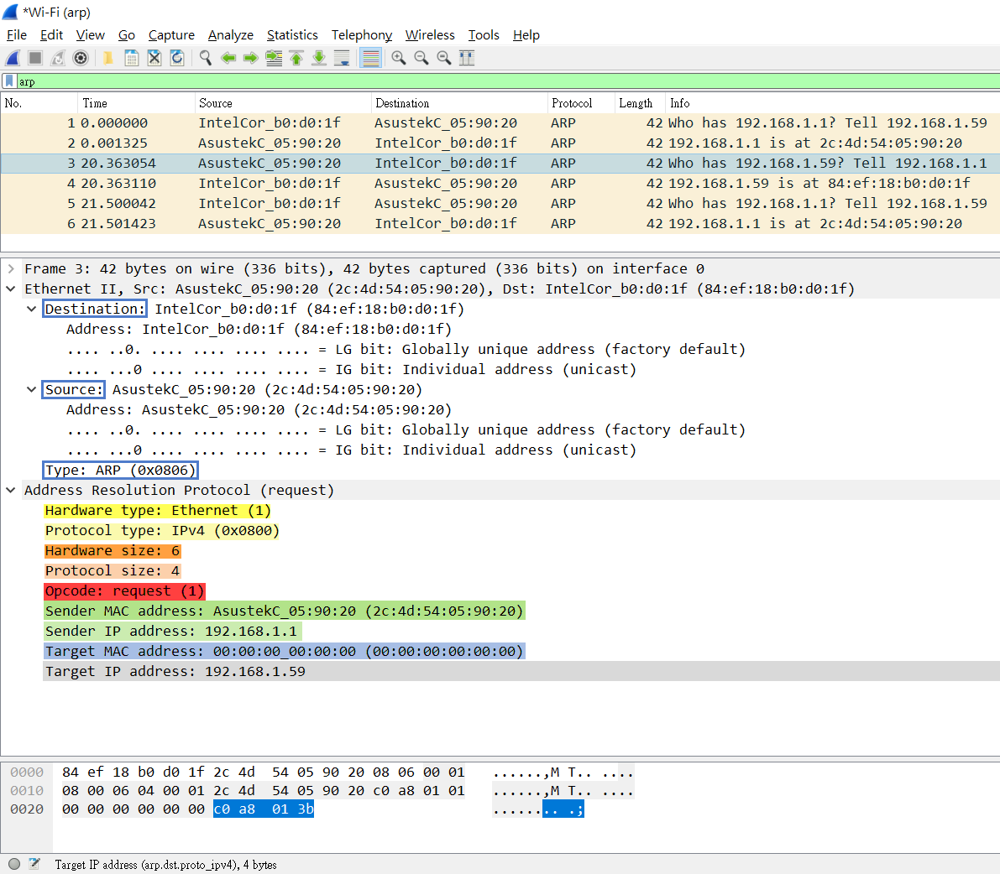
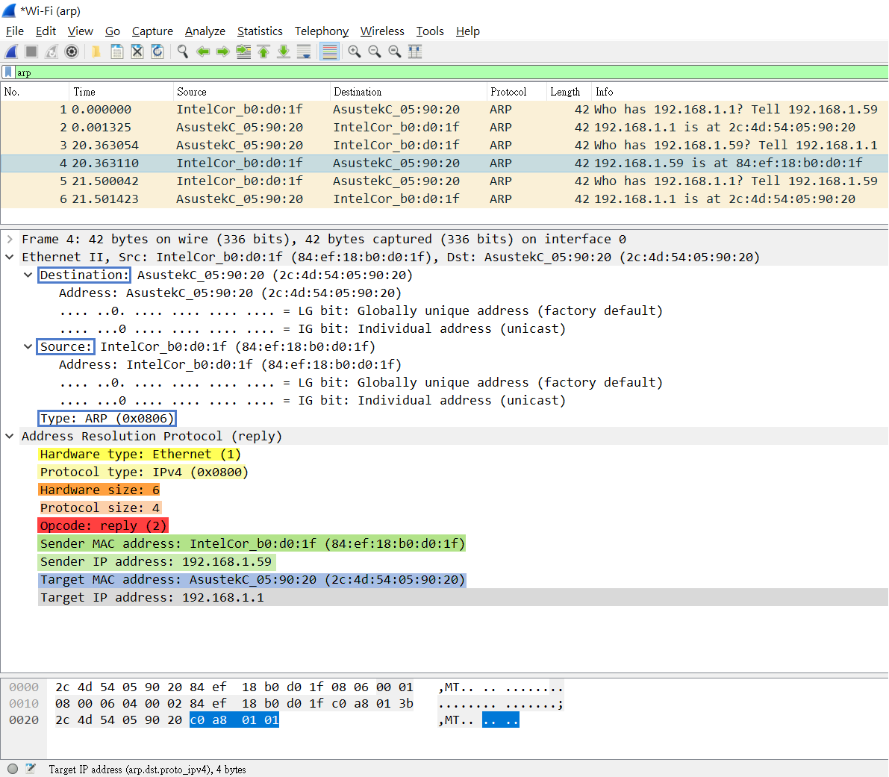

# Lab: Packet Sniffing with Wireshark
Use Wireshark to learn how to do packet sniffing.

Download: 

An illustration of capture an incomming frame:  

## ipconfig & arp

Start the Wireshark:  

## ARP 
ARP packet format:  
 

ARP Request:  

ARP Reply:  

# HW: Use Wireshare to analyze the ARP protocol
- Start your web browser and clear the browser’s cache memory, but do not access any website yet.
- Open the Wireshark and start capturing.
- Go to your browser and retrieve any file from a website. Wireshark starts capturing packets.
- In the filter field of the Wireshark window type arp (lower case) and click Apply. Stop capturing and save the captured file.

Answer these questions:
- Part I: ARP request message
  - a. the hardware type.
  - b. the protocol type.
  - c. the hardware length.
  - d. the protocol length.
  - e. the operation code.
  - f. the source hardware address.
  - g. the source protocol address?
  - h. the destination hardware address.
  - i. the destination protocol address?
  
- Part II: ARP reply message
  - a. the hardware type.
  - b. the protocol type.
  - c. the hardware length.
  - d. the protocol length.
  - e. the operation code.
  - f. the source hardware address.
  - g. the source protocol address?
  - h. the destination hardware address.
  - i. the destination protocol address?
  
