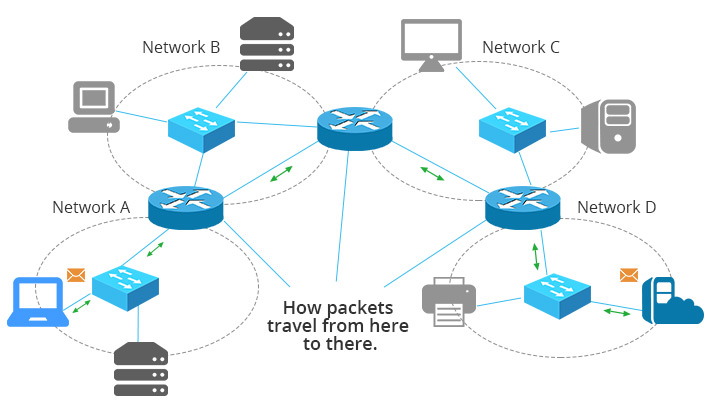

# Connection devices
- Hub
  - only for physical layer
  - a repeater that regenerates the original bits
- Bridge
  - for data-link layer
  - connect two segments by forwarding boradcast MAC address
- Link-layer switch
  - for data-link layer
  - forward broadcase frame
  - check MAC address in the frame
- Router
  - for network layer
  - route with IP addresses

## Routing

## Link-layer switch construct the swtiching table by learning

## Loop problem - broadcast strom
- redundant switches
- switches forward (regenerate) the broadcast frame continuously

## Spanning Tree Protocol (STP)
- prevents problems caused by loops on a network
- create a logical topology by __Shortest Path__ algorithm.
  1. Each switch has an unique ID, the smallest one will be the root switch.
  2. Find a shortest path from root switch to other switches.
  3. Define the __forwarding port__ and __blocking port__ according the spanning tree.

# The 5-4-3 rule for Ehternet Networking
- 5 segments with 4 repeaters, and no more than 3 of the 5 network segments can be for end-uses.

# Twisted Pair Cables cabling
- Unshielded Twisted Pair Cable (UTP)
- Shielded Twisted Pair Cable (STP)
- Wire standard
  - CAT 4: up to 16 Mbps, full-duplex
  - CAT 5: up to 100 Mbps, full-duplex
  - CAT 6: up to 1000 Mbps, full-duplex
- Connector: RJ-45
  - T568A and T568B
  
  
    
  - Straight Through cable: Connect different type devices, e.q. computer and switch 
  - Cross-over cable: Connect the same type devices, e.q. two computers or two switches.
  
  

# Network Cabling

- Cable Manager
- Patch Panel
- Cooling System
- Overhead Cable Pathway
- ...

