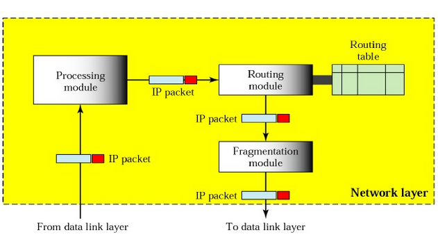
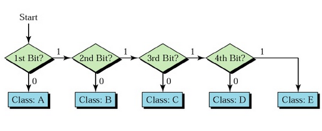
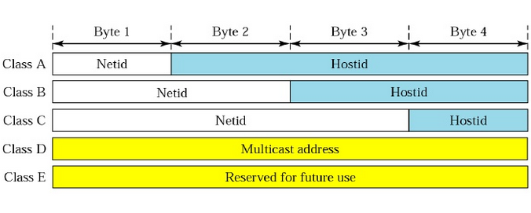
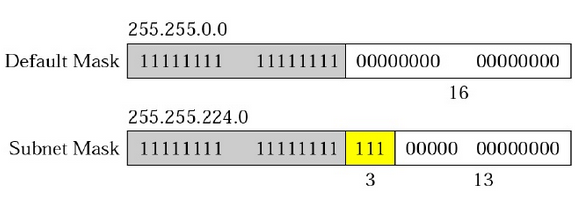
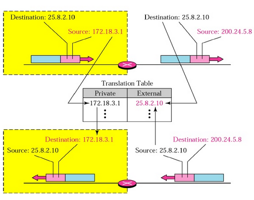

# Network Layer

## Inter-Networking
- Hop-to-Hop

    

- Host-to-Host

    

## Network Layer at source

## Network Layer at router

## Network Layer at destination

## Switching
[ch.8](https://github.com/cnchenpu/data-comm/blob/master/17_data-comm_switch.md#switching)

- Circuit switching
    + Connection Oriented
- Packet switching
    + Virtual Circuit switching
    + Datagram switching
        + Connectionless

# Addressing
- IPv4: 32 bits
- IPv6: 128 bits

## IP Address class

## Net ID & Host ID

- Network address: host ID bits all 0.
- Broadcast address: host ID bits all 1.

- Class A
    + 27=128 networks
    + 224=16,777,216 addresses in each network
- Class B
    + 214=16,384 networks
    + 216=65,536 addresses in each network
- Class C
    + 221=2,097,152 networks
    + 28=256 addresses in each network

## Subnet & Netmask
- Subnet: use host ID for subnet ID
- Netmask: to find the network ID

## Private IP

## NAT (Network Address Translation)

## DHCP (Dynamic Host Configuration Protocol)

