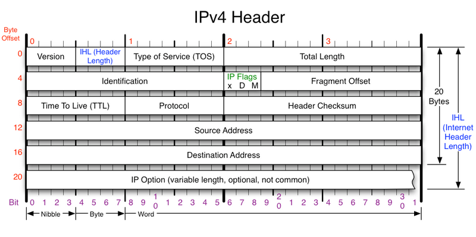
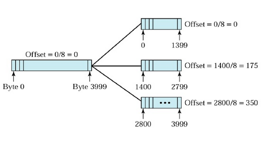
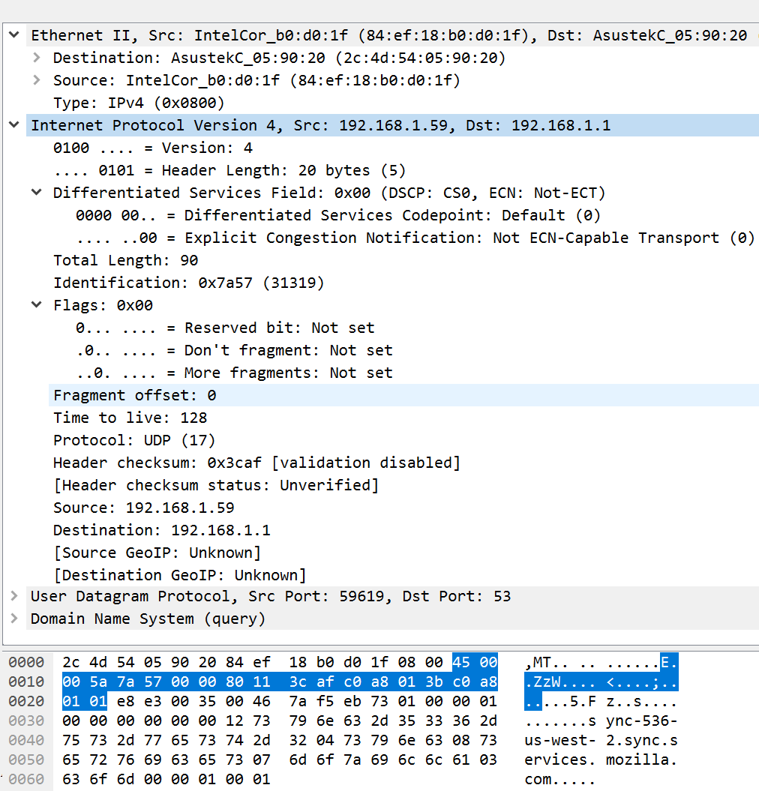
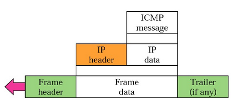
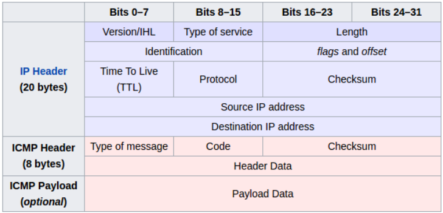
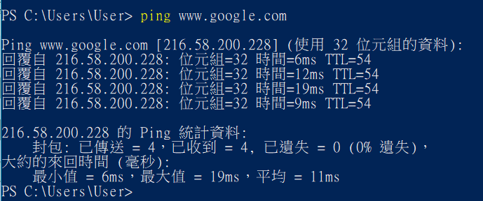
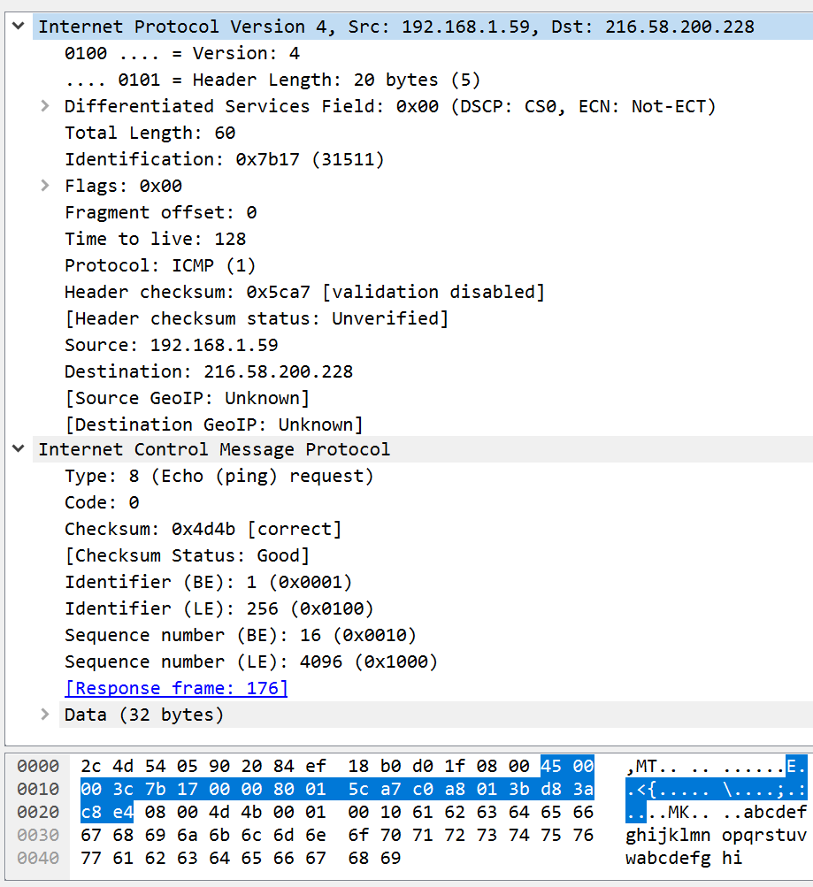
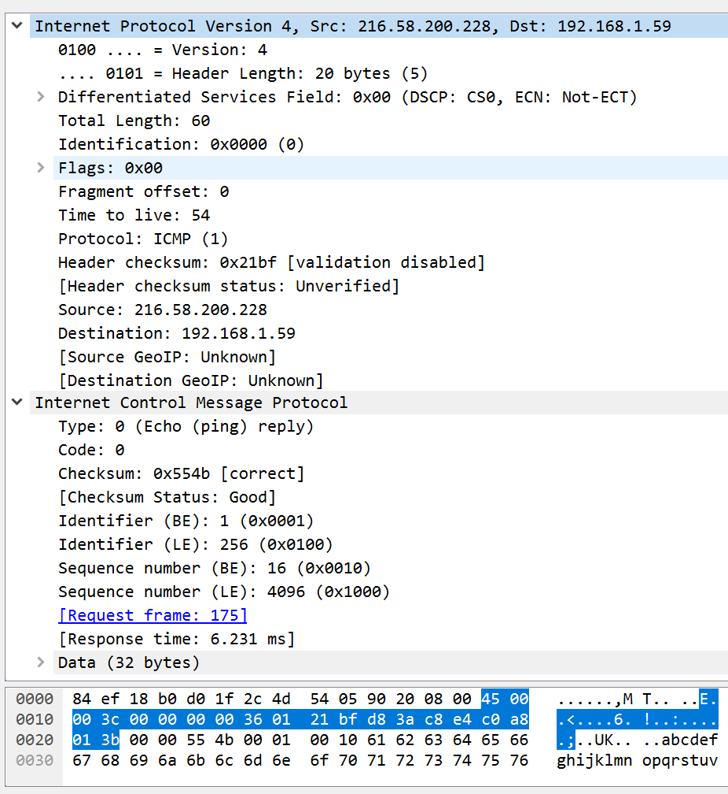

# Network Layer Protocols

## IPv4 Header

- Version: 
    + IP protocol version
    + 4 bits
- Header Length: 
    + total_length / 4
    + 4 bits
- Differentiated Services Field: 
    + type of service
    + 8 bits
- Total Length: 
    + IP datagram or fragment length = (data_length + header_length)
    + max length: 216=65,535
    + 16 bits
- Identicifation: 
    + IP packet ID
    + 16 bits
- Flags: 
    + fragmentation flages
    + 3 bits
- Fragment offset:
    + fragment offset from start of IP datagram
    + 13 bits  
    + 
- Time To Live (TTL):
    + control how many times of the datagram can transfer through routers
    + 8 bits
- Protocol:
    + protocol types
    + 8 bits
        + 1 ICMP
        + 2 IGMP
        + 6 TCP
        + 17 UDP
- Header Checksum:
    + checksum of IP header
    + 16 bits
- Source Address
    + 32 bits
- Destination Address
    + 32 bits
- Option
    + 0~40 bytes

__The minimum lenght of IP header is 20 bytes.__

### IPv4 Header Wireshark example

- Version: 4
    + IP protocol version 
- Header Length: 5 (20 bytes)
    + total_length: 5x4=20 bytes
- Differentiated Services Field: 0x00
    + default
- Total Length: 0x5a (90 bytes)
    + data lenght=total_length - header_length
- Identification: 0x7a57
- Flags: 0x00
- Fragment offset: 0
- Time to live: 80 (128)
- Protocol: 11 (17, UDP)
- Header checksum: 0x3caf
- Source: 0xc0a8013b = 192.168.1.59
- Destination: 0xc0a80101 = 192.168.1.1

# ICMP (Internet Control Message Protocol)
- There is no _flow control_ or _congestion control_ mechanism in IP.

- error-reporting message
    + destination unreachible
    + source quench
    + time exceeded
    + parameter problems
    + redirection
- query message
    + echo request and reply
    + time-stamp request and reply

## ICMP - ping

- __ping request__

- __ping reply__

