# Routing Protocol

## An Internet as a Graph
- Internet is modeled as a weighted graph
  - each router as a __node__ and each network between a pair of routers as an __edge__
  - each edge is associated with a cost
  
  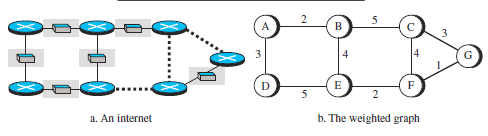

## Least-Cost Routing
- If there are N routers in an internet, there are (N − 1) least-cost paths from each router to any other router. This means we need N × (N − 1) least-cost paths for the whole internet.
- Find the least cost between the source to the destination router
- The source router chooses a route to the destination router in such a way that the total cost for the route is the least cost among all possible routes. 

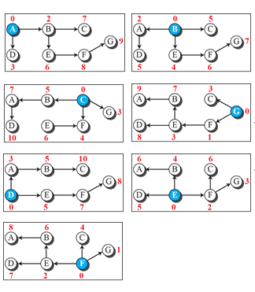

## Bellman-Ford Equation
  - __D_ij___ is the shortest distance and __c_ij___ is the cost between nodes ___i___ and ___j___.
- __D_xy_ = min{(c_xa_ + D_ay_), (c_xb_ + D_by_), (c_xc_ + D_cy_),...}__

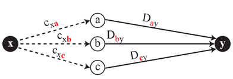

- __D_xy_ = min{D_xy_, (c_xz_ + D_zy_)}__

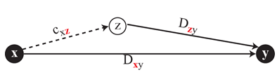

## Distance Vector Algorithm
- each node creates is its own least-cost tree about its immediate neighbors
- exchange information between immediate neighbors to make the tree more and more complete

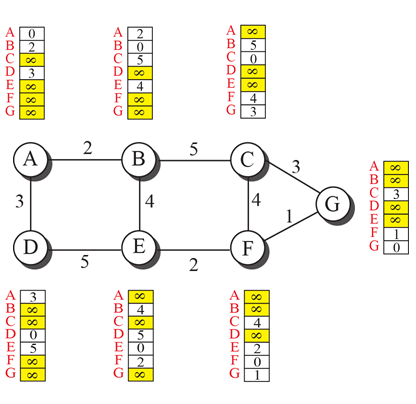

- B receives a copy of A’s vector

  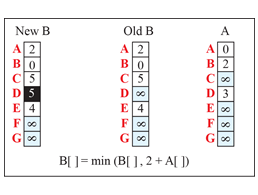

- B receives a copy of E’s vector

  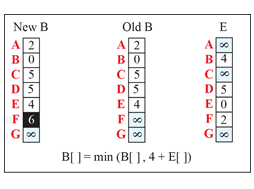

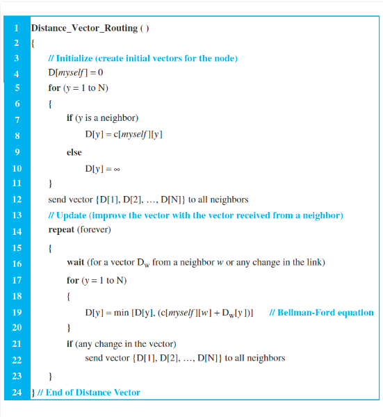

### Problem of Distance Vector Algorithm
- Count to Infinity
  - if a link is broken (cost becomes infinity), every other router should be aware of it immediately, but in distance-vector routing, this takes some time
- Two-Node Loop
  - 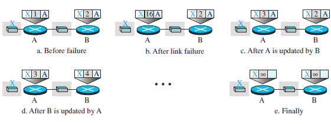

### Solution of problem of Distance Vector Algorithm
- Split Horizon
  - if node B thinks that the optimum route to reach X is via A, it does not need to advertise this piece of information to A
  - In our scenario, node B eliminates the last line of its forwarding table before it sends it to A. In this case, node A keeps the value of infinity as the distance to X. Later, when node A sends its forwarding table to B, node B also corrects its forwarding table.

## Link State Routing
- The __edge__ represents a network in the internet, the __cost__ associated with an edge defines the __state__ of the link.
- __Link-State Database (LSDB)__, collection of states for all links
- 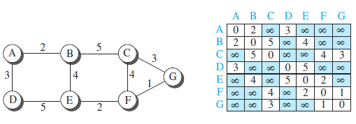
- 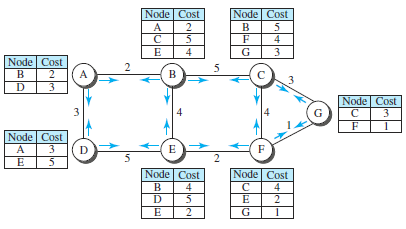
- In the distance-vector routing algorithm, each router tells its neighbors what it knows about the whole internet.
- In the link-state routing algorithm, each router tells the whole internet what it knows about its neighbors.

## Dijkstra Algorithm
- 1. The node chooses itself as the root of the tree, creating a tree with a single node, and sets the total cost of each node based on the information in the LSDB.
- 2. The node selects one node, among all nodes not in the tree, which is closest to the root, and adds this to the tree. After this node is added to the tree, the cost of all other nodes not in the tree needs to be updated because the paths may have been changed.
- 3. The node repeats step 2 until all nodes are added to the tree.
- 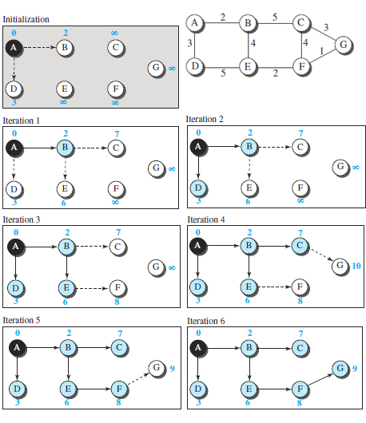
- 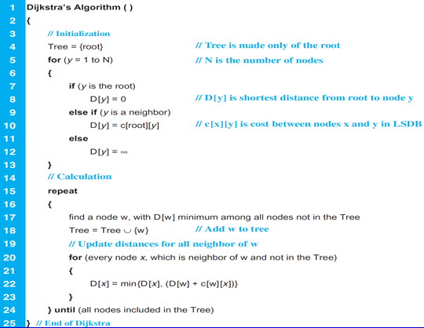

## Single Source Shortest Path
- a shortest path from one vertex to rest others
- greedy method  
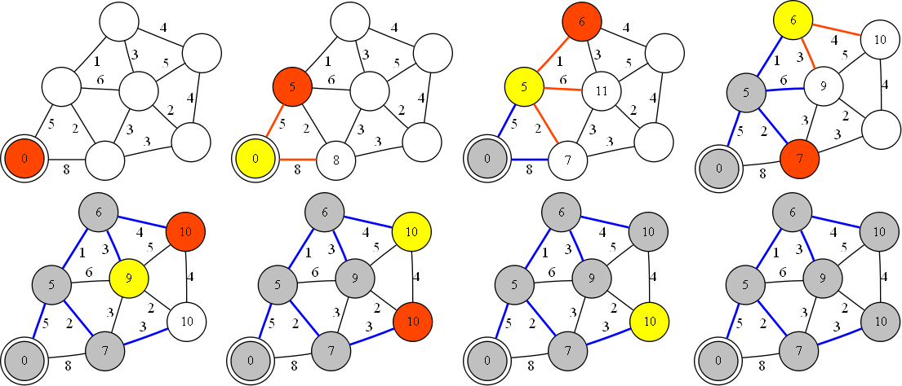

## Routing Protocol Implementations
- Routing Information Protocol (RIP) 
  - based on the distance-vector routing algorithm  
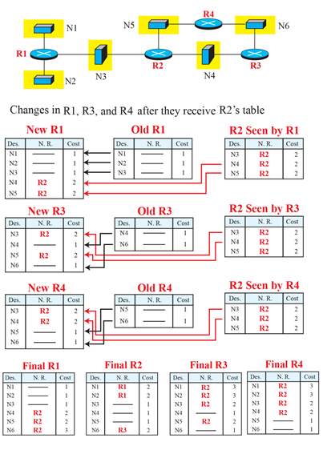

- Open Shortest Path First (OSPF) 
  - based on the link-state routing protocol  

