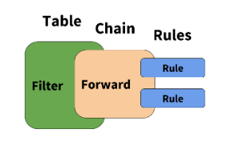

# iptables
The **iptables** is a tool to filter or block internet traffic. The **iptables** firewall is a list of rules which can accept or reject the incomming connection. If no rules are met, we use the default rule.

Man page: **iptables** is used to set up, maintain, and inspect the ***tables*** of IPv4 packet filter rules in the Linux kernel. Several different tables may be defined. Each ***tables*** contains a number of built-in ***chains*** and may also contain user-defined chains. The default table is ***filter table***. Each ***chains*** is a list of ***rules*** which can match a set of packets. Each rule specifies what to do with a packet that matches. Rules are the items that actually classify traffic to be acted upon. Rules are applied to chains, which are attached to tables, similar to the graphic below.



## Synopsis:
```bash
# appand a rule to the end of chain
iptables -A chain rule
    - chain : INPUT, FORWARD, OUTPUT,
    - rule = [parameters] [match] [target]
    - parameters :
        -p : protocol (tcp, udp, /etc/protocol)
        -s : source address
        -d : destination address
    - match = -m match-name
    - target = -j ACCEPT|DROP

# delete a rule from a chain
iptables -D chain rule-number

# insert a rule into a chain
iptbles -I chain rule-number

# list iptable rules
iptables -L|-S

# set the policy for the chain to the given target
iptables -P chain target
```

Check iptables status:
```bash
$ iptables -L   # list iptables rules
$ cat /etc/sysconfig/iptables   # saved iptables rules
$ service iptables status
$ chkconfig iptables --list
$ lsmod | grep tables
```


## 1. Decide which ports and services to open
We will need secure remote access, web and email services.
- SSH: 22
- HTTP: 80
- SSL: 443
- SMTP: 25
- secure SMTP: 465
- POP3: 110
- secure POP3: 995
- IMAP: 143
- IMAP over SSL: 993

## 2. Flush the firewall rules - erase them all
- ```iptables -F```
- Results: empty default filter table (```iptables -L```)
```
Chain INPUT (policy ACCEPT)
target     prot opt source               destination         

Chain FORWARD (policy ACCEPT)
target     prot opt source               destination         

Chain OUTPUT (policy ACCEPT)
target     prot opt source               destination  
```
- Results: accept all (```iptables -S```)
```
-P INPUT ACCEPT
-P FORWARD ACCEPT
-P OUTPUT ACCEPT
```

## 3. Block the most common attacks
- Block **[null packets](https://ddos-guard.net/en/terminology/attack_type/tcp-null-attack)** which used for port scanning.
  - to drop input TCP packets which no flag setting (ALL NONE)
  - ```iptables -A INPUT -p tcp --tcp-flags ALL NONE -j DROP``` 
  
- Block **[syn-flood attack](https://en.wikipedia.org/wiki/SYN_flood)** which is a form of DDoS attack.
  - to drop new input TCP connections which dosn't set the SYN flag
    - [TCP Header](https://en.wikipedia.org/wiki/Transmission_Control_Protocol#Connection_establishment)
  - ```iptables -A INPUT -p tcp ! --syn -m state --state NEW -j DROP```
  
- Block **[XMAS Tree packtes](https://en.wikipedia.org/wiki/Christmas_tree_packet)** which used for TCP/IP stack fingerprinting
  - to drop input TCP packets which all flags are set
  - ```iptables -A INPUT -p tcp --tcp-flags ALL ALL -j DROP```

## 4. Open ports for selected services
- Accept localhost (lo) interface traffic.
  - to accept any input traffic that comes to localhost (lo) interface
  - ```iptables -A INPUT -i lo -j ACCEPT```
  
- Accept web server traffic.
  - to accept input TCP packets which the destination port are 80 (HTTP) & 443 (SSL)
  - ```iptables -A INPUT -p tcp -m tcp --dport 80 -j ACCEPT```
  - ```iptables -A INPUT -p tcp -m tcp --dport 443 -j ACCEPT```

- Allow SMTP services.
  - to accept input TCP packet which the destination port are 110 (POP3) & 995 (secure POP3)
  - ```iptables -A INPUT -p tcp -m tcp --dport 110 -j ACCEPT```
  - ```iptables -A INPUT -p tcp -m tcp --dport 995 -j ACCEPT```

- Allow IMAP mail protocol.
  - to accept input TCP packet which the destination port are 143 (IMAP) & 993 (IMAP over SSL)
  - ```iptables -A INPUT -p tcp -m tcp --dport 143 -j ACCEPT```
  - ```iptables -A INPUT -p tcp -m tcp --dport 993 -j ACCEPT```

- Allow SSH traffic.
  - to accept input TCP packet which the destination port is 22 (SSH)
  - ```iptables -A INPUT -p tcp -m tcp --dport 22 -j ACCEPT```
  - only allow SSH connection from specific IP address
  - ```iptables -A INPUT -p tcp -s YOUR_IP_ADDRESS -m tcp --dport 22 -j ACCEPT```

- Allow return traffic initiated by the server.
  - insert a rule to accept connections which the status are ESTABLISHED & RELATED
  - ```iptables -I INPUT -m state --state ESTABLISHED,RELATED -j ACCEPT```

- Allow all outgoing connections.
  - ```iptables -P OUTPUT ACCEPT```

- Block everything else.
  - ```iptables -P INPUT DROP```

## Check, save and activate iptables configurations
- List rults.
  - ```iptables -L```
```
Chain INPUT (policy DROP)
target     prot opt source               destination
ACCEPT     all  --  anywhere             anywhere            state RELATED,ESTABLISHED          
DROP       tcp  --  anywhere             anywhere            tcp flags:FIN,SYN,RST,PSH,ACK,URG/NONE 
DROP       tcp  --  anywhere             anywhere            tcp flags:!FIN,SYN,RST,ACK/SYN state NEW 
DROP       tcp  --  anywhere             anywhere            tcp flags:FIN,SYN,RST,PSH,ACK,URG/FIN,SYN,RST,PSH,ACK,URG 
ACCEPT     all  --  anywhere             anywhere            
ACCEPT     tcp  --  anywhere             anywhere            tcp dpt:http 
ACCEPT     tcp  --  anywhere             anywhere            tcp dpt:https 
ACCEPT     tcp  --  anywhere             anywhere            tcp dpt:pop3 
ACCEPT     tcp  --  anywhere             anywhere            tcp dpt:pop3s 
ACCEPT     tcp  --  anywhere             anywhere            tcp dpt:imap 
ACCEPT     tcp  --  anywhere             anywhere            tcp dpt:imaps 
ACCEPT     tcp  --  anywhere             anywhere            tcp dpt:ssh 

Chain FORWARD (policy ACCEPT)
target     prot opt source               destination         

Chain OUTPUT (policy ACCEPT)
target     prot opt source               destination 
```

  - ```iptables -S```
```
-P INPUT DROP
-P FORWARD ACCEPT
-P OUTPUT ACCEPT
-A INPUT -m state --state RELATED,ESTABLISHED -j ACCEPT 
-A INPUT -p tcp -m tcp --tcp-flags FIN,SYN,RST,PSH,ACK,URG NONE -j DROP 
-A INPUT -p tcp -m tcp ! --tcp-flags FIN,SYN,RST,ACK SYN -m state --state NEW -j DROP 
-A INPUT -p tcp -m tcp --tcp-flags FIN,SYN,RST,PSH,ACK,URG FIN,SYN,RST,PSH,ACK,URG -j DROP 
-A INPUT -i lo -j ACCEPT 
-A INPUT -p tcp -m tcp --dport 80 -j ACCEPT 
-A INPUT -p tcp -m tcp --dport 443 -j ACCEPT 
-A INPUT -p tcp -m tcp --dport 110 -j ACCEPT 
-A INPUT -p tcp -m tcp --dport 995 -j ACCEPT 
-A INPUT -p tcp -m tcp --dport 143 -j ACCEPT 
-A INPUT -p tcp -m tcp --dport 993 -j ACCEPT 
-A INPUT -p tcp -m tcp --dport 22 -j ACCEPT 
```

- Save to configuration file.
  - ```iptables-save | tee /etc/sysconfig/iptables```
(only show the filter table)  
```
*filter
:INPUT DROP [240:18987]
:FORWARD ACCEPT [0:0]
:OUTPUT ACCEPT [244:22380]
-A INPUT -m state --state RELATED,ESTABLISHED -j ACCEPT 
-A INPUT -p tcp -m tcp --tcp-flags FIN,SYN,RST,PSH,ACK,URG NONE -j DROP 
-A INPUT -p tcp -m tcp ! --tcp-flags FIN,SYN,RST,ACK SYN -m state --state NEW -j DROP 
-A INPUT -p tcp -m tcp --tcp-flags FIN,SYN,RST,PSH,ACK,URG FIN,SYN,RST,PSH,ACK,URG -j DROP 
-A INPUT -i lo -j ACCEPT 
-A INPUT -p tcp -m tcp --dport 80 -j ACCEPT 
-A INPUT -p tcp -m tcp --dport 443 -j ACCEPT 
-A INPUT -p tcp -m tcp --dport 110 -j ACCEPT 
-A INPUT -p tcp -m tcp --dport 995 -j ACCEPT 
-A INPUT -p tcp -m tcp --dport 143 -j ACCEPT 
-A INPUT -p tcp -m tcp --dport 993 -j ACCEPT 
-A INPUT -p tcp -m tcp --dport 22 -j ACCEPT 
COMMIT
```

- Restart iptables service.
  - ```service iptables restart```

