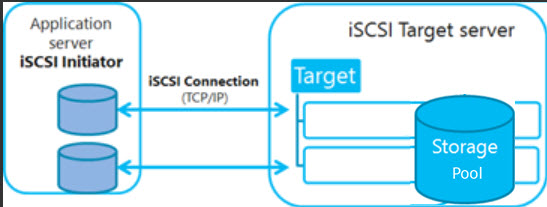

# iSCSI SAN

## iSCSI SAN Terminology

Item |Description
---|---
Target | The service on an iSCSi server that gives access to backend storage devices.
Backend Storage | The storage devices on the iSCSI target that the iSCSI target component is providing access to
Initiator | The iSCSi client that connects to a target and is identified by IQN
IQN | The iSCSI qualified name. A unique name that is used for identifying targets as well as initiators
TPG | The Target Portal Group. This is the collection of the IP Address and TCP ports to which a specific iSCSI target will listen.
Portal | The IP address and port that a target or initiator uses to establish connections
ACl | The access control list that is based on the iSCSI initiator IQN and used to provide access to specific user
LUN | A Logical Unit Number. The backend storage devices that are shared through the target. This can be any device that supports read/write operations, such as disk, partitions, logical volumes, files or tape drves

## Setting Up the iSCSI Target on RHEL 7

1. Create the backing storage devices.
2. Create the IQN and default target portal group (TPG).
3. Configure one or more ACLs for the TPG.
4. Create LUNs to provide access to the backing storage devices.
5. Create a portal to provide a network interface that iSCSI initiators can connect to.
6. Verify and commit the configuration.

