# Data Center / Lab

## Network devices: Switch, Firewall, Wi-Fi AP.
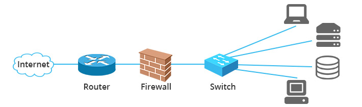

## Information services: Server, Storage, KVM.
- Dell iDRAC
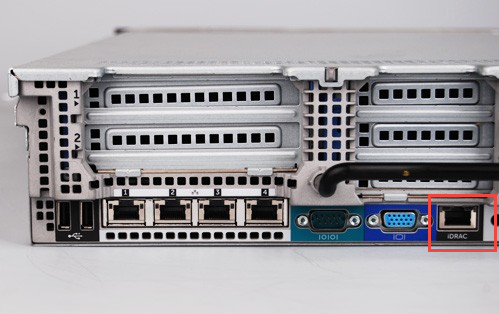
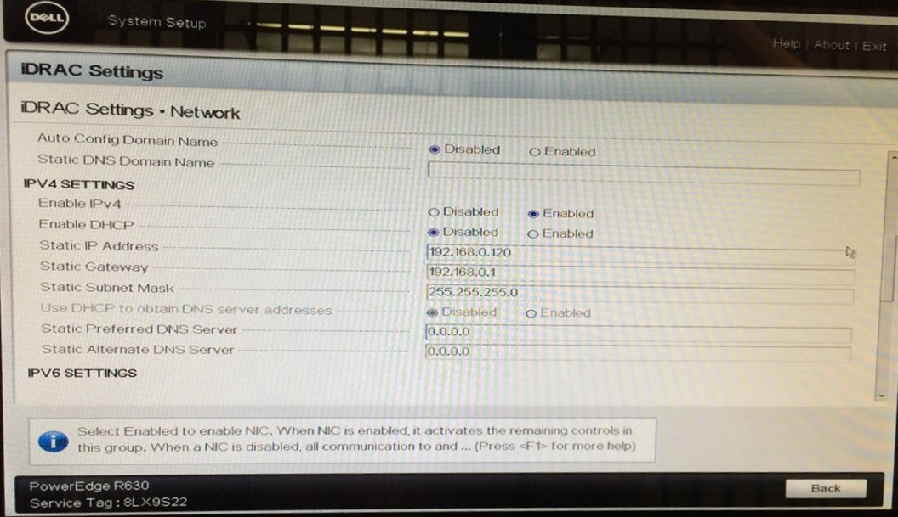

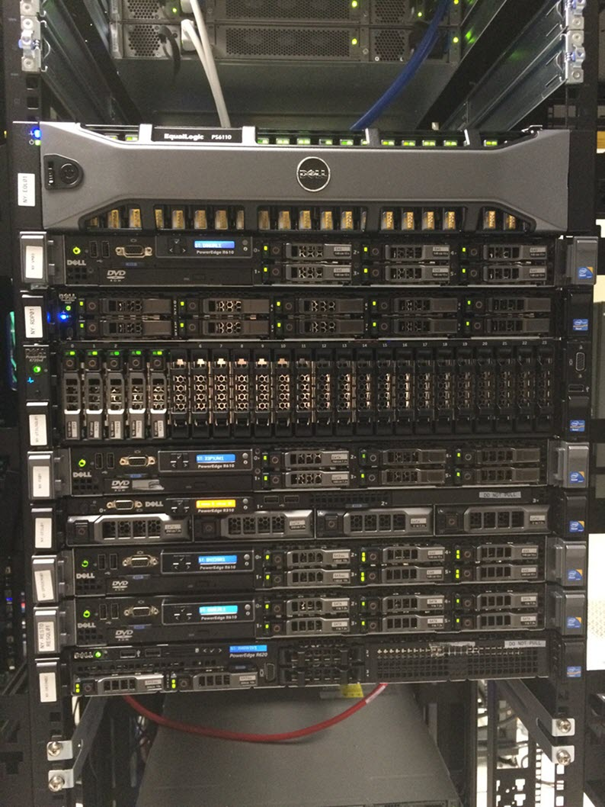

## Power: Power cable, UPS.
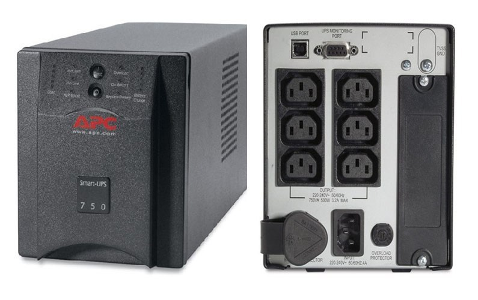

## Cooling: AC, Water cooler
- Humidity: 40%-60%
- Temperature: 18-27&deg;C

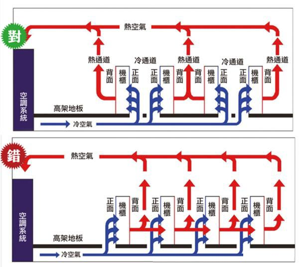
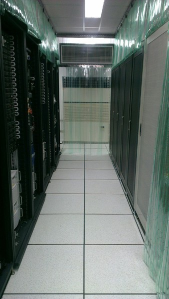

## Fire: Fire extinguisher, Smoke detectors.

## Security: Access contorl, Camera.
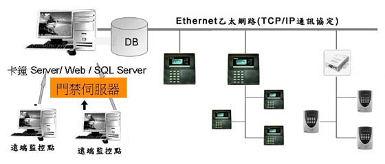

## Other: Rack, Patch panel.
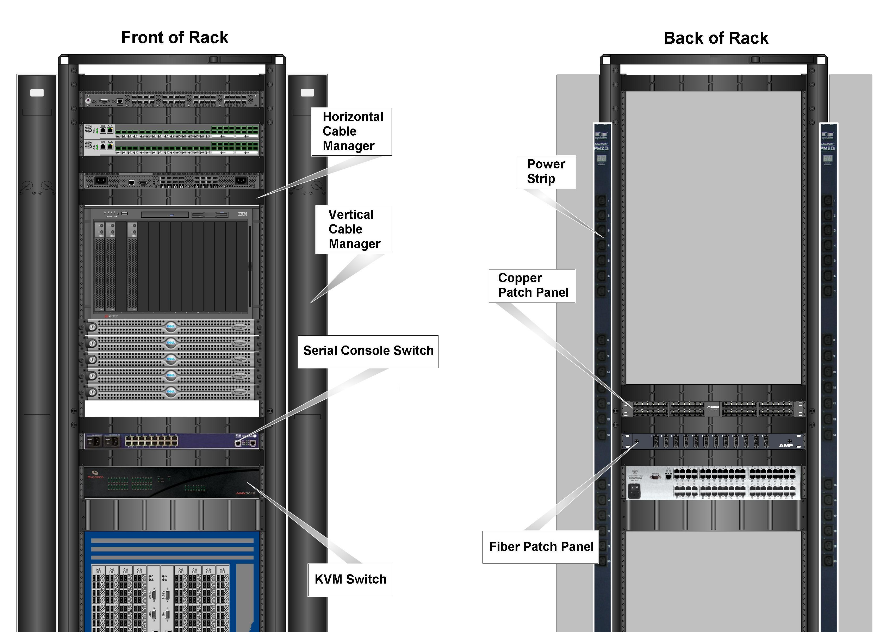

### Cabling
- Horizontal Cable Manager
- Vertical Cable Manager
- Cable Hangers and Trays
- Patch Panels

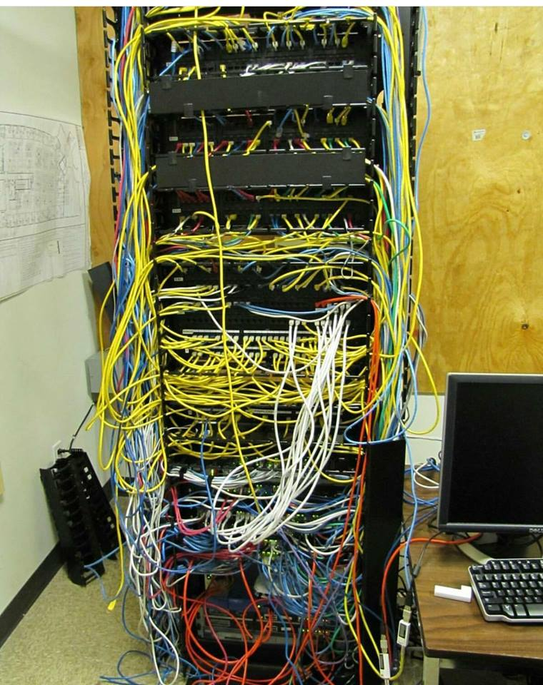
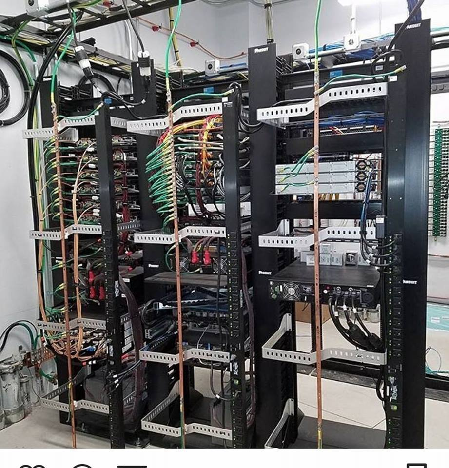
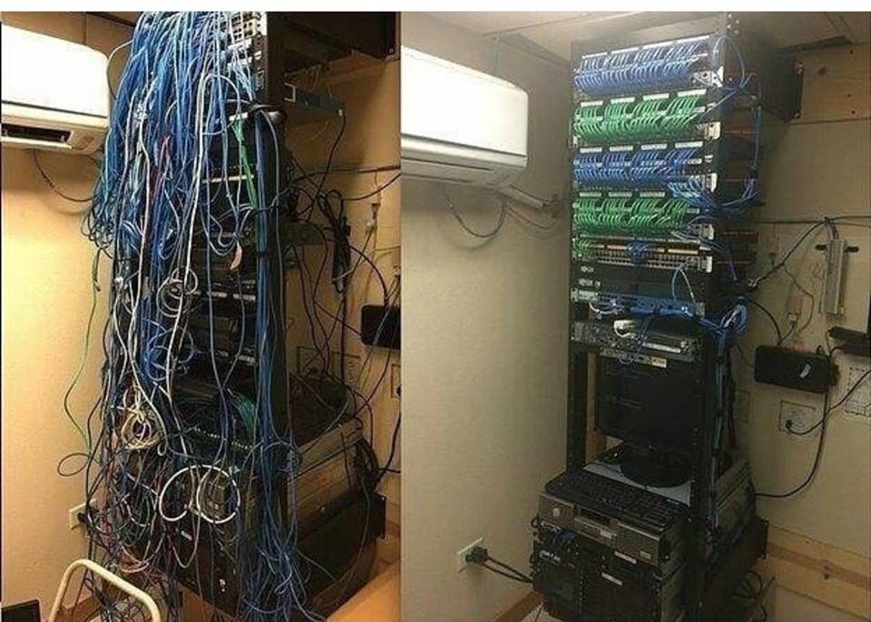
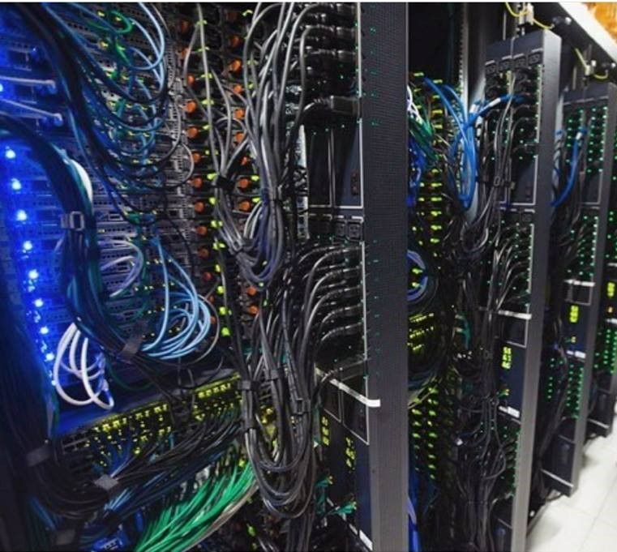
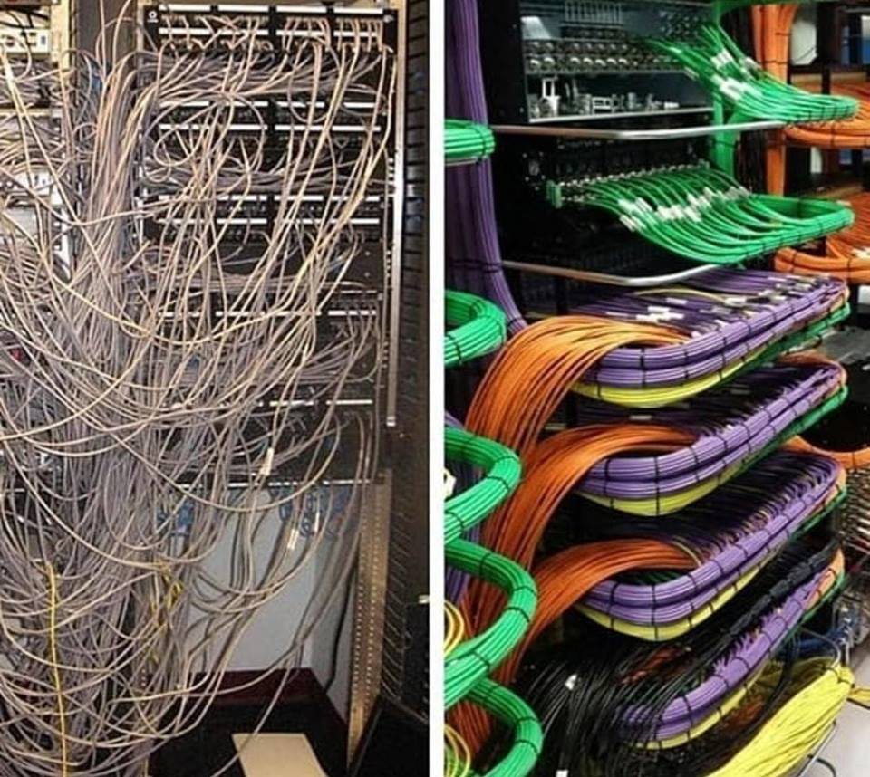
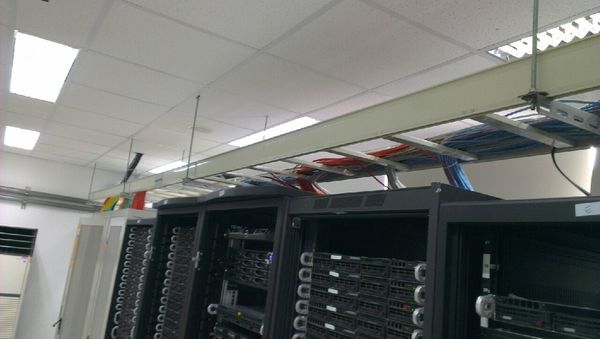
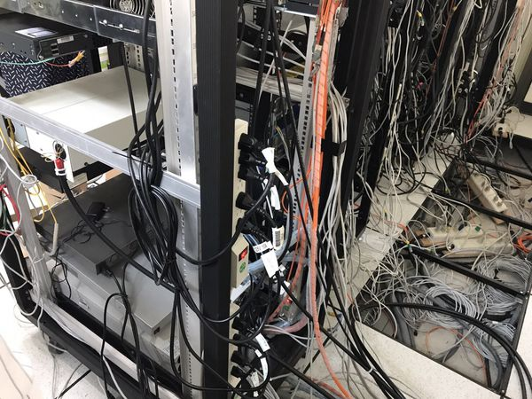
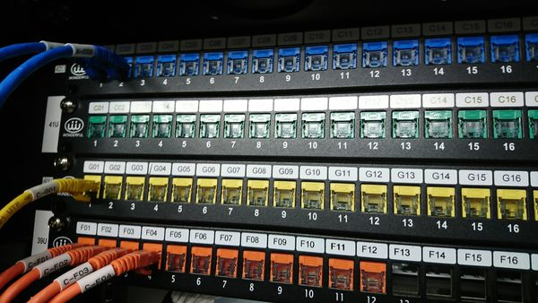

