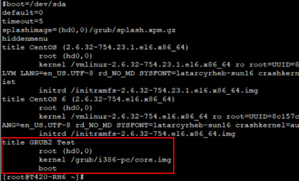
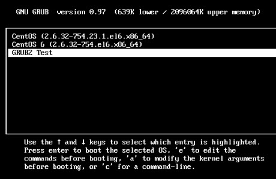
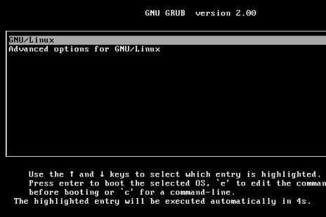

# Lab: Upgrading to GRUB 2     
- When you do an in-place upgrade of Red Hat Enterprise Linux (RHEL) from version 6 to 7, the upgrade from GRUB Legacy to GRUB 2 does not happen automatically, but it should be done manually.
- You can download and upgrade GRUB 2 manually.

### 1. Download GRUB 2 package:
```
# wget http://ftp.gnu.org/gnu/grub/grub-2.02.tar.gz
``` 

### 2. Make and Install GRUB 2 packages:
```
# gunzip grub-2.02.tar.gz

# tar xvf grub-2.02.tar

# cd grub-2.02

grub-2.02]# ./configure

grub-2.02]# make

grub-2.02]# make install
```

### 3. Generating the GRUB 2 configuration files:
    
1. Install the GRUB 2 files to the ``/boot/grub/`` directory of system disk (/dev/sda):
    ```
    $ grub-install --grub-setup=/bin/true /dev/sda
    ```  

  ```
  The --grub-setup=/bin/true option ensures that the old GRUB Legacy configuration is not deleted.
  ```

2. Generate the grub.cfg: 
   - On BIOS-based machines:
        ```
        $ grub-mkconfig -o /boot/grub/grub.cfg
        ```
    - On UEFI-based machines:
        ```
        $ grub-mkconfig -o /boot/efi/EFI/redhat/grub.cfg
        ```
    
    ```
    Note the difference in the configuration file extensions:
      .conf is for GRUB
      .cfg is for GRUB 2 
    ```    

### 4. Testing GRUB 2 with GRUB Legacy bootloader still installed
To safely test GRUB 2 configuration, we will start GRUB 2 from GRUB Legacy.

1. Add a new section into ``/boot/grub/grub.conf``: 
   - The ``/boot`` partition is in the ``/dev/sda1``.
   ```
    title GRUB2 Test
	    root (hd0,0)
	    kernel /grub/i386-pc/core.img
	    boot
   ```
   

2. Reboot the system. 
3. Select the ``GRUB2 Test`` entry when the GRUB menu presented.
   
   

4. When presented with a ``GRUB 2`` menu, use the default boot option.
   
   

5. If the above did not work, restart, and do not choose the ``GRUB2 Test`` entry on next boot.  

### 5. Replace GRUB legacy bootloader by reinstall GRUB 2
   - On BIOS-based machines:
     ```
     $ grub-install /dev/sda
     ```
   - On UEFI-based machines:
     ```
     $ yum reinstall grub2-efi shim
     ```

# HW4 (due date: 10/22):
- Import the test VM from me, the GRUB 2 has installed for you.
- Take a VM snapshot before you do this lab.
- Upgrade boot loader to GRUB 2.
- Show me the GRUB 2 screen in the class.