# Lab: Rescue System From MBR Failure
The MBR could be damaged by by disk error or GRUB installation failure. This lab demosnstrate how to backup and restore MBR for boot failure.

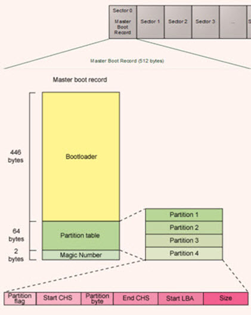

## 1. Backup MBR
MBR is located in the first sector (512 bytes) of boot disk (/dev/sda).
```bash
$ dd if=/dev/sda of=mbr.bin bs=512 count=1
```
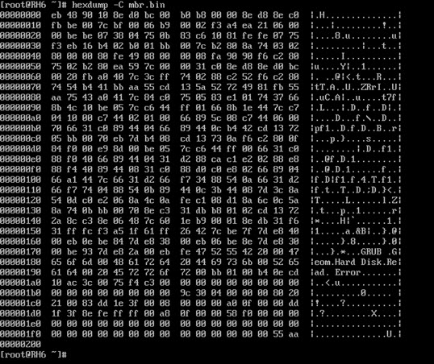

## 2. MBR currupted and boot failed
Clean the MBR.

<B>NOTE: THIS WILL DAMAGE YOUR SYSTEM</B>
```bash
$ dd if=/dev/zero of=/dev/sda bs=446 count=1
```
The boot record is cleaned.
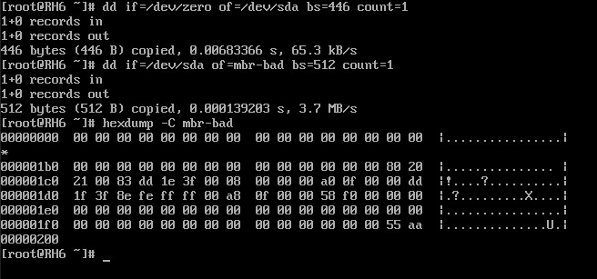

Reboot and failed.


## 3. Boot into rescue mode from CD-ROM
Use CD-ROM to boot up system to rescue mode.

- Choose "Rescue installed system"
  
  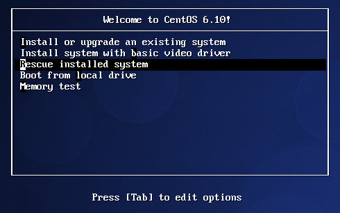

- You don't need to enable network during rescue operations.
  
  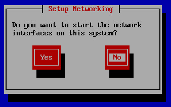

- Choose "Continue".
  
  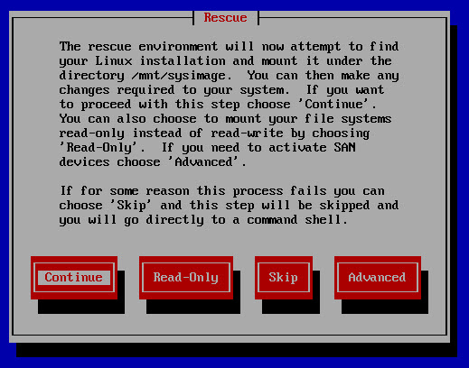

- You system will be mounted under /mnt/sysimage.
  
  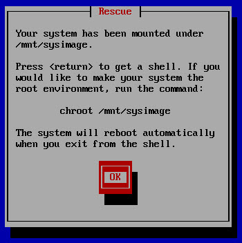
  
  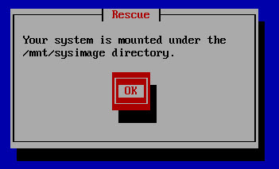

- Start the shell.
  
  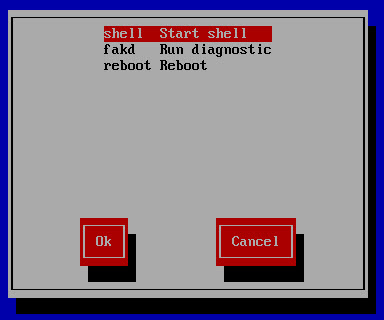

- Change root.
  ```bash
  $ chroot /mnt/sysimage
  ```

  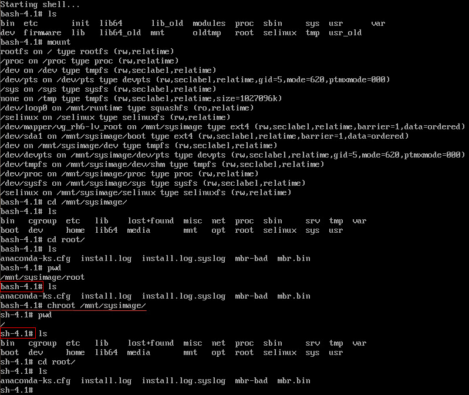

## 4. Restore MBR
Restore MBR from backup.

```bash
$ dd if=mbr.bin of=/dev/sda bs=512 count=1
```

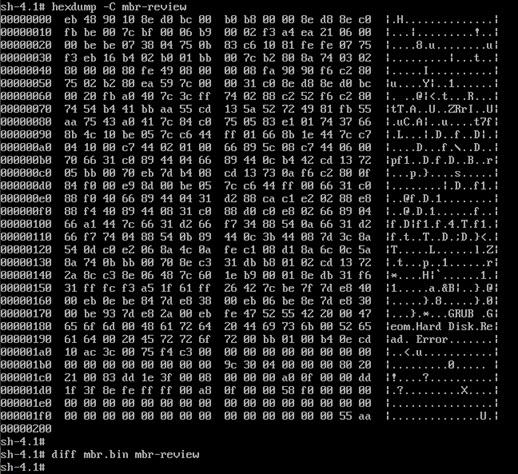

## 5. Reboot and welcome system back