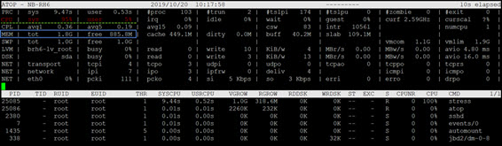

# Lab: Stress Tests

### Install stress tool
```
# yum install -y epel-release.noarch 
# yum install stress
```
```
Example: stress --cpu 8 --io 4 --vm 2 --vm-bytes 128M --timeout 10s
```
## CPU and memory stress tests
- Example: 1 thread to allocate/free 1.5 GB memory
```
# stress -m 1 --vm-bytes 1.5G
stress: info: [25084] dispatching hogs: 0 cpu, 0 io, 1 vm, 0 hdd
```
```
# free
             total       used       free     shared    buffers     cached
Mem:       1922092    1400260     521832        208      41156     459880
-/+ buffers/cache:     899224    1022868
Swap:      1048572          0    1048572
```
```
# top
top - 10:17:44 up  1:38,  3 users,  load average: 0.18, 0.15, 0.07
Tasks: 103 total,   2 running, 101 sleeping,   0 stopped,   0 zombie
Cpu(s):  4.7%us, 95.3%sy,  0.0%ni,  0.0%id,  0.0%wa,  0.0%hi,  0.0%si,  0.0%st
Mem:   1922092k total,  1340860k used,   581232k free,    41136k buffers
Swap:  1048572k total,        0k used,  1048572k free,   459880k cached

  PID USER      PR  NI  VIRT  RES  SHR S %CPU %MEM    TIME+ COMMAND
25085 root      20   0 1030m 638m  148 R 99.9 34.0   0:10.04 stress
25082 root      20   0 15028 1220  944 R  0.3  0.1   0:00.05 top
    1 root      20   0 19344 1564 1240 S  0.0  0.1   0:01.19 init  
```


```
# sar 1
Linux 2.6.32-754.el6.x86_64 (NB-RH6) 	10/20/2019 	_x86_64_	(1 CPU)

10:42:35 AM     CPU     %user     %nice   %system   %iowait    %steal     %idle
10:42:36 AM     all      6.06      0.00     93.94      0.00      0.00      0.00
10:42:37 AM     all      4.08      0.00     95.92      0.00      0.00      0.00
```
```
# mpstat 1
Linux 2.6.32-754.el6.x86_64 (NB-RH6) 	10/20/2019 	_x86_64_	(1 CPU)

10:42:48 AM  CPU    %usr   %nice    %sys %iowait    %irq   %soft  %steal  %guest   %idle
10:42:49 AM  all    6.12    0.00   93.88    0.00    0.00    0.00    0.00    0.00    0.00
10:42:50 AM  all    5.10    0.00   94.90    0.00    0.00    0.00    0.00    0.00    0.00
```

## IO stress test
- Example: 30 IO sync threads
```
# stress --io 30
stress: info: [25561] dispatching hogs: 0 cpu, 30 io, 0 vm, 0 hdd
```
```
# iostat -kx 1 

avg-cpu:  %user   %nice %system %iowait  %steal   %idle
           0.00    0.00   28.00   72.00    0.00    0.00

Device:     rrqm/s   wrqm/s     r/s     w/s    rkB/s    wkB/s avgrq-sz avgqu-sz   await r_await w_await  svctm  %util
sda           0.00     0.00    0.00    3.00     0.00     8.00     5.33     0.72  765.00    0.00  765.00 240.67  72.20
dm-0          0.00     0.00    0.00    1.00     0.00     4.00     8.00     0.72 2295.00    0.00 2295.00 721.00  72.10
dm-1          0.00     0.00    0.00    0.00     0.00     0.00     0.00     0.00    0.00    0.00    0.00   0.00   0.00
```

- Example: 1 thread to write disk (default: 1 GB)
```
# stress -d 1
stress: info: [25682] dispatching hogs: 0 cpu, 0 io, 0 vm, 1 hdd
```
```
# iostat -kx 1
avg-cpu:  %user   %nice %system %iowait  %steal   %idle
           0.00    0.00   10.64   89.36    0.00    0.00

Device:    rrqm/s   wrqm/s     r/s     w/s    rkB/s    wkB/s avgrq-sz avgqu-sz   await r_await w_await  svctm  %util
sda          0.00 12024.47    0.00   74.47     0.00 38127.66  1024.00   151.39 2998.80    0.00 2998.80  14.29 106.38
dm-0         0.00     0.00    0.00 12119.15     0.00 48476.60     8.00 19357.89 2358.44    0.00 2358.44   0.09 106.28
dm-1         0.00     0.00    0.00    0.00     0.00     0.00     0.00     0.00    0.00    0.00    0.00   0.00   0.00
```
```
# vmstat 1
procs -----------memory---------- ---swap-- -----io---- --system-- -----cpu-----
 r  b   swpd   free   buff  cache   si   so    bi    bo   in   cs us sy id wa st
 0  3      0 147772  43376 1507724    0    0    24    75  586 2348  1 53 45  1  0	
 1  2      0 109332  43384 1544572    0    0     0 39940  401  318  0 15  0 85  0	
 0  2      0 1103812  43388 580340    0    0     0 24628  446  238  0 26  0 74  0
```

# HW4 (deu date: 11/04): CPU bound vs. IO bound
- What is CPU bound and IO bound process?
- Use stress tool to make you own examples:
  - Demo and explain your example in **vmstat**, **iostat** or other commands
- Compose your results in your HacdMD page, than email me the link.
  - Email subject format: [HW4_you-student-ID]

