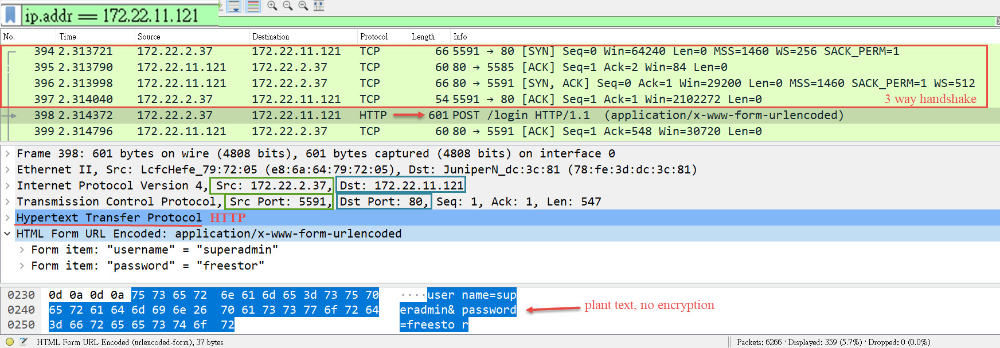
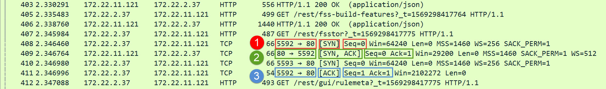
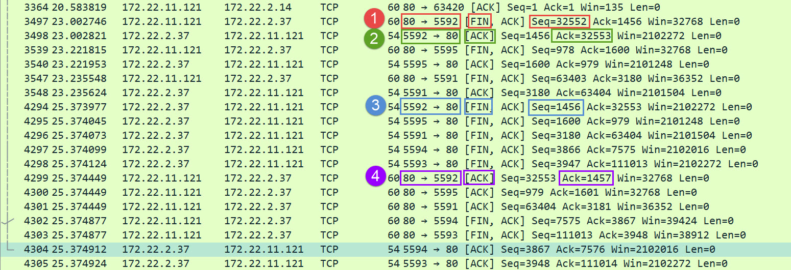

# Lab: Packet Sniffing with Wireshark
Use Wireshark to learn how to do packet sniffing.

Download: <a href="https://www.wireshark.org/download.html"></a>

An illustration of capture an incomming frame: <br>


## ipconfig & arp


Start the Wireshark: <br>


## ARP 
ARP packet format: <br>


ARP Request: <br>


ARP Reply: <br>


## 3 Way Handshake


- [Example](https://github.com/cnchenpu/sys-net-admin/blob/master/wireshark-ex1-3way-handshake.pcapng?raw=true) of 3 Way Handshake.


## 4 Way Handshake


## HTTP
- plant txt
- 

- connection initiation (3 way handshake)
  

- connection closed (4 way handshake)
  

- [Example](https://github.com/cnchenpu/sys-net-admin/blob/master/wireshark-ex2-http.pcapng?raw=true) of HTTP.


## DNS query & response


## TLS Handshake


# HW: Use Wireshare to analyze the ARP protocol (Due date: 10/24)
- Start your web browser and clear the browser’s cache memory, but do not access any website yet.
- Open the Wireshark and start capturing.
- Go to your browser and retrieve any file from a website. Wireshark starts capturing packets.
- In the filter field of the Wireshark window type arp (lower case) and click Apply. Stop capturing and save the captured file.

#### Put you homework in HackMD, then email me the link to ```cnchen @ pu.edu.tw```, email subject format: ```[HW1_you-student-ID]```

#### Answer these questions:
- Part I: ARP request message
  - a. the hardware type.
  - b. the protocol type.
  - c. the hardware length.
  - d. the protocol length.
  - e. the operation code.
  - f. the source hardware address.
  - g. the source protocol address?
  - h. the destination hardware address.
  - i. the destination protocol address?
  
- Part II: ARP reply message
  - a. the hardware type.
  - b. the protocol type.
  - c. the hardware length.
  - d. the protocol length.
  - e. the operation code.
  - f. the source hardware address.
  - g. the source protocol address?
  - h. the destination hardware address.
  - i. the destination protocol address?
  
