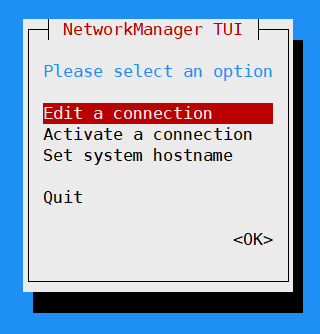

# Linux Network Configuration Tools

## IP Networking Control Files
### Interface definitions
```bash
# cat /etc/sysconfig/network-scripts/ifcfg-eth0 
DEVICE=eth0
TYPE=Ethernet
UUID=abcb8fbe-fac3-4af5-a5c9-dc03746c3f2a
ONBOOT=yes
NM_CONTROLLED=yes
#BOOTPROTO=dhcp
BOOTPROTO=static
IPADDR=172.22.2.222
PREFIX=23
GATEWAY=172.22.2.1
DNS=8.8.8.8
##
DEFROUTE=yes
IPV4_FAILURE_FATAL=yes
IPV6INIT=no
NAME="System eth0"
HWADDR=08:00:27:37:6B:5B
PEERDNS=yes
PEERROUTES=yes
LAST_CONNECT=1568257891
```

### Hostname and default gateway definition
```bash
# RHEL 6
$ cat /etc/sysconfig/network
NETWORKING=yes
HOSTNAME=ENCU-RH6
#GATEWAY=
```

```bash
# RHEL 7
/etc/hostname
```

### DNS servers settings
```/etc/resolv.conf```

### Reading Routes and IP Information
#### ifconfig
```
# ifconfig
eth0      Link encap:Ethernet  HWaddr 08:00:27:45:58:D3  
          inet addr:192.168.0.183  Bcast:192.168.0.255  Mask:255.255.255.0
          inet6 addr: fe80::a00:27ff:fe45:58d3/64 Scope:Link
          UP BROADCAST RUNNING MULTICAST  MTU:1500  Metric:1
          RX packets:3905 errors:0 dropped:0 overruns:0 frame:0
          TX packets:2183 errors:0 dropped:0 overruns:0 carrier:0
          collisions:0 txqueuelen:1000 
          RX bytes:374848 (366.0 KiB)  TX bytes:231915 (226.4 KiB)

lo        Link encap:Local Loopback  
          inet addr:127.0.0.1  Mask:255.0.0.0
          inet6 addr: ::1/128 Scope:Host
          UP LOOPBACK RUNNING  MTU:65536  Metric:1
          RX packets:0 errors:0 dropped:0 overruns:0 frame:0
          TX packets:0 errors:0 dropped:0 overruns:0 carrier:0
          collisions:0 txqueuelen:0 
          RX bytes:0 (0.0 b)  TX bytes:0 (0.0 b)
```

#### ifup, ifdown, ifcfg
#### ip addr
```
# ip addr show
1: lo: <LOOPBACK,UP,LOWER_UP> mtu 65536 qdisc noqueue state UNKNOWN 
    link/loopback 00:00:00:00:00:00 brd 00:00:00:00:00:00
    inet 127.0.0.1/8 scope host lo
    inet6 ::1/128 scope host 
       valid_lft forever preferred_lft forever
2: eth0: <BROADCAST,MULTICAST,UP,LOWER_UP> mtu 1500 qdisc pfifo_fast state UP qlen 1000
    link/ether 08:00:27:45:58:d3 brd ff:ff:ff:ff:ff:ff
    inet 192.168.0.183/24 brd 192.168.0.255 scope global eth0
    inet 10.0.1.100/24 scope global eth0
    inet6 fe80::a00:27ff:fe45:58d3/64 scope link 
       valid_lft forever preferred_lft forever
```
``` 
# ip addr add 10.0.1.100/24 dev eth0
```
```
# ip addr del 10.0.1.100/24 dev eth0
```

#### route 
```
# route 
Kernel IP routing table
Destination     Gateway         Genmask         Flags Metric Ref    Use Iface
192.168.0.0     *               255.255.255.0   U     1      0        0 eth0
default         192.168.0.1     0.0.0.0 
```
```
# route add -net 10.0.1.0 netmask 255.255.255.0 gw 192.168.0.1
#
# route 
Kernel IP routing table
Destination     Gateway         Genmask         Flags Metric Ref    Use Iface
10.0.1.0        192.168.0.1     255.255.255.0   UG    0      0        0 eth0
192.168.0.0     *               255.255.255.0   U     1      0        0 eth0
default         192.168.0.1     0.0.0.0         UG    0      0        0 eth0
#
# route del -net 10.0.1.0 netmask 255.255.255.0 gw 192.168.0.1
```

#### ip route
```
# ip route list
192.168.0.0/24 dev eth0  proto kernel  scope link  src 192.168.0.183  metric 1 
default via 192.168.0.1 dev eth0  proto static
```

### Restart network service
```/etc/init.d/network restart```

```systemctl restart network.service``` 

### Ethernet Layer Tools
#### arp
```
# arp
Address                  HWtype  HWaddress           Flags Mask            Iface
192.168.0.120            ether   74:f6:1c:20:e2:92   C                     eth0
192.168.0.155            ether   00:24:36:7b:b9:31   C                     eth0
192.168.0.171            ether   ac:37:43:98:d8:7f   C                     eth0
192.168.0.178            ether   40:40:a7:b3:31:6e   C                     eth0
192.168.0.163            ether   08:00:27:13:63:5b   C                     eth0
192.168.0.176            ether   9c:4e:36:9c:40:d8   C                     eth0
192.168.0.1              ether   68:ff:7b:56:06:8e   C                     eth0
```

#### ip neigh
```
# ip neigh
192.168.0.120 dev eth0 lladdr 74:f6:1c:20:e2:92 STALE
192.168.0.155 dev eth0 lladdr 00:24:36:7b:b9:31 STALE
192.168.0.171 dev eth0 lladdr ac:37:43:98:d8:7f STALE
192.168.0.178 dev eth0 lladdr 40:40:a7:b3:31:6e STALE
192.168.0.163 dev eth0 lladdr 08:00:27:13:63:5b STALE
192.168.0.176 dev eth0 lladdr 9c:4e:36:9c:40:d8 REACHABLE
192.168.0.1 dev eth0 lladdr 68:ff:7b:56:06:8e STALE
```

#### ip link
Displaying link layer characteristics.
```
# ip link
1: lo: <LOOPBACK,UP,LOWER_UP> mtu 65536 qdisc noqueue state UNKNOWN 
    link/loopback 00:00:00:00:00:00 brd 00:00:00:00:00:00
2: eth0: <BROADCAST,MULTICAST,UP,LOWER_UP> mtu 1500 qdisc pfifo_fast state UP qlen 1000
    link/ether 08:00:27:45:58:d3 brd ff:ff:ff:ff:ff:ff
```

#### ethtool
```
# ethtool eth0
Settings for eth0:
	Supported ports: [ TP ]
	Supported link modes:   10baseT/Half 10baseT/Full 
	                        100baseT/Half 100baseT/Full 
	                        1000baseT/Full 
	Supported pause frame use: No
	Supports auto-negotiation: Yes
	Advertised link modes:  10baseT/Half 10baseT/Full 
	                        100baseT/Half 100baseT/Full 
	                        1000baseT/Full 
	Advertised pause frame use: No
	Advertised auto-negotiation: Yes
	Speed: 1000Mb/s
	Duplex: Full
	Port: Twisted Pair
	PHYAD: 0
	Transceiver: internal
	Auto-negotiation: on
	MDI-X: off (auto)
	Supports Wake-on: umbg
	Wake-on: d
	Current message level: 0x00000007 (7)
			       drv probe link
	Link detected: yes
```

## nmcli
```
# nmcli nm status
RUNNING         STATE           WIFI-HARDWARE   WIFI       WWAN-HARDWARE   WWAN      
running         connected       enabled         enabled    enabled         enabled
```
```
# nmcli con stat
NAME           UUID                                   DEVICES   SCOPE    DEFAULT  VPN  
System eth0    b1247f0a-0f22-4f42-b1f6-80717776d673   eth0      system   yes      no 
```
```
# nmcli dev list
GENERAL.DEVICE:                 eth0
GENERAL.TYPE:                   802-3-ethernet
GENERAL.DRIVER:                 e1000
GENERAL.HWADDR:                 08:00:27:45:58:D3
GENERAL.STATE:                  connected
CAPABILITIES.CARRIER-DETECT:    yes
CAPABILITIES.SPEED:             1000 Mb/s
WIRED-PROPERTIES.CARRIER:       on
IP4-SETTINGS.ADDRESS:           192.168.0.183
IP4-SETTINGS.PREFIX:            24 (255.255.255.0)
IP4-SETTINGS.GATEWAY:           192.168.0.1
IP4-DNS1.DNS:                   192.168.0.1
```

## nmtui


