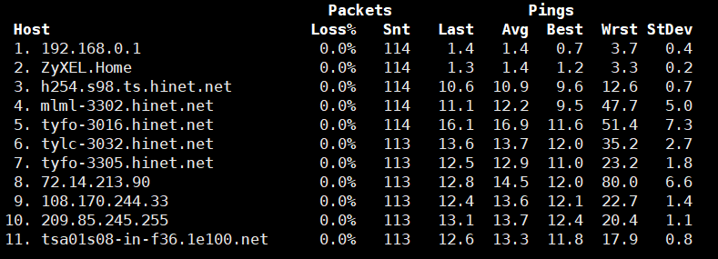

# Linux Network Configuration

## Configuration File
```bash
# cat /etc/sysconfig/network-scripts/ifcfg-eth0 
DEVICE=eth0
TYPE=Ethernet
UUID=abcb8fbe-fac3-4af5-a5c9-dc03746c3f2a
ONBOOT=yes
NM_CONTROLLED=yes
#BOOTPROTO=dhcp
BOOTPROTO=static
IPADDR=172.22.2.222
PREFIX=23
GATEWAY=172.22.2.1
DNS=8.8.8.8
##
DEFROUTE=yes
IPV4_FAILURE_FATAL=yes
IPV6INIT=no
NAME="System eth0"
HWADDR=08:00:27:37:6B:5B
PEERDNS=yes
PEERROUTES=yes
LAST_CONNECT=1568257891
```

## Configure Tools
### ifconfig
```
# ifconfig
eth0      Link encap:Ethernet  HWaddr 08:00:27:45:58:D3  
          inet addr:192.168.0.183  Bcast:192.168.0.255  Mask:255.255.255.0
          inet6 addr: fe80::a00:27ff:fe45:58d3/64 Scope:Link
          UP BROADCAST RUNNING MULTICAST  MTU:1500  Metric:1
          RX packets:3905 errors:0 dropped:0 overruns:0 frame:0
          TX packets:2183 errors:0 dropped:0 overruns:0 carrier:0
          collisions:0 txqueuelen:1000 
          RX bytes:374848 (366.0 KiB)  TX bytes:231915 (226.4 KiB)

lo        Link encap:Local Loopback  
          inet addr:127.0.0.1  Mask:255.0.0.0
          inet6 addr: ::1/128 Scope:Host
          UP LOOPBACK RUNNING  MTU:65536  Metric:1
          RX packets:0 errors:0 dropped:0 overruns:0 frame:0
          TX packets:0 errors:0 dropped:0 overruns:0 carrier:0
          collisions:0 txqueuelen:0 
          RX bytes:0 (0.0 b)  TX bytes:0 (0.0 b)
```
### ethtool
```
# ethtool eth0
Settings for eth0:
	Supported ports: [ TP ]
	Supported link modes:   10baseT/Half 10baseT/Full 
	                        100baseT/Half 100baseT/Full 
	                        1000baseT/Full 
	Supported pause frame use: No
	Supports auto-negotiation: Yes
	Advertised link modes:  10baseT/Half 10baseT/Full 
	                        100baseT/Half 100baseT/Full 
	                        1000baseT/Full 
	Advertised pause frame use: No
	Advertised auto-negotiation: Yes
	Speed: 1000Mb/s
	Duplex: Full
	Port: Twisted Pair
	PHYAD: 0
	Transceiver: internal
	Auto-negotiation: on
	MDI-X: off (auto)
	Supports Wake-on: umbg
	Wake-on: d
	Current message level: 0x00000007 (7)
			       drv probe link
	Link detected: yes
```
### ifup, ifdown, ifcfg
### ip addr
```
# ip addr show
1: lo: <LOOPBACK,UP,LOWER_UP> mtu 65536 qdisc noqueue state UNKNOWN 
    link/loopback 00:00:00:00:00:00 brd 00:00:00:00:00:00
    inet 127.0.0.1/8 scope host lo
    inet6 ::1/128 scope host 
       valid_lft forever preferred_lft forever
2: eth0: <BROADCAST,MULTICAST,UP,LOWER_UP> mtu 1500 qdisc pfifo_fast state UP qlen 1000
    link/ether 08:00:27:45:58:d3 brd ff:ff:ff:ff:ff:ff
    inet 192.168.0.183/24 brd 192.168.0.255 scope global eth0
    inet 10.0.0.1/24 scope global eth0
    inet6 fe80::a00:27ff:fe45:58d3/64 scope link 
       valid_lft forever preferred_lft forever
```
``` 
# ip addr add 10.0.0.1/24 dev eth0
```
```
# ip addr del 10.0.0.1/24 dev eth0
```

### route, ip route
```
# route 
Kernel IP routing table
Destination     Gateway         Genmask         Flags Metric Ref    Use Iface
192.168.0.0     *               255.255.255.0   U     1      0        0 eth0
default         192.168.0.1     0.0.0.0 
```
```
# ip route list
192.168.0.0/24 dev eth0  proto kernel  scope link  src 192.168.0.183  metric 1 
default via 192.168.0.1 dev eth0  proto static
```

### traceroute
```
# traceroute www.google.com
traceroute to www.google.com (216.58.200.228), 30 hops max, 60 byte packets
 1  192.168.0.1 (192.168.0.1)  1.100 ms  0.934 ms  1.132 ms
 2  ZyXEL.Home (192.168.1.1)  1.777 ms  1.635 ms  1.217 ms
 3  h254.s98.ts.hinet.net (168.95.98.254)  10.545 ms  10.415 ms  11.606 ms
 4  mlml-3302.hinet.net (168.95.221.66)  11.433 ms  12.002 ms  11.875 ms
 5  tyfo-3016.hinet.net (220.128.9.66)  22.035 ms tyfo-3016.hinet.net (220.128.9.70)  17.106 ms tyfo-3016.hinet.net (220.128.9.66)  21.720 ms
 6  tylc-3032.hinet.net (220.128.13.218)  14.279 ms  12.631 ms  13.201 ms
 7  tyfo-3305.hinet.net (220.128.12.13)  16.134 ms  16.786 ms  16.438 ms
 8  72.14.213.90 (72.14.213.90)  13.772 ms 72.14.215.0 (72.14.215.0)  12.139 ms  12.728 ms
 9  108.170.244.129 (108.170.244.129)  14.661 ms  14.234 ms 108.170.244.97 (108.170.244.97)  13.269 ms
10  72.14.238.17 (72.14.238.17)  13.928 ms 72.14.237.231 (72.14.237.231)  14.670 ms  14.528 ms
11  tsa03s01-in-f228.1e100.net (216.58.200.228)  12.610 ms  13.235 ms  14.319 ms
```

### mtr
```
mtr www.google.com
```


### nslookup, host, dig
```
# nslookup www.google.com
Server:		192.168.0.1
Address:	192.168.0.1#53

Non-authoritative answer:
Name:	www.google.com
Address: 216.58.200.228
```
```
# host www.google.com
www.google.com has address 216.58.200.228
www.google.com has IPv6 address 2404:6800:4008:801::2004
```
```
# dig www.google.com

; <<>> DiG 9.8.2rc1-RedHat-9.8.2-0.68.rc1.el6 <<>> www.google.com
;; global options: +cmd
;; Got answer:
;; ->>HEADER<<- opcode: QUERY, status: NOERROR, id: 19732
;; flags: qr rd ra; QUERY: 1, ANSWER: 1, AUTHORITY: 0, ADDITIONAL: 0

;; QUESTION SECTION:
;www.google.com.			IN	A

;; ANSWER SECTION:
www.google.com.		172	IN	A	172.217.160.100

;; Query time: 17 msec
;; SERVER: 192.168.0.1#53(192.168.0.1)
;; WHEN: Sun Sep 29 09:28:57 2019
;; MSG SIZE  rcvd: 48
```

### nmcli
```
# nmcli nm status
RUNNING         STATE           WIFI-HARDWARE   WIFI       WWAN-HARDWARE   WWAN      
running         connected       enabled         enabled    enabled         enabled
```
```
# nmcli con stat
NAME           UUID                                   DEVICES   SCOPE    DEFAULT  VPN  
System eth0    b1247f0a-0f22-4f42-b1f6-80717776d673   eth0      system   yes      no 
```
```
# nmcli dev list
GENERAL.DEVICE:                 eth0
GENERAL.TYPE:                   802-3-ethernet
GENERAL.DRIVER:                 e1000
GENERAL.HWADDR:                 08:00:27:45:58:D3
GENERAL.STATE:                  connected
CAPABILITIES.CARRIER-DETECT:    yes
CAPABILITIES.SPEED:             1000 Mb/s
WIRED-PROPERTIES.CARRIER:       on
IP4-SETTINGS.ADDRESS:           192.168.0.183
IP4-SETTINGS.PREFIX:            24 (255.255.255.0)
IP4-SETTINGS.GATEWAY:           192.168.0.1
IP4-DNS1.DNS:                   192.168.0.1
```
