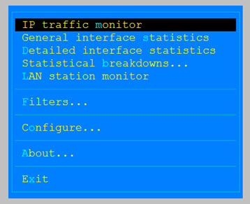
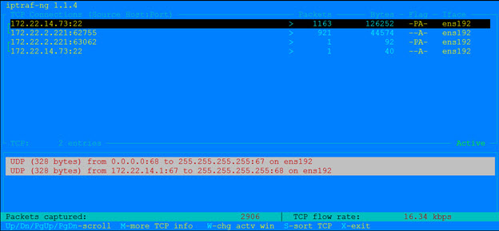

# Linux Network Analysis Tools

## Network information
### netstat
```
# netstat -ntup
Active Internet connections (w/o servers)
Proto Recv-Q Send-Q Local Address         Foreign Address         State         PID/Program name   
tcp        0      0 192.168.0.183:22      192.168.0.176:64914     ESTABLISHED   2245/sshd   
tcp        0     64 192.168.0.183:22      192.168.0.176:50109     ESTABLISHED   5804/sshd
```
```
# netstat -r
Kernel IP routing table
Destination     Gateway         Genmask         Flags   MSS Window  irtt  Iface
192.168.0.0     *               255.255.255.0   U         0 0          0  eth0
default         192.168.0.1     0.0.0.0         UG        0 0          0  eth0
```
```
# netstat -s
Ip:
    4622 total packets received
    0 forwarded
    0 incoming packets discarded
    4607 incoming packets delivered
    2526 requests sent out
Icmp:
    21 ICMP messages received
    0 input ICMP message failed.
    ICMP input histogram:
        destination unreachable: 21
    21 ICMP messages sent
    0 ICMP messages failed
    ICMP output histogram:
        destination unreachable: 21
IcmpMsg:
        InType3: 21
        OutType3: 21
Tcp:
    31 active connections openings
    33 passive connection openings
    3 failed connection attempts
    2 connection resets received
    2 connections established
    2496 segments received
    1445 segments send out
    0 segments retransmited
    0 bad segments received.
    1001 resets sent
Udp:
    41 packets received
    21 packets to unknown port received.
    0 packet receive errors
    58 packets sent
    0 receive buffer errors
    0 send buffer errors
...
```

### ss (socket statistics)
```
# ss
State       Recv-Q Send-Q        Local Address:Port         Peer Address:Port   
ESTAB       0      0             192.168.0.183:ssh          192.168.0.176:64914   
ESTAB       0      0             192.168.0.183:ssh          192.168.0.176:50109
```

## Ethernet layer tools
### arping
To detect duplicate IP
```
# arping -D 192.168.0.163 
ARPING 192.168.0.163 from 0.0.0.0 eth0
Unicast reply from 192.168.0.163 [08:00:27:13:63:5B]  1.141ms
Sent 1 probes (1 broadcast(s))
Received 1 response(s)
```

### ip neigh
```
# ip neigh
192.168.0.163 dev eth0 lladdr 08:00:27:13:63:5b STALE
192.168.0.1   dev eth0 lladdr 68:ff:7b:56:06:8e STALE
192.168.0.176 dev eth0 lladdr 9c:4e:36:9c:40:d8 DELAY
```

### mii-diag
```
# mii-diag eth0
Basic registers of MII PHY #0:  1340 796d 0141 0c24 0de1 01e0 0000 0000.
 Basic mode control register 0x1340: Auto-negotiation enabled.
  Restarted auto-negotiation in progress!
 You have link beat, and everything is working OK.
 Your link partner is generating 100baseTx link beat  (no autonegotiation).
   End of basic transceiver information.
```

## Routing diagonsis
### traceroute
```
# traceroute www.google.com
traceroute to www.google.com (216.58.200.228), 30 hops max, 60 byte packets
 1  192.168.0.1 (192.168.0.1)  1.100 ms  0.934 ms  1.132 ms
 2  ZyXEL.Home (192.168.1.1)  1.777 ms  1.635 ms  1.217 ms
 3  h254.s98.ts.hinet.net (168.95.98.254)  10.545 ms  10.415 ms  11.606 ms
 4  mlml-3302.hinet.net (168.95.221.66)  11.433 ms  12.002 ms  11.875 ms
 5  tyfo-3016.hinet.net (220.128.9.66)  22.035 ms tyfo-3016.hinet.net (220.128.9.70)  17.106 ms tyfo-3016.hinet.net (220.128.9.66)  21.720 ms
 6  tylc-3032.hinet.net (220.128.13.218)  14.279 ms  12.631 ms  13.201 ms
 7  tyfo-3305.hinet.net (220.128.12.13)  16.134 ms  16.786 ms  16.438 ms
 8  72.14.213.90 (72.14.213.90)  13.772 ms 72.14.215.0 (72.14.215.0)  12.139 ms  12.728 ms
 9  108.170.244.129 (108.170.244.129)  14.661 ms  14.234 ms 108.170.244.97 (108.170.244.97)  13.269 ms
10  72.14.238.17 (72.14.238.17)  13.928 ms 72.14.237.231 (72.14.237.231)  14.670 ms  14.528 ms
11  tsa03s01-in-f228.1e100.net (216.58.200.228)  12.610 ms  13.235 ms  14.319 ms
```

### mtr
```
mtr www.google.com
```


## DNS Lookup Utilities
### nslookup
```
# nslookup www.google.com
Server:		192.168.0.1
Address:	192.168.0.1#53

Non-authoritative answer:
Name:	www.google.com
Address: 216.58.200.228
```

### host
```
# host www.google.com
www.google.com has address 216.58.200.228
www.google.com has IPv6 address 2404:6800:4008:801::2004
```

### dig
```
# dig www.google.com

; <<>> DiG 9.8.2rc1-RedHat-9.8.2-0.68.rc1.el6 <<>> www.google.com
;; global options: +cmd
;; Got answer:
;; ->>HEADER<<- opcode: QUERY, status: NOERROR, id: 19732
;; flags: qr rd ra; QUERY: 1, ANSWER: 1, AUTHORITY: 0, ADDITIONAL: 0

;; QUESTION SECTION:
;www.google.com.			IN	A

;; ANSWER SECTION:
www.google.com.		172	IN	A	172.217.160.100

;; Query time: 17 msec
;; SERVER: 192.168.0.1#53(192.168.0.1)
;; WHEN: Sun Sep 29 09:28:57 2019
;; MSG SIZE  rcvd: 48
```

## Advanced network tools
### nmap
Network exploration tool and security / port scanner.

```
# nmap -sn 192.168.0.0/24
...
Nmap scan report for 192.168.0.189
Host is up (0.014s latency).
MAC Address: 00:AE:FA:FD:75:01 (Unknown)
Nmap scan report for 192.168.0.240
Host is up (0.00022s latency).
MAC Address: 20:CF:30:B5:F5:BB (Asustek Computer)
Nmap done: 256 IP addresses (9 hosts up) scanned in 3.11 seconds
```

### nc (ncat)
Concatenate and redirect sockets.

```nc``` (```ncat```) reads and writes data across the network from the command line.

- Listen for connections on TCP port 8080.
  
  ```nc -l 8080```

- Enable communication between host1 (client) and host2 (server).
 
  ```HOST1$ nc -l 8000```

  ```HOST2$ nc HOST1 8000```

- Send a file over TCP port 9899 from host2 (client) to host1 (server).
  
  ```HOST1$ nc -l 9899 > outputfile```

  ```HOST2$ nc HOST1 9899 < inputfile```

- Transfer file in the other direction.

  ```HOST1$ nc -l 9899 < inputfile```

  ```HOST2$ nc HOST1 9899 > outputfile```

- Transfer whole directory from host2 to host1.
  
  ```HOST1$ nc -l 5000 | tar xvf -```

  ```HOST2$ tar cvf - /path/to/dir | nc host1 5000```

- Backup host1 whole disk to remote host2.
  
  ```HOST2$ nc -l 5000 | dd of=sdb-backup.img.gz```

  ```HOST1$ dd if=/dev/sdb | gzip -c | nc hsot2 5000```

- Test port 80 for web server.
  - Listen port 80 and response test.heml:

    ```bash
    $ while true; do nc -l 80 < test.html; done
    ```

  - Check host on the browser
  - Host shows HTTP requests from browser:
   
    ```
    GET / HTTP/1.1
    Host: 192.168.1.14
    User-Agent: Mozilla/5.0 (Windows NT 10.0; Win64; x64; rv:69.0) Gecko/20100101 Firefox/69.0
    Accept: text/html,application/xhtml+xml,application/xml;q=0.9,*/*;q=0.8
    Accept-Language: zh-TW,zh;q=0.8,en-US;q=0.5,en;q=0.3
    Accept-Encoding: gzip, deflate
    Connection: keep-alive
    Upgrade-Insecure-Requests: 1
    ...
    ```

- Create backdoor at host1 to run commands from host2

  ```HOST1$ nc -l 8000 -e /bin/bash```

  ```HOST2$ nc host1 8000```

  Then run commands or open files of host1 at host2.

- Port scanning.
  
  ```$ nc -z host.example.com 20-30```

### tcpdump
Dump traffic on a network.

```
# tcpdump -i enp0s3 arp
tcpdump: verbose output suppressed, use -v or -vv for full protocol decode
listening on enp0s3, link-type EN10MB (Ethernet), capture size 262144 bytes
23:50:28.151642 ARP, Request who-has E560-RH7 (08:00:27:33:1e:15 (oui Unknown)) tell 192.168.1.59, length 46
23:50:28.151657 ARP, Reply E560-RH7 is-at 08:00:27:33:1e:15 (oui Unknown), length 28
23:50:28.446032 ARP, Request who-has E560-RH7 tell gateway, length 46
23:50:28.446063 ARP, Reply E560-RH7 is-at 08:00:27:33:1e:15 (oui Unknown), length 28
```
```
# tcpdump -i enp0s3 -c 10 -w test.pcap
tcpdump: listening on enp0s3, link-type EN10MB (Ethernet), capture size 262144 bytes

10 packets captured
10 packets received by filter
0 packets dropped by kernel
```
```
# tcpdump -r test.pcap 
reading from file test.pcap, link-type EN10MB (Ethernet)
23:40:09.331080 IP E560-RH7.ssh > 192.168.1.59.neod1: Flags [P.], seq 2810805079:2810805203, ack 2784357959, win 252, length 124
23:40:09.331280 IP 192.168.1.59.neod1 > E560-RH7.ssh: Flags [.], ack 124, win 2049, length 0
23:40:09.939682 IP 192.168.1.193.49154 > 255.255.255.255.ircu-2: UDP, length 175
23:40:13.013061 IP 192.168.1.193.49154 > 255.255.255.255.ircu-2: UDP, length 175
23:40:16.090072 IP 192.168.1.193.49154 > 255.255.255.255.ircu-2: UDP, length 175
23:40:18.852361 IP 192.168.1.193.49154 > 255.255.255.255.ircu-2: UDP, length 175
23:40:20.690333 IP 192.168.1.59.neod1 > E560-RH7.ssh: Flags [P.], seq 1:37, ack 124, win 2049, length 36
23:40:20.690588 IP E560-RH7.ssh > 192.168.1.59.neod1: Flags [P.], seq 124:160, ack 37, win 252, length 36
23:40:20.730571 IP 192.168.1.59.neod1 > E560-RH7.ssh: Flags [.], ack 160, win 2049, length 0
23:40:21.926092 IP 192.168.1.193.49154 > 255.255.255.255.ircu-2: UDP, length 175
```  

### iperf
Network throughput test.

```HOST1$ iperf3 -s
-----------------------------------------------------------
Server listening on 5201
-----------------------------------------------------------
Accepted connection from 172.22.14.73, port 55450
[  5] local 172.22.14.84 port 5201 connected to 172.22.14.73 port 55452
[ ID] Interval           Transfer     Bandwidth
[  5]   0.00-1.00   sec  1.06 GBytes  9.13 Gbits/sec                  
[  5]   1.00-2.00   sec  1.06 GBytes  9.08 Gbits/sec                  
[  5]   2.00-3.00   sec  1.12 GBytes  9.59 Gbits/sec                  
[  5]   3.00-4.00   sec  1021 MBytes  8.57 Gbits/sec                  
[  5]   4.00-5.00   sec  1.10 GBytes  9.41 Gbits/sec                  
[  5]   5.00-6.00   sec  1.14 GBytes  9.80 Gbits/sec                  
[  5]   6.00-7.00   sec  1.10 GBytes  9.48 Gbits/sec                  
[  5]   7.00-8.00   sec  1.15 GBytes  9.85 Gbits/sec                  
[  5]   8.00-9.00   sec  1.19 GBytes  10.3 Gbits/sec                  
[  5]   9.00-10.00  sec  1.13 GBytes  9.72 Gbits/sec                  
[  5]  10.00-10.03  sec  36.9 MBytes  9.16 Gbits/sec                  
- - - - - - - - - - - - - - - - - - - - - - - - -
[ ID] Interval           Transfer     Bandwidth
[  5]   0.00-10.03  sec  0.00 Bytes  0.00 bits/sec                  sender
[  5]   0.00-10.03  sec  11.1 GBytes  9.49 Gbits/sec                  receiver
```

```HOST2 $ # iperf3 -c 172.22.14.84
Connecting to host 172.22.14.84, port 5201
[  4] local 172.22.14.73 port 55452 connected to 172.22.14.84 port 5201
[ ID] Interval           Transfer     Bandwidth       Retr  Cwnd
[  4]   0.00-1.00   sec  1.10 GBytes  9.48 Gbits/sec    0    829 KBytes       
[  4]   1.00-2.00   sec  1.05 GBytes  9.06 Gbits/sec    0    868 KBytes       
[  4]   2.00-3.00   sec  1.12 GBytes  9.60 Gbits/sec    0    906 KBytes       
[  4]   3.00-4.00   sec  1.00 GBytes  8.60 Gbits/sec    0    919 KBytes       
[  4]   4.00-5.00   sec  1.09 GBytes  9.38 Gbits/sec    0    926 KBytes       
[  4]   5.00-6.00   sec  1.13 GBytes  9.74 Gbits/sec    0    963 KBytes       
[  4]   6.00-7.00   sec  1.11 GBytes  9.53 Gbits/sec    0    966 KBytes       
[  4]   7.00-8.00   sec  1.15 GBytes  9.88 Gbits/sec    0    983 KBytes       
[  4]   8.00-9.00   sec  1.19 GBytes  10.2 Gbits/sec    0    987 KBytes       
[  4]   9.00-10.00  sec  1.13 GBytes  9.74 Gbits/sec    0   1018 KBytes       
- - - - - - - - - - - - - - - - - - - - - - - - -
[ ID] Interval           Transfer     Bandwidth       Retr
[  4]   0.00-10.00  sec  11.1 GBytes  9.52 Gbits/sec    0             sender
[  4]   0.00-10.00  sec  11.1 GBytes  9.52 Gbits/sec                  receiver

iperf Done.
```

### iptraf 
Interactive IP LAN monitor.




