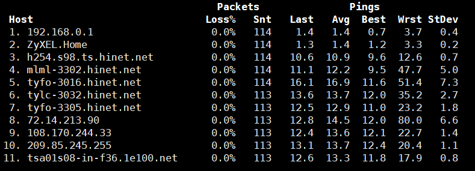

# Linux Network Analysis Tools

## Network information
### netstat
```
# netstat -ntup
Active Internet connections (w/o servers)
Proto Recv-Q Send-Q Local Address         Foreign Address         State         PID/Program name   
tcp        0      0 192.168.0.183:22      192.168.0.176:64914     ESTABLISHED   2245/sshd   
tcp        0     64 192.168.0.183:22      192.168.0.176:50109     ESTABLISHED   5804/sshd
```
```
# netstat -r
Kernel IP routing table
Destination     Gateway         Genmask         Flags   MSS Window  irtt  Iface
192.168.0.0     *               255.255.255.0   U         0 0          0  eth0
default         192.168.0.1     0.0.0.0         UG        0 0          0  eth0
```

### ss (socket statistics)
```
# ss
State       Recv-Q Send-Q        Local Address:Port         Peer Address:Port   
ESTAB       0      0             192.168.0.183:ssh          192.168.0.176:64914   
ESTAB       0      0             192.168.0.183:ssh          192.168.0.176:50109
```

## Ethernet layer tools
### arping
To detect duplicate IP
```
# arping -D 192.168.0.163 
ARPING 192.168.0.163 from 0.0.0.0 eth0
Unicast reply from 192.168.0.163 [08:00:27:13:63:5B]  1.141ms
Sent 1 probes (1 broadcast(s))
Received 1 response(s)
```

### ip neigh
```
# ip neigh
192.168.0.163 dev eth0 lladdr 08:00:27:13:63:5b STALE
192.168.0.1   dev eth0 lladdr 68:ff:7b:56:06:8e STALE
192.168.0.176 dev eth0 lladdr 9c:4e:36:9c:40:d8 DELAY
```

### mii-diag
```
# mii-diag eth0
Basic registers of MII PHY #0:  1340 796d 0141 0c24 0de1 01e0 0000 0000.
 Basic mode control register 0x1340: Auto-negotiation enabled.
  Restarted auto-negotiation in progress!
 You have link beat, and everything is working OK.
 Your link partner is generating 100baseTx link beat  (no autonegotiation).
   End of basic transceiver information.
```

## Routing diagonsis
### traceroute
```
# traceroute www.google.com
traceroute to www.google.com (216.58.200.228), 30 hops max, 60 byte packets
 1  192.168.0.1 (192.168.0.1)  1.100 ms  0.934 ms  1.132 ms
 2  ZyXEL.Home (192.168.1.1)  1.777 ms  1.635 ms  1.217 ms
 3  h254.s98.ts.hinet.net (168.95.98.254)  10.545 ms  10.415 ms  11.606 ms
 4  mlml-3302.hinet.net (168.95.221.66)  11.433 ms  12.002 ms  11.875 ms
 5  tyfo-3016.hinet.net (220.128.9.66)  22.035 ms tyfo-3016.hinet.net (220.128.9.70)  17.106 ms tyfo-3016.hinet.net (220.128.9.66)  21.720 ms
 6  tylc-3032.hinet.net (220.128.13.218)  14.279 ms  12.631 ms  13.201 ms
 7  tyfo-3305.hinet.net (220.128.12.13)  16.134 ms  16.786 ms  16.438 ms
 8  72.14.213.90 (72.14.213.90)  13.772 ms 72.14.215.0 (72.14.215.0)  12.139 ms  12.728 ms
 9  108.170.244.129 (108.170.244.129)  14.661 ms  14.234 ms 108.170.244.97 (108.170.244.97)  13.269 ms
10  72.14.238.17 (72.14.238.17)  13.928 ms 72.14.237.231 (72.14.237.231)  14.670 ms  14.528 ms
11  tsa03s01-in-f228.1e100.net (216.58.200.228)  12.610 ms  13.235 ms  14.319 ms
```

### mtr
```
mtr www.google.com
```


## DNS diagnosis
### nslookup
```
# nslookup www.google.com
Server:		192.168.0.1
Address:	192.168.0.1#53

Non-authoritative answer:
Name:	www.google.com
Address: 216.58.200.228
```

### host
```
# host www.google.com
www.google.com has address 216.58.200.228
www.google.com has IPv6 address 2404:6800:4008:801::2004
```

### dig
```
# dig www.google.com

; <<>> DiG 9.8.2rc1-RedHat-9.8.2-0.68.rc1.el6 <<>> www.google.com
;; global options: +cmd
;; Got answer:
;; ->>HEADER<<- opcode: QUERY, status: NOERROR, id: 19732
;; flags: qr rd ra; QUERY: 1, ANSWER: 1, AUTHORITY: 0, ADDITIONAL: 0

;; QUESTION SECTION:
;www.google.com.			IN	A

;; ANSWER SECTION:
www.google.com.		172	IN	A	172.217.160.100

;; Query time: 17 msec
;; SERVER: 192.168.0.1#53(192.168.0.1)
;; WHEN: Sun Sep 29 09:28:57 2019
;; MSG SIZE  rcvd: 48
```

## Advanced network tools
### nmap
```
# nmap -sn 192.168.0.0/24
...
Nmap scan report for 192.168.0.189
Host is up (0.014s latency).
MAC Address: 00:AE:FA:FD:75:01 (Unknown)
Nmap scan report for 192.168.0.240
Host is up (0.00022s latency).
MAC Address: 20:CF:30:B5:F5:BB (Asustek Computer)
Nmap done: 256 IP addresses (9 hosts up) scanned in 3.11 seconds
```

### nc (ncat)


```nc``` (```ncat```) reads and writes data across the network from the command line.

- Listen for connections on TCP port 8080.
  
  ```nc -l 8080```

- Send a file over TCP port 9899 from host2 (client) to host1 (server).
  
  ```HOST1$ nc -l 9899 > outputfile```

  ```HOST2$ nc HOST1 9899 < inputfile```

- Transfer in the other direction, turning nc into a "one file" server.

  ```HOST1$ nc -l 9899 < inputfile```

  ```HOST2$ nc HOST1 9899 > outputfile```

- Enable communication between host1 (client) and host2 (server).
 
  ```HOST1$ nc -l 8000```

  ```HOST2$ nc HOST1 8000```

- Port scanning.
  
  ```$ nc -z host.example.com 20-30```

### tcpdump
  