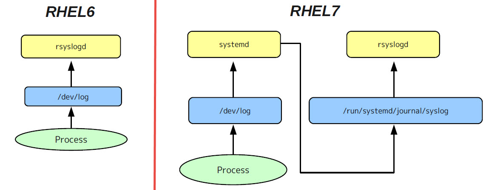

# Log Management

## journalctl
**journalctl** is a utility for querying and displaying logs from systemd’s journal (```systemd-journald.service```). 

### Viewing journal log messages:
```bash
$ journalctl
$ journalctl -b     # boot messages
# time range
$ journalctl --since "1 hour ago"  |  --since "2 days ago"  |  --since "2019-06-26 23:00:00" --until "2019-06-26 23:20:00" 
$ journalctl -u <service-name>.service      # show only specific service log
$ journalctl -k     # show only kernel messages
$ journalctl -f     # tail -f /var/log/messages
```


## systemd-journald
**systemd-journald** is a system service (```systemd-journald.service```) that collects and stores logging data. By default, the journal stores log data in ```/run/log/journal/```. Since /run/ is volatile, log data is lost at reboot. The configuration file is ```/etc/systemd/journald.conf```.
```bash
$ systemctl list-units --type service --all | grep journal
systemd-journal-flush.service   # Flush Journal to Persistent Storage
systemd-journald.service        # Journal Service
systemd-journald.socket         # Journal Socket

$ systemctl status systemd-journald.service
```


### Log flow
Journal events can be transferred to traditional syslog daemon (***syslogd***). The syslog daemon behaves like a normal journal client, and reads messages from the journal files, similarly to journalctl.


## *rsyslog.service* - System Logging Service (extened of traditional *syslogd*)
```bash
$ systemctl list-units --type service --all | grep rsyslog
$ systemctl status rsyslog.service
```

### Configuration file for *rsyslogd*: /etc/rsyslog.conf
```bash
#### MODULES ####
# The imjournal module bellow is now used as a message source instead of imuxsock.
$ModLoad imuxsock # provides support for local system logging (e.g. via logger command)
$ModLoad imjournal # provides access to the systemd journal
#$ModLoad imklog # reads kernel messages (the same are read from journald)
#$ModLoad immark  # provides --MARK-- message capability

# Provides TCP syslog reception
$ModLoad imtcp
$InputTCPServerRun 514
....

#### RULES ####
# Log anything (except mail) of level info or higher.
# Don't log private authentication messages!
*.info;mail.none;authpriv.none;cron.none                /var/log/messages
....

# ### begin forwarding rule ###
# remote host is: name/ip:port, e.g. 192.168.0.1:514, port optional
#*.* @@remote-host:514
```

### Configure centralized rsyslog server
1. Load **imtcp** module at remote-server.
2. Open **port 514** for firewall at remote-server.
   ```bash
   $ firewall-cmd --permanent --add-port=514/tcp
   $ firewall-cmd --reload
   ```
3. Add **\*.\* @@remote-host:514** in ***/etc/rsyslog.conf*** at client.
   ```bash
   $ echo "*.* @@remote-server:514" >> /etc/rsyslog.conf
   ```
4. Restart **rsyslog.service** in both hosts is necessary.

## *logrotate* - Log Rotation

### Configuration file for log rotation: /etc/logrotate.conf
```bash
# rotate log files weekly
weekly 

# keep 4 weeks worth of backlogs
rotate 4

# create new (empty) log files after rotating old ones
create

# use date as a suffix of the rotated file
dateext

# uncomment this if you want your log files compressed
#compress

# RPM packages drop log rotation information into this directory
include /etc/logrotate.d
```

### Configuration files for log rotation: /etc/logrotate.d/syslog
```bash
/var/log/cron
/var/log/maillog
/var/log/messages
/var/log/secure
/var/log/spooler
{
    # If the log file is missing, go on to the next one without issuing an error message.
    missingok

    # If sharedscripts is specified, the scripts are only run once.
    sharedscripts

    # The command will be executed after the log file is rotated.
    postrotate
        # HUP - Lets rsyslogd close all open files.
        /bin/kill -HUP `cat /var/run/syslogd.pid 2> /dev/null` 2> /dev/null || true
    endscript
}
```

### Tells logrotate to force the rotation:
```bash
$ logrotate -fv /etc/logrotate.conf
```
