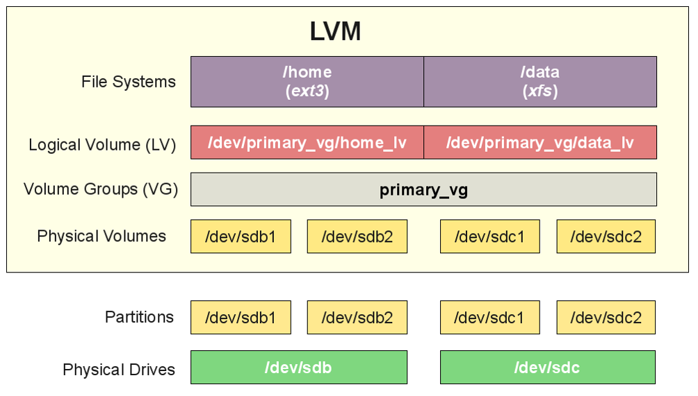
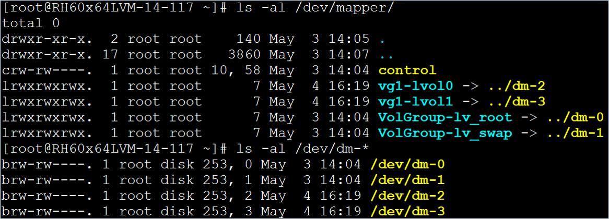
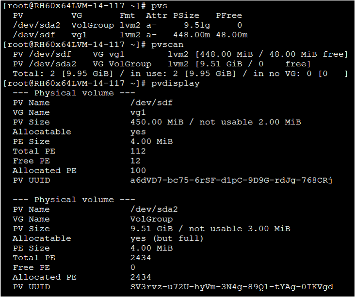
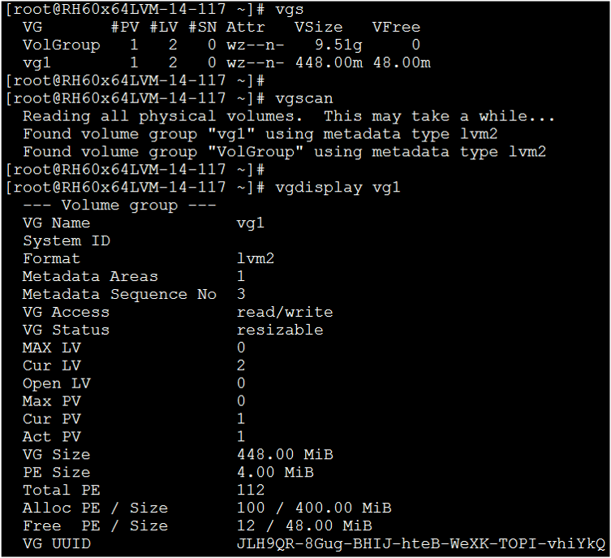
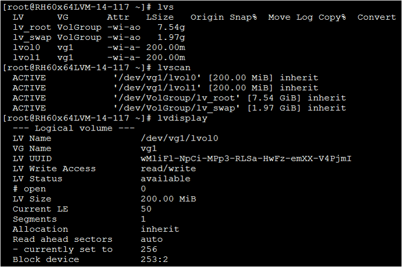
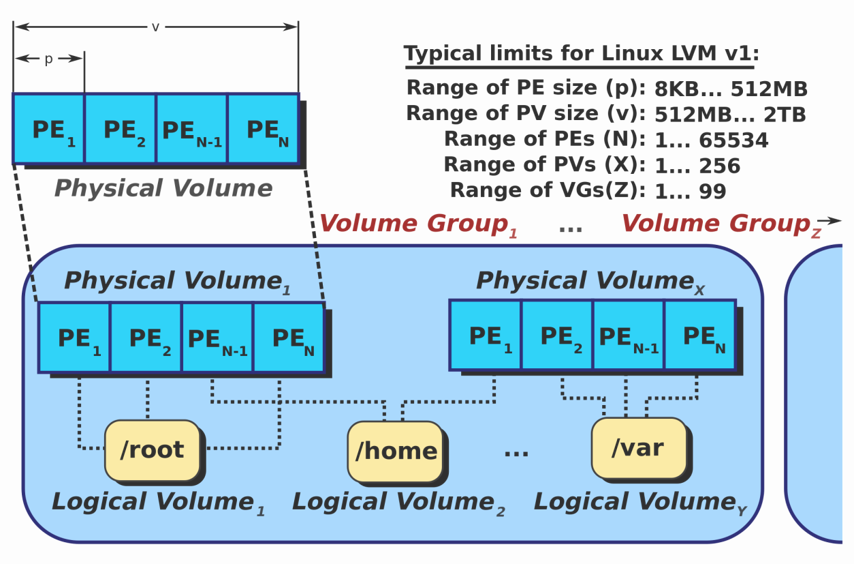

# Logical Volume Management


## The configuration file: /etc/lvm/lvm.conf
```
# By default we accept every block device:
    filter = [ "a/.*/" ]
# Exclude the cdrom drive
# filter = [ "r|/dev/cdrom|" ]
```

## Create PV - Physical Volume
```=
# pvcreate /dev/sdb
Physical volume "/dev/sdb" successfully created
#
# pvcreate /dev/sdc1
Physical volume "/dev/sdc1" successfully created
```  

```=
# pvs
WARNING: Ignoring duplicate config value: write_cache_state
  PV         VG   Fmt  Attr PSize    PFree   
  /dev/sdb        lvm2 ---     1.00g    1.00g
  /dev/sdc1       lvm2 ---  1023.00m 1023.00m
```

## Create VG - Volume Group
```
# vgcreate vg /dev/sdb /dev/sdc1
Volume group "vg" successfully created
```  

```=
# vgs
WARNING: Ignoring duplicate config value: write_cache_state
  VG   #PV #LV #SN Attr   VSize VFree
  vg     2   0   0 wz--n- 1.99g 1.99g
```

## Create LV - Logical Volume
```
# lvcreate -l 80%VG -n lv1 vg
Logical volume "lv1" created.
```

```=
# lvs
WARNING: Ignoring duplicate config value: write_cache_state
  LV   VG   Attr       LSize    Pool Origin Data%  Meta%  Move Log Cpy%Sync Convert
  lv1  vg   -wi-a----- 1.59g 
```  

```=
# vgs
WARNING: Ignoring duplicate config value: write_cache_state
  VG   #PV #LV #SN Attr   VSize VFree  
  vg     2   1   0 wz--n- 1.99g 408.00m
```

```=
# pvs
WARNING: Ignoring duplicate config value: write_cache_state
  PV         VG   Fmt  Attr PSize    PFree  
  /dev/sdb   vg   lvm2 a--  1020.00m      0 
  /dev/sdc1  vg   lvm2 a--  1020.00m 408.00m
```

```
# lvcreate -L 300M -n lv2 vg
Logical volume "lv2" created.
```

```=
# lvs
WARNING: Ignoring duplicate config value: write_cache_state
  LV   VG   Attr       LSize   Pool Origin Data%  Meta%  Move Log Cpy%Sync Convert
  lv1  vg   -wi-a-----   1.59g                                                    
  lv2  vg   -wi-a----- 300.00m 
```

```=
# vgs
WARNING: Ignoring duplicate config value: write_cache_state
  VG   #PV #LV #SN Attr   VSize VFree  
  vg     2   2   0 wz--n- 1.99g 108.00m
```

```=
# pvs
WARNING: Ignoring duplicate config value: write_cache_state
  PV         VG   Fmt  Attr PSize    PFree  
  /dev/sdb   vg   lvm2 a--  1020.00m      0 
  /dev/sdc1  vg   lvm2 a--  1020.00m 108.00m
```

## Format and mount LV device
```
# mkfs.ext3 /dev/mapper/vg-lv1
# mount /dev/mapper/vg-lv1 /mnt/
```

### The Device-Mapper device


### PV basic commands: pvs, pvscan, pvdisplay


### VG basic commands: vgs, vgscan, vgdisplay


### LV basic commands: lvs, lvscan, lvdisplay


## LVM Limitation
Depends on the PE (physical extent) definition.
- Maxium PE numbers: (2^16 = 65536)
- Default PE size: 4 MB
  
  

Create 8M PE: ```vgcreate -s 8m vg1 /dev/sdd1```

# Lab 1: LVM basic exercise.
1. Create 4 1GB disks for PV.
2. Create a VG which includes 3 PV disks.
3. Create 2 LVs of equal size.

## LVM Extend
1. pvcreate
   ```
   # pvcreate /dev/sdd
   Physical volume "/dev/sdd" successfully created
   ```

   ```=
   # pvs
   WARNING: Ignoring duplicate config value: write_cache_state
   PV         VG   Fmt  Attr PSize    PFree  
   /dev/sdb   vg   lvm2 a--  1020.00m      0 
   /dev/sdc1  vg   lvm2 a--  1020.00m 108.00m
   /dev/sdd        lvm2 ---     1.00g   1.00g
   ```

2. vgextend
   ```
   # vgextend vg /dev/sdd
   Volume group "vg" successfully extended
   ```
   
   ```=
   # vgs
   WARNING: Ignoring duplicate config value: write_cache_state
   VG   #PV #LV #SN Attr   VSize VFree
   vg     3   2   0 wz--n- 2.99g 1.10g
   ```

3. umount 
   ```
   #umount /dev/mapper/vg-lv1
   ```

4. lvextend {-l|--extents | -L|--size  [+] …}
   ```
   # lvextend -L +1G /dev/mapper/vg-lv1
   Size of logical volume vg/lv1 changed from 1.59 GiB (408 extents) to 2.59 GiB (664 extents).
   Logical volume lv1 successfully resized.
   ```

   ```=
   # vgs
   WARNING: Ignoring duplicate config value: write_cache_state
   VG   #PV #LV #SN Attr   VSize VFree  
   vg     3   2   0 wz--n- 2.99g 104.00m
   ```

   ```=
   # lvs
   WARNING: Ignoring duplicate config value: write_cache_state
   LV   VG   Attr       LSize   Pool Origin Data%  Meta%  Move Log Cpy%Sync Convert
   lv1  vg   -wi-a-----   2.59g                                                    
   lv2  vg   -wi-a----- 300.00m 
   ```

5. e2fsck & resize2fs
   ```
   # e2fsck -f /dev/mapper/vg-lv1
   # resize2fs /dev/mapper/vg-lv1
   ```

6. mount
   ```
   # mount /dev/mapper/vg-lv1 /mnt/
   ```

## LVM Shrink
1. unmount
2. e2fsck
3. resize2fs
   
   ```resize2fs /dev/vg1/lvol0 100M```

4. lvreduce {-l|--extents | -L|--size  [-] …} 
   
   ```lvreduce -L 100M /dev/vg1/lvol0```

5. vgreduce
   
   ```vgreduce vg1 /dev/sde2```

6. pvremove
   
   ```pvremove /dev/sde2```

