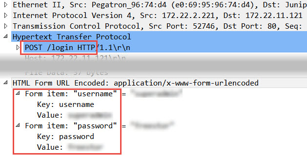
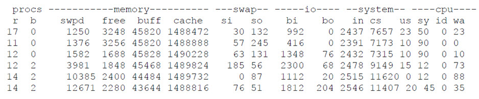

# Midterm Exam (11/5)

1. 使用者在進行系統升級的過程中誤把電腦的 boot loader 給破壞掉了，MBR 與 GRUB 皆已損壞，電腦已無法開機。所幸在 /root 底下仍留有 MBR 與 grub.conf 的備份，分別叫做 mbr.bak 與 grub.bak，所以仍有機會復原回來。你的任務就是修復這個錯誤，拯救水深火熱中的客戶。
   
   - Hint:
     - 你必須借助 Linux ISO 來開機，並從 rescue mode 來進行診斷和復原的工作。
     - 因為 GRUB 已經損壞，所以重新安裝 GRUB 是必要的。
     - grub.bak 的內容並不完整，你仍須要進一步去修正他。

   - 得分要件:
     - 正常重開機後，將下列命令的輸出畫面截圖，貼到你的 HackMD 筆記上:
       1. ll /boot/grub
       2. cat /boot/grub/grub.conf
   
2. 使用 Wireshark 解析這段封包，找出任一組 TCP 3-Way Handshake 的封包，以及 client 用來登入 web server 的 "username" 與 "password"。Client 與 web server 的 IP 分別是 172.22.2.221 與 172.22.11.121。

  - Hint:
    - 將 Wireshark filter 的條件限定在 client 或 server 的 IP 以及特定的 protocol 下，可以縮小搜尋的範圍。
    - 3-Way Handshake 的封包為三個一組，protocol 是 TCP。
    - Web server 登入的封包形式為 "POST /login"，protocol 是 HTTP。
      - Login 的資訊會顯示在 Wireshark 封包細節的視窗中，如下圖一。

  - 得分要件:
    - 將你所找到的資訊截圖並標示出來，貼到你的 HackMD 筆記上:
      1.  任一組 TCP 3-Way Handshake 的三個封包
      2.  Login 的 username 與 password 的值

    圖一:
    

3.  請問在下圖二的 vmstat 輸出中，以下那項對 vmstat 的解讀是合理的 (可複選) :
    1.  顯示系統正處於忙碌處理 IO 動作的狀態。
    2.  Swap 的需求是增加的，同時暗示著記憶體使用短缺。
    3.  因為有很多 IO 讀取的動作，使得記憶體的需求大增。
    4.  CPU 的反應時間低落，是受到 IO 效能不好的影響。

    圖二:
    

 ### 將以上你的答案與截圖結果紀錄在你的 HackMD 筆記上，email 給我。 
 ### 筆記上要記載你的學號與姓名，Email 信件主旨格式: [MIDEXAM_你的學號]
 ### 截止時間: 2019/11/5 9:40 PM
