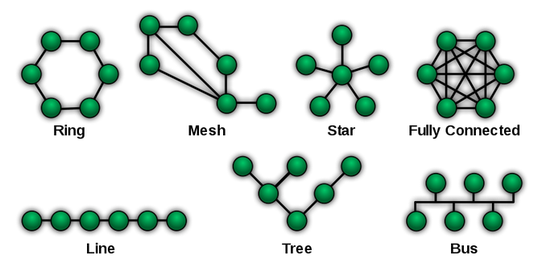
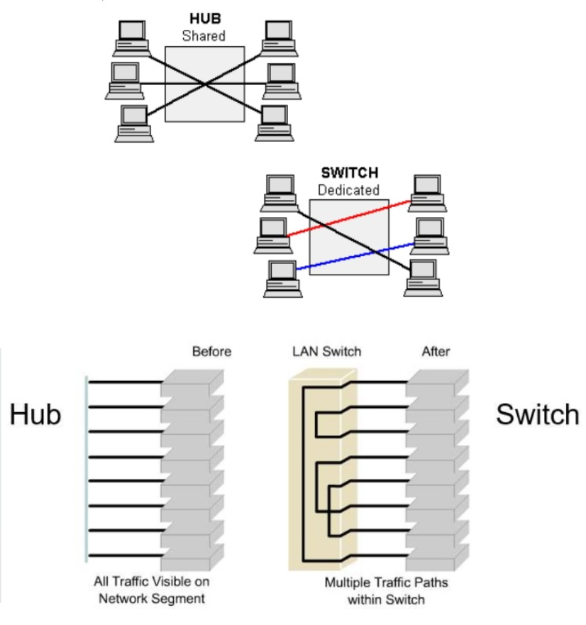

# Computer Network

What we need to care about the computer network?
- connect people
- extend services
- scale
- availibility
- security
So, we need to know how it work and how to manage it.
- network structure
- connection media
- access link
- switching and routing
- protocol
- network services
- performance: delay, data loss and throughput
- security: flaw, encryption and authentication

## Network Topology

## Connection Media
- UTP (Unshielded Twisted Pair)
- STP (Shielded Twisted Pain)
- Coaxial Cable
- Optical Fiber
- Radio Wave

## Scaling (Network Equipment)
- MODEM (MOdulation-DEModulation)
  - Cable MODEM
  - ADSL MODEM
- NIC (Network Interface Card)
- Repeater
- Hub
  - Multi-port Repeater
  - Broadcast
- Bridge
  - Connecting two network island
- Switched Hub
  - Multi-port Bridge
  - Layer 3 Switch
  
- Router
  -  A router works by looking at the IP address in the data packet and decides if it is for internal use or if the packet should move outside the network (to the WAN).
- Gateway
  - A gateway acts as a conversion from one protocol to another.

## Protocol
Different languages for different layers.
[Data Communications in Networks.](https://hackmd.io/rXs0HZ2qR2CWWV4peYQ4eg?view)

