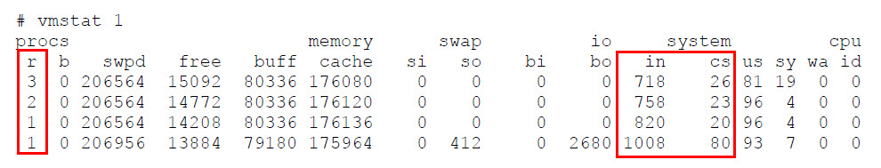
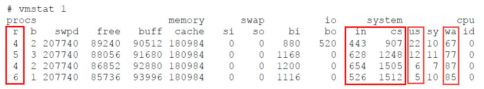
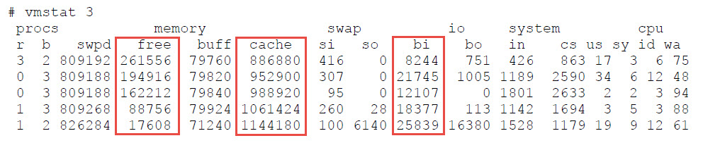

# Linux System and Performance Monitoring

Performance tuning is the process of finding bottlenecks in a system and achieving balance between the different sub-systems of an OS. These
sub-systems include: **CPU**, **Memory**, **IO** and **Network**.

Sub-system utilization will affect each other, e.q.:
- Large amounts of page-in IO requests can fill the memory queues.
- Full gigabit throughput on an Ehternet controller may consume a CPU.
- A CPU man be consumed attempting to maintain free memory queues.
- A large number of disk write requests from memory many consime a CPU and IO channels.

### Application type:
- **IO Bound**
  - An IO bound application requires heavy use of memory and the underlying storage system. 
  - An IO bound application does not require much of the CPU or network (unless the storage system is on a network). 
  - IO bound applications use CPU resources to make IO requests and then often go into a sleep state. 
  - Database applications are often considered IO bound applications.
- **CPU Bound**
  - A CPU bound application requires heavy use of the CPU. 
  - CPU bound applications require the CPU for batch processing and/or mathematical calculations. 
  - High volume web servers, mail servers, and any kind of rendering server are often considered CPU bound applications.

### Performance Monitoring Tools
Tool | Description
---|---
top | Display Linux processes
vmstat | Report virtual memory statistics
mpstat | Report processors related statistics
sar | Collect and report system activity information
ps | Report a snapshot of the current processes
iostat | Report CPU and IO statistics
iotop | I/O monitor
netstat | Print network connections, routing tables and interface statistics
dstat | Versatile tool for generating system resource statistics
iptraf-ng | Interactive Colorful IP LAN Monitor
ethtool | Query or control network driver and hardware settings
iperf3 | Perform network throughput tests

## CPU

### CPU utilization factors:
- Interrupt (**in**)
- Context Switch (**cs**)
  - A high amount of context switching is acceptable if CPU utilization stays within balance:
    - 65% – 70% User Time
    - 30% - 35% System Time
    - 0% - 5% Idle Time
- Run Queue (Load)
  - (**r**) Runnable threads but CPU is not available to execute them.
    - A run queue should have no more than 1-3 threads queued per processor.
  - (**b**) Blocked and waiting on IO request to finish.
- User Time (**us**)
  - The percentage of time a CPU spends executing process threads in the user space.
- System Time (**sy**)
  - The percentage of time the CPU spends executing kernel threads and interrupts.
  - When the CPU spends more time in system mode, it is more than likely overloaded and trying to reschedule priorities.
- Wait IO (**wa**)
  - The percentage of time a CPU spends idle because ALL process threads are blocked waiting for IO requests to complete.
- Idle (**id**)
  - The percentage of time a processor spends in a completely idle state.

### Normal CPU unilization

- There are a high amount of interrupts (**in**) and a low amount of context switches (**cs**). It appears that a single process is making requests to hardware devices.
- The run queue (**r**) is at the acceptable limits.

### CPU overloaded

- The amount of context switches is higher than interrupts.
- THe wait on IO (**wa**) is high; the user time (**us**) is low.
- The run queue (**r**) is fill.

## Memory
### Virtual Memory and page:
- OS use disk (**swap**) as virtual memory.
- Disk IO is slower than using RAM.
- Virtual memory is divided into pages.

### Memory statistics in the vmstat:
- **swpd**
  - The amount of virtual memory currently in use. As free memory reaches low thresholds, more data is paged to the swap device.
- **free**
  - The amount of physical RAM currently available to running applications.
- **buff**
  - The amount of physical memory in the buffer cache as a result of read() and write() operations.
- **cache** 
  - The amount of memory used as cache.
- **si** 
  - Amount of memory swapped in from disk (/s).
- **so** 
  - Amount of memory swapped to disk (/s).
- **bo**
  - Blocks received from a block device (blocks/s).
- **bi** 
  - Blocks sent to a block device (blocks/s).

### Heavy utilization of virtual memory in an IO application

- The large amount of disk blocks are paged in (**bi**) from the filesystem.
- The amount of **cache** is growing. 
- The amount of **free** memory left decreased (17 MB left).

## IO

## Network

