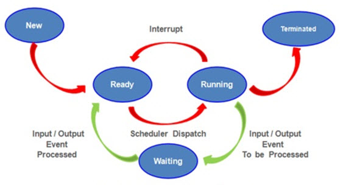
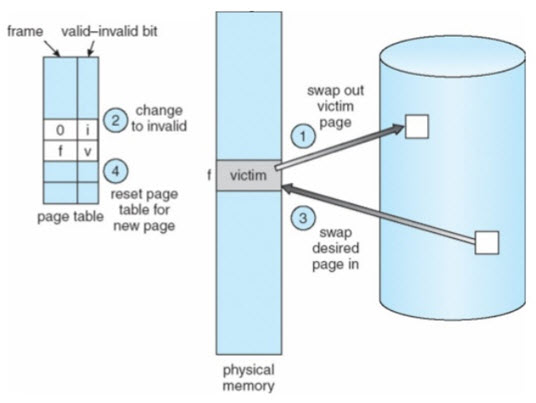
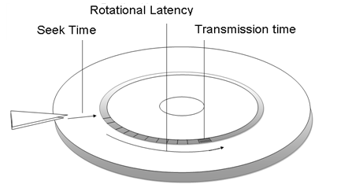
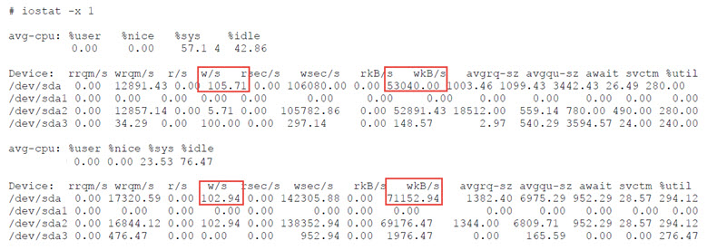
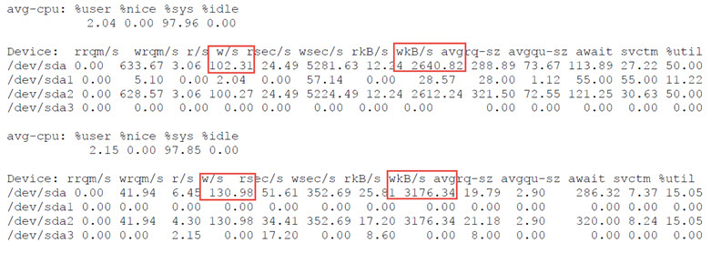
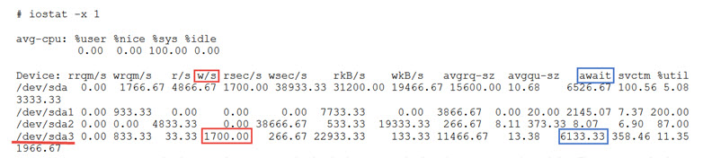

# Linux System and Performance Monitoring

Performance tuning is the process of finding bottlenecks in a system and achieving balance between the different sub-systems of an OS. These sub-systems include: **CPU**, **Memory**, **IO** and **Network**.

Sub-system utilization will affect each other, e.q.:
- Large amounts of page-in IO requests can fill the memory queues.
- Full gigabit throughput on an Ehternet controller may consume a CPU.
- A CPU man be consumed attempting to maintain free memory queues.
- A large number of disk write requests from memory many consime a CPU and IO channels.

### Application type:
- **IO Bound**
  - An IO bound application requires heavy use of memory and the underlying storage system. 
  - An IO bound application does not require much of the CPU or network (unless the storage system is on a network). 
  - IO bound applications use CPU resources to make IO requests and then often go into a sleep state. 
  - Database applications are often considered IO bound applications.
- **CPU Bound**
  - A CPU bound application requires heavy use of the CPU. 
  - CPU bound applications require the CPU for batch processing and/or mathematical calculations. 
  - High volume web servers, mail servers, and any kind of rendering server are often considered CPU bound applications.


### Performance Monitoring Tools
Tool | Description
---|---
top | Display Linux processes
vmstat | Report virtual memory statistics
free | Display amount of free and used memory in the system
mpstat | Report processors related statistics
sar | Collect and report system activity information
ps | Report a snapshot of the current processes
pstree | Display a tree of processes
iostat | Report CPU and IO statistics
iotop | I/O monitor
netstat | Print network connections, routing tables and interface statistics
dstat | Versatile tool for generating system resource statistics
iptraf-ng | Interactive Colorful IP LAN Monitor
ethtool | Query or control network driver and hardware settings
iperf3 | Perform network throughput tests


## CPU

#### Process status diagram:


### CPU utilization factors:
- Interrupt (**in**)
- Context Switch (**cs**)
  - OS saves the state of active process and restore the state of new process.
  - A high amount of context switching is acceptable if CPU utilization stays within balance:
    - 65% – 70% User Time
    - 30% - 35% System Time
    - 0% - 5% Idle Time
- Run Queue (Load)
  - (**r**) Runnable threads but CPU is not available to execute them.
    - A run queue should have no more than 1-3 threads queued per processor.
  - (**b**) Blocked and waiting on IO request to finish.
- User Time (**us**)
  - The percentage of time a CPU spends executing process threads in the user space.
- System Time (**sy**)
  - The percentage of time the CPU spends executing kernel threads and interrupts.
  - When the CPU spends more time in system mode, it is more than likely overloaded and trying to reschedule priorities.
- Wait IO (**wa**)
  - The percentage of time a CPU spends idle because ALL process threads are blocked waiting for IO requests to complete.
- Idle (**id**)
  - The percentage of time a processor spends in a completely idle state.

### Normal CPU unilization


- There are a high amount of interrupts (**in**) and a low amount of context switches (**cs**). It appears that a single process is making requests to hardware devices.
- The run queue (**r**) is at the acceptable limits.

### CPU overloaded


- The amount of context switches is higher than interrupts.
- THe wait on IO (**wa**) is high; the user time (**us**) is low.
- The run queue (**r**) is fill.


## Memory
### Virtual Memory and page:
- OS use disk (**swap**) as virtual memory.
- Disk IO is slower than using RAM.
- Virtual memory is divided into pages.



### Memory statistics in the vmstat:
- **swpd**
  - The amount of virtual memory currently in use.
  - If the swap device sustained, the memory is shortage on the system.
  - As free memory reaches low thresholds, more data is paged to the swap device.
- **free**
  - The amount of physical RAM currently available to running applications.
  - Low amounts of free memory are a good sign that caches are effectively used, unless there are sustained writes to the swap device and disk.
- **buff**
  - The amount of physical memory in the buffer cache as a result of read() and write() operations.
- **cache** 
  - The amount of memory used as cache.
- **si** 
  - Amount of memory swapped in from disk.
  - Read from swap disk then write to RAM.
- **so** 
  - Amount of memory swapped to disk.
  - Write to the swap disk.
- **bo**
  - Blocks received from (read) a block device (blocks/s).
- **bi** 
  - Blocks sent to (write) a block device (blocks/s).

### Heavy utilization of virtual memory in an IO application


- The large amount of disk blocks are written (**bi**) from the filesystem.
- The amount of **cache** is growing as the amount of **free** memory decreasing (17 MB left).


## IO

### The disk latency



### IOPS

Device | Type | IOPS | Interface
---|---|---|---
7200 RPM SATA HD | HD | 75 ~ 100 | SATA II (3 Gbit/s)
10000 RPM SATA HD | HD | 125 ~ 150 | SATA II
15000 RPM SAS HD | HD | 175 ~ 210 | SAS
Intel X25-M G2（MLC）| SSD | ~8600 | SATA II
OCZ Vertex 3 | SSD | ~60000 | SATA III (6 Gbit/s)

```
E.q.

- 10000 RPM = 166 RPS (1000/60).
- A disk rotation: 1/166 = 0.006 seconds = 6 millisecond (ms).
- Average rotation latenvy: 6/2 = 3 ms.
- Assume average seek time + transmission time are 5 ms, then total service time for an IO is 8 ms.
- 1/8 x 1000 = 125 IOPS.
```

#### IOPS x Transfer Size (Bytes) = Byte per second.

### Sequential I/O
- Large amounts of data to be read/write swquentially at once.
- Sequential workload performance relies on the ability to move large amounts of data as fast as possible.
- E.q., database executing large queries and streaming media services.  



- The amount of data writen per IO for /dev/sda increases:
  - 53040/105 = 505 KB
  - 71152/102 = 697 KB

### Random I/O
- The I/O requests are rather small.
- Random access workload relies on how many requests can be processed at once.
- E.q., web and mail servers.



- The IOPS for write stays almost the same as the sequential output (102~130).
- The IO size is smaller and remained.
  - 2604/102 = 23 KB
  - 3176/130 = 24 KB

#### High IO requests:

- The /dev/sda3 is swap device
- The write request (**w/s**) and wait time (**await**) are high.
- Swap device busy indicates high demand of virtual memory.
  
## Network

### iperf
Network throughput test.

```
HOST1$ iperf3 -s
-----------------------------------------------------------
Server listening on 5201
-----------------------------------------------------------
Accepted connection from 172.22.14.73, port 55450
[  5] local 172.22.14.84 port 5201 connected to 172.22.14.73 port 55452
[ ID] Interval           Transfer     Bandwidth
[  5]   0.00-1.00   sec  1.06 GBytes  9.13 Gbits/sec                  
[  5]   1.00-2.00   sec  1.06 GBytes  9.08 Gbits/sec                  
[  5]   2.00-3.00   sec  1.12 GBytes  9.59 Gbits/sec                  
[  5]   3.00-4.00   sec  1021 MBytes  8.57 Gbits/sec                  
[  5]   4.00-5.00   sec  1.10 GBytes  9.41 Gbits/sec                  
[  5]   5.00-6.00   sec  1.14 GBytes  9.80 Gbits/sec                  
[  5]   6.00-7.00   sec  1.10 GBytes  9.48 Gbits/sec                  
[  5]   7.00-8.00   sec  1.15 GBytes  9.85 Gbits/sec                  
[  5]   8.00-9.00   sec  1.19 GBytes  10.3 Gbits/sec                  
[  5]   9.00-10.00  sec  1.13 GBytes  9.72 Gbits/sec                  
[  5]  10.00-10.03  sec  36.9 MBytes  9.16 Gbits/sec                  
- - - - - - - - - - - - - - - - - - - - - - - - -
[ ID] Interval           Transfer     Bandwidth
[  5]   0.00-10.03  sec  0.00 Bytes  0.00 bits/sec                  sender
[  5]   0.00-10.03  sec  11.1 GBytes  9.49 Gbits/sec                  receiver
```

```
HOST2 $ # iperf3 -c 172.22.14.84
Connecting to host 172.22.14.84, port 5201
[  4] local 172.22.14.73 port 55452 connected to 172.22.14.84 port 5201
[ ID] Interval           Transfer     Bandwidth       Retr  Cwnd
[  4]   0.00-1.00   sec  1.10 GBytes  9.48 Gbits/sec    0    829 KBytes       
[  4]   1.00-2.00   sec  1.05 GBytes  9.06 Gbits/sec    0    868 KBytes       
[  4]   2.00-3.00   sec  1.12 GBytes  9.60 Gbits/sec    0    906 KBytes       
[  4]   3.00-4.00   sec  1.00 GBytes  8.60 Gbits/sec    0    919 KBytes       
[  4]   4.00-5.00   sec  1.09 GBytes  9.38 Gbits/sec    0    926 KBytes       
[  4]   5.00-6.00   sec  1.13 GBytes  9.74 Gbits/sec    0    963 KBytes       
[  4]   6.00-7.00   sec  1.11 GBytes  9.53 Gbits/sec    0    966 KBytes       
[  4]   7.00-8.00   sec  1.15 GBytes  9.88 Gbits/sec    0    983 KBytes       
[  4]   8.00-9.00   sec  1.19 GBytes  10.2 Gbits/sec    0    987 KBytes       
[  4]   9.00-10.00  sec  1.13 GBytes  9.74 Gbits/sec    0   1018 KBytes       
- - - - - - - - - - - - - - - - - - - - - - - - -
[ ID] Interval           Transfer     Bandwidth       Retr
[  4]   0.00-10.00  sec  11.1 GBytes  9.52 Gbits/sec    0             sender
[  4]   0.00-10.00  sec  11.1 GBytes  9.52 Gbits/sec                  receiver

iperf Done.
```

### iptraf 
Interactive IP LAN monitor.


