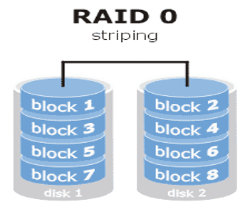
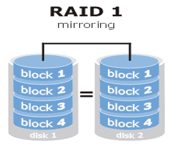
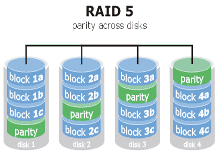
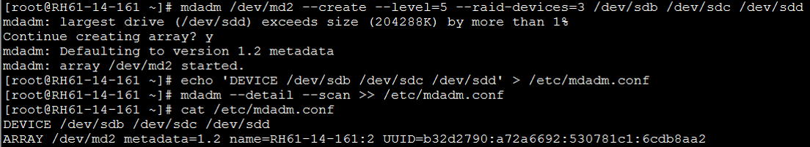
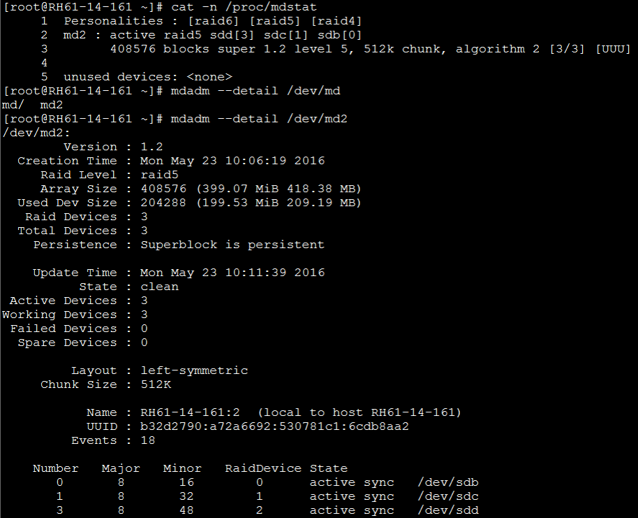

# RAID




### Create Software RAID
```mdadm --create /dev/md# --level=(#|NAME) --raid-devices=# DEVICE [--spare-devices=# DEVICE]``` 



### RAID status
```cat -n /proc/mdstat```

```mdadm --detail /dev/md2```



### RAID failure and remove disk
1. stop RAID
   
   ```mdadm --stop /dev/md2```

2. fail the RAID
   
   ```mdadm /dev/md2 --fail /dev/sdd```

3. remove the RAID
   
   ```mdadm /dev/md2 --remove /dev/sdd```

### RAID allocate disk and resize
1. ```mdadm --manage /dev/md2 --add /dev/sdd```
2. ```mdadm /dev/md2 --stop /dev/md2```
3. ```mdadm --assemble /dev/md2```
4. ```mdadm --grow /dev/md2 --size=max```
5. ```resize2fs  /dev/md2```

### Create Hyprid-RAID (RAID 50)
1. create RAID 5 - md0
   
   ```mdadm --create /dev/md0 --raid-devices=3  --level=5 /dev/sdb1 /dev/sdc1 /dev/sdd1```

2. create another RAID 5 - md1
   
   ```mdadm --create /dev/md1 --raid-devices=3  --level=5 /dev/sde1 /dev/sdf1 /dev/sdg1```

3. create RAID 0 of 2 RAID 5 = RAID 50 - dm3
   
   ```mdadm --create /dev/md3 --raid-devices=2  --level=0 /dev/md0 /dev/md1```

### RAID remove
1. stop RAID
   
   ```mdadm --stop /dev/md2```

2. remove superblock
   
   ```mdadm --zero-superblock /dev/sdb /dev/sdc /dev/sdd```

3. remove configure file
   
   ```rm /etc/mdadm.conf```

