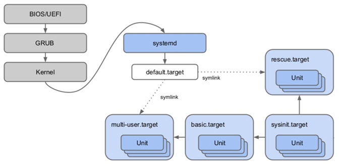
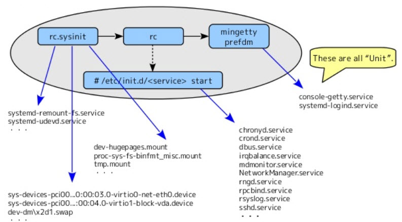
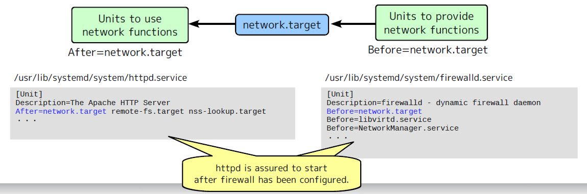
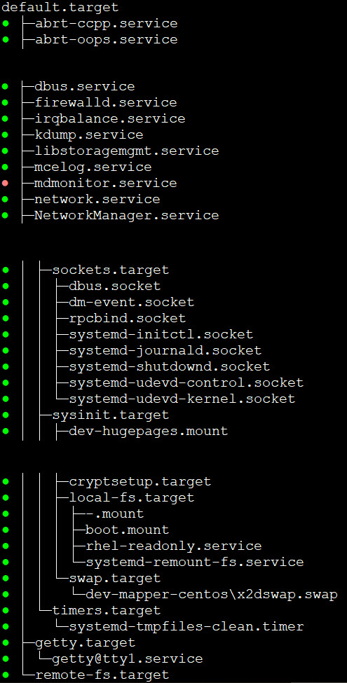
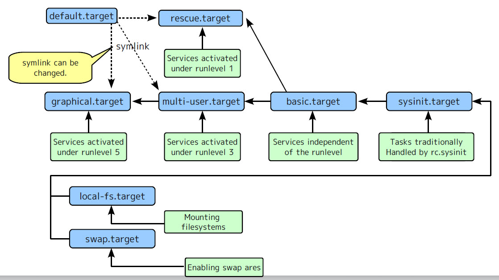
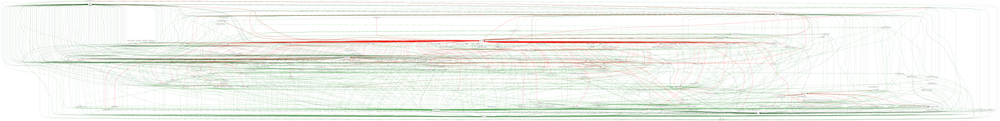

# Working with the *systemd*
The ***systemd***, system and service manager, is responsible for controlling how services are started, stopped and managed. It is backward compatible with **init scripts** used by previous versions of Linux. The ***systemd*** management command is ```systemctl```.


### Objective of *systemd*:
- Reducing the system startup time.
- Handling dynamic system configuration changes.
- Providing the standard method for service start and stop.
- Controling the process execution environment (**cgroup**).


## How *systemd* boots the system?
Kernel runs the ```/sbin/init``` which links to ```/lib/systemd/systemd```. It runs the default target, ```/etc/systemd/system/default.target```, which link to ```/lib/systemd/system/multi-user.target``` for a text login or ```/usr/lib/systemd/system/graphical.target``` for a GUI environment.



### systemd service units v.s. init scripts

Previous versions of Linux use ***init scripts*** located in the ```/etc/rc.d/init.d/``` directory to start and stop services. In RHEL 7, these init scripts have been replaced with ***systemd service units***. 




Two most essential components of ***systemd*** are **Unit** and **Target**. The **unit** represents a service resource; the **target** describes a stage about what service is needed at what time.

## Unit
The basic item of configuration is the **unit** file. A **unit** file ```/usr/lib/systemd/system/<resource name>.<unit type>``` basically describes a resource and tells **systemd** how to activate that resource. 

Unit configuration files are placed in two location:
- Installed default files: ``/usr/lib/systemd/system/``
- Customized override files: ``/etc/systemd/system/``

unit type | function | extention
---|---|---
service unit | Start and control daemons and the processes they consist of. When activated, an associated daemon is started. | .service
target unit | Replaces init run levels. This is used to group other units when defining unit dependencies, or to provide a timing synchronization point when defining order relationships. | .target
socket unit | Describes a network or IPC socket, or a FIFO buffer that systemd uses for socket-based activation. | .socket
mount unit | Contorl mount points in the file system. When activated, an associated filesystem is mounted. This is automatically generated from /etc/fstab. | .mount
device unit | When udev recognizes a new device, the associated unit is defined and activated automatically. This is automatically generated by udev. | .device
swap unit | When activated, an associated swap area is enabled. This is automatically generated from /etc/fstab. | .swap

List current active units:
```bash
$ systemctl list-units
```
List all loaded units:
```bash
$ systemctl list-units --all
```
List all unit file:
```bash
$ systemctl list-unit-files
$ ls /usr/lib/systemd/system/
```
Display a unit file of a service:
```bash
$ systemctl cat <service-name>.service
```
Checking server properties:
```bash
$ systemctl show <service-name>.service
```

### Common services
service name | description
---|---
atd.service | one time task scheduler
crond.service | routine task scheduler
NetworkManager.service | network management
quotacheck.service | disk quota check
syslog.service | system log management
sendmail.service | email service
smartd.service | hard disk health check
sshd.service | secure remote login
httpd.service | web service
cups.socket | printer service

### Check service status:
```bash
$ systemctl status <service-name>
```
```
$ systemctl status sshd
● sshd.service - OpenSSH server daemon
   Loaded: loaded (/usr/lib/systemd/system/sshd.service; enabled; vendor preset: enabled)
   Active: active (running) since Mon 2019-09-23 10:35:47 CST; 1 months 0 days ago
     Docs: man:sshd(8)
           man:sshd_config(5)
 Main PID: 1360 (sshd)
   CGroup: /system.slice/sshd.service
           └─1360 /usr/sbin/sshd -D

Sep 23 10:35:46 Coconut-14-73 systemd[1]: Starting OpenSSH server daemon...
Sep 23 10:35:47 Coconut-14-73 sshd[1360]: Server listening on 0.0.0.0 port 22.
Sep 23 10:35:47 Coconut-14-73 sshd[1360]: Server listening on :: port 22.
Sep 23 10:35:47 Coconut-14-73 systemd[1]: Started OpenSSH server daemon.
Sep 23 10:37:16 Coconut-14-73 sshd[1929]: Accepted password for root from 172.22.2.221 port 64155 ssh2
```
```
$ systemctl status firewalld
● firewalld.service - firewalld - dynamic firewall daemon
   Loaded: loaded (/etc/systemd/system/firewalld.service; enabled; vendor preset: enabled)
   Active: inactive (dead) since Tue 2019-10-01 13:50:23 CST; 3 weeks 2 days ago
     Docs: man:firewalld(1)
  Process: 921 ExecStart=/usr/sbin/firewalld --nofork --nopid $FIREWALLD_ARGS (code=exited, status=0/SUCCESS)
 Main PID: 921 (code=exited, status=0/SUCCESS)

Sep 23 10:35:40 Coconut-14-73 systemd[1]: Starting firewalld - dynamic firewall daemon...
Sep 23 10:35:42 Coconut-14-73 systemd[1]: Started firewalld - dynamic firewall daemon.
Oct 01 13:50:22 Coconut-14-73 systemd[1]: Stopping firewalld - dynamic firewall daemon...
Oct 01 13:50:23 Coconut-14-73 systemd[1]: Stopped firewalld - dynamic firewall daemon.
```

### Check service configurations:
```bash
$ cat /usr/lib/systemd/system/<service name>.service

$ systemctl cat <service-name>.service
```

### Edit service unit (configuration) file:
```bash
$ systemctl edit --full <service-name>.service
```

### Reload systemd configuration files:
```bash
$ systemctl daemon-reload
```

## The equivalent tools between SysV init utils and systemd systemctl

SysV init tool | systemctl | Description
---|---|---
service service-name start | systemctl start service-name | Start service
service service-name stop | systemctl stop name | Stop service
service service-name restart | systemctl restart name | Restarts service
service service-name reload | systemctl reload name | Reloads the configuration for service
service service-name status | systemctl status service-name | Displays the current status of service
service –status-all | systemctl | Displays the status of all current services
chkconfig service-name on | systemctl enable service-name | Enable service to run on startup 
chkconfig service-name off | systemctl disable service-name | Disables service to run on startup 
chkconfig –list service-name | systemctl is-enabled service-name | Verify whether service is currently enabled
chkconfig –list | systemctl –type=service | Displays all services and tells whether they are enabled or disabled
shutdown -h now | systemctl poweroff | Power-off the machine (halt)
shutdown -r now | systemctl reboot | Reboot the system

[Check the major difference between RHEL 7 and RHEL 6](https://hackmd.io/d_ADDCXjR1SyBzpcOtfV0Q)


### E.q. The firewalld.service unit file ```/usr/lib/systemd/system/firewalld.service```:
```bash
[Unit]
Description=firewalld - dynamic firewall daemon
Before=network-pre.target   
# Before: this (firewalld) service will be started BEFORE the 'network-pre.target'
Wants=network-pre.target    
# Wants: Pre-require units of this unit. The firewalld WANTS the network-pre.target to start, but not necessary.
After=dbus.service          
# After: this (firewalld) service will be started AFTER the 'dbus.service'
After=polkit.service
Conflicts=iptables.service ip6tables.service ebtables.service ipset.service
Documentation=man:firewalld(1)

[Service]
EnvironmentFile=-/etc/sysconfig/firewalld
ExecStart=/usr/sbin/firewalld --nofork --nopid $FIREWALLD_ARGS
ExecReload=/bin/kill -HUP $MAINPID
# supress to log debug and error output also to /var/log/messages
StandardOutput=null
StandardError=null
Type=dbus
BusName=org.fedoraproject.FirewallD1
KillMode=mixed

[Install]
WantedBy=multi-user.target  
# WantedBy: the firewalls is WANTEDBY the 'multi-user.target', but not necessary. The firewalld will be started after 'multi-user.target' starts.
Alias=dbus-org.fedoraproject.FirewallD1.service
```

### Unit order and dependency
- Dependency means if unit A is activated, unit B must be activated, too.
    - Requires: A list of units that this unit depends on, which is started when this unit is started
    - Wants: A weaker form of Requires: the units listed are started but the current unit is not stopped if any of them fail
    - Conflicts: A negative dependency: the units listed are stopped when this one is started and, conversely, if one of them is started, this one is stopped
    
- Order means unit A must be activated before/after unit B.
  - Before: This unit should be started before the units listed
  - After: This unit should be started after the units listed



Shows units required and wanted by the specified unit.
```bash
$ systemctl list-dependencies [service-name]
$ systemctl show <service-name> | egrep 'After|Before'
```






### Display the status of all services:
```bash
#SysV utility (RHEL6)
$ service --status-all

$ chkconfig --list 
$ chkconfig --list <service-name>
```
```bash
#systemd utility
$ systemctl list-units
$ systemctl list-units --type service
$ systemctl list-units --type service --all
$ systemctl list-unit-files
```

### Starting and stopping services:
```bash
#SysV utility (RHEL6)
$ service <service-name> status | start | stop | restart 

#systemd utility
$ systemctl status | start | stop | restart | reload <service-name>
```

### Enabling and disabling services:
```bash
#SysV utility (RHEL6)
$ chkconfig <service-name> on | off

#systemd utility
$ systemctl enable | disable <service-name>
```

Enable service will create a symbolic link to the service's configuration file (```/usr/lib/systemd/system/<service-name>.service```) at the **.wants** directory which specified by the **"WantedBy="** option. The ```<unit name>.wants``` directories are used to configure autostartup of services.

For example:
```bash
$ systemctl enable firewalld.service
Created symlink from /etc/systemd/system/multi-user.target.wants/firewalld.service to /etc/systemd/system/firewalld.service.

$ ll /etc/systemd/system/multi-user.target.wants/
lrwxrwxrwx. 1 root root 41 Aug  6 14:42 firewalld.service -> /usr/lib/systemd/system/firewalld.service
```

### Check if service is enabled:
```bash
$ systemctl is-enabled <service-name>
```

### Show service detail info:
```bash
$ systemctl show <service-name>
```


## Target
A ***target unit*** is a special kind of unit file because it doesn’t represent a single resource; rather, it groups other units to bring the system to a particular state. Target units in systemd loosely resemble run levels in System V in the sense that each target unit represents a particular system state.

In RHEL 7, *run levels* have been replaced with *systemd target units*. Target units have a **.target** extension and similar to run levels. Check target for run levels:

```bash
$ ll /usr/lib/systemd/system/runlevel*.target
```

run level | target units | description
---|---|---
0 | runlevel0.target, poweroff.target | shutdown and power off
1 | runlevel1.target, rescue.target | rescue shell for maintenance mode
2, 3, 4 | runlevel[234].target, multi-user.target | non-graphical multi-user mode
5 | runlevel5.target, graphical.target | graphical multi-user mode
6 | runlevel6.target, reboot.target | system reboot

### The target unit file example - /usr/lib/systemd/system/multi-user.target
```
[Unit]
Description=Multi-User System
Documentation=man:systemd.special(7)
Requires=basic.target
Conflicts=rescue.service rescue.target
After=basic.target rescue.service rescue.target
AllowIsolate=yes
```

### List the currently active targets:
```bash
$ systemctl list-units --type target
```

### Check default target mode (run level):
```bash
# RHEL6: /etc/inittab
$ systemctl get-default
$ ll /etc/systemd/system/default.target
$ runlevel
```

### Set default target mode:
```bash
$ systemctl set-default multi-user.target
```

### Changing system states:
```bash
$ systemctl reboot      #reboot (reboot.target)
$ systemctl poweroff    #power off (poweroff.target)
$ systemctl emergency   #put in emergency mode (emergency.target)
$ systemctl default     #back to default mode (multi-user.target)
```

### Viewing log messages:
```bash
$ journalctl
$ journalctl -b     # boot messages
# time range
$ journalctl --since "1 hour ago"  |  --since "2 days ago"  |  --since "2019-06-26 23:00:00" --until "2019-06-26 23:20:00" 
$ journalctl -u <service-name>.service
$ journalctl -k     # show only kernel messages
$ journalctl -f     # tail -f /var/log/messages
```


### Use *systemd-analyze* to check server's boot problem
```bash
$ systemd-analyze
$ systemd-analyze time 
$ systemd-analyze blame
$ systemd-analyze critical-chain
$ systemd-analyze plot > systemd.svg
$ systemd-analyze dot | dot -Tsvg > systemd2.svg
```

