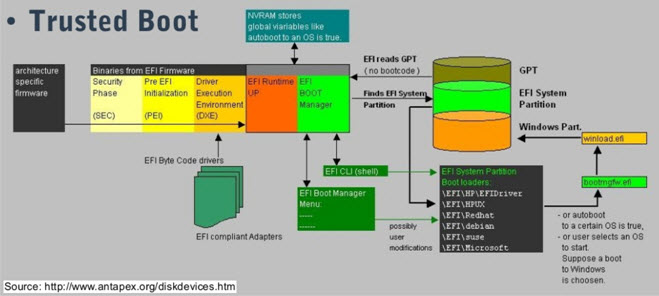
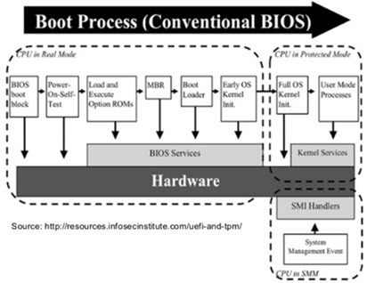

# UEFI (Unified Extensible Firmware Interface)


The advantage of UEFI:
- supporting larger hard drives (The traditional BIOS can only boot from drives of 2.1 TB or less.)
- faster boot times (The BIOS must run in 16-bit processor mode, and only has 1 MB of space to execute in.)
- uses the GPT partitioning scheme instead of MBR
- Secure Boot or Trusted Boot option
- GUI and mouse available


## GPT (GUID Partition Table) disk with UEFI
- UEFI support the boot disk over 2.2 Terabyte.
- GPT disks use logical block addressing (LBA).
- To preserve backward compatibility with MBR disks, the first sector (LBA 0) of GPT is reserved for MBR data and it is called “protective MBR”.
- The primary GPT table includes, by default, 128 partition entries. (MBR can only has 4 partitions)
- The secondary GPT table is identical to the primary GPT table. It is used as a backup table for recovery. 
- Uses CRC32 fields for improved data integrity.
  


## Disk partition and boot loader for UEFI
- EFI is only used when UEFI is enabled. 
- EFI System Partition (ESP) contains boot loader. The ESP mount point is ```/boot/efi```.
- The EFI software provided by Red Hat is stored in ```/boot/efi/EFI/redhat/```.

```
$ fdisk /dev/sda -l
WARNING: fdisk GPT support is currently new, and therefore in an experimental phase. Use at your own discretion.

Disk /dev/sda: 17.2 GB, 17179869184 bytes, 33554432 sectors
Units = sectors of 1 * 512 = 512 bytes
Sector size (logical/physical): 512 bytes / 512 bytes
I/O size (minimum/optimal): 512 bytes / 512 bytes
Disk label type: gpt

#         Start          End    Size  Type            Name
 1         2048       411647    200M  EFI System      EFI System Partition
 2       411648      1435647    500M  Microsoft basic 
 3      1435648     33552383   15.3G  Linux LVM
```

```
$ partx /dev/sda
NR   START      END  SECTORS  SIZE NAME                 UUID
 1    2048   411647   409600  200M EFI System Partition babe9ef5-b6df-4cc1-a29b-5f1fd77d6f0b
 2  411648  1435647  1024000  500M                      5d19f200-4db2-49b2-99fa-84930b703ebe
 3 1435648 33552383 32116736 15.3G                      2bad62a6-735a-4d31-a4a4-f192427580a9
```

```
$ mount
/dev/sda2 on /boot type xfs (rw,relatime,...)
/dev/sda1 on /boot/efi type vfat (rw,relatime,...)
```

```
/boot/
├── config-3.10.0-327.el7.x86_64
├── efi
│   └── EFI
│       ├── BOOT
│       │   ├── BOOTX64.EFI
│       │   └── fallback.efi
│       └── centos
│           ├── BOOT.CSV
│           ├── fonts
│           │   └── unicode.pf2
│           ├── gcdx64.efi
│           ├── grub.cfg
│           ├── grubenv
│           ├── grubx64.efi
│           ├── MokManager.efi
│           ├── shim-centos.efi
│           └── shim.efi
├── grub
│   └── splash.xpm.gz
├── grub2
│   ├── grub.cfg
│   ├── grubenv -> /boot/efi/EFI/centos/grubenv
│   └── themes
│       └── system
├── initramfs-0-rescue-71e3e2b8e46041bb8b6387a79fd5830c.img
├── initramfs-3.10.0-327.el7.x86_64.dsf.img
├── initramfs-3.10.0-327.el7.x86_64.img
├── initramfs-3.10.0-327.el7.x86_64.img.orig
├── initramfs-3.10.0-327.el7.x86_64kdump.img
├── initramfs-dsftmp -> initramfs-3.10.0-327.el7.x86_64.img
├── initrd-plymouth.img
├── symvers-3.10.0-327.el7.x86_64.gz
├── System.map-3.10.0-327.el7.x86_64
├── vmlinuz-0-rescue-71e3e2b8e46041bb8b6387a79fd5830c
└── vmlinuz-3.10.0-327.el7.x86_64
```

## Disk partition and boot loader for traditional BIOS
```
$ mount
/dev/sda1 on /boot type ext4 (rw)
```

```
/boot
├── config-2.6.32-754.el6.x86_64
├── efi
│   └── EFI
│       └── redhat
│           └── grub.efi
├── grub
│   ├── device.map
│   ├── e2fs_stage1_5
│   ├── fat_stage1_5
│   ├── ffs_stage1_5
│   ├── grub.conf
│   ├── iso9660_stage1_5
│   ├── jfs_stage1_5
│   ├── menu.lst -> ./grub.conf
│   ├── minix_stage1_5
│   ├── reiserfs_stage1_5
│   ├── splash.xpm.gz
│   ├── stage1
│   ├── stage2
│   ├── ufs2_stage1_5
│   ├── vstafs_stage1_5
│   └── xfs_stage1_5
├── initramfs-2.6.32-754.el6.x86_64.img
├── initrd-2.6.32-754.el6.x86_64kdump.img
├── lost+found
├── symvers-2.6.32-754.el6.x86_64.gz
├── System.map-2.6.32-754.el6.x86_64
└── vmlinuz-2.6.32-754.el6.x86_64
```

## Boot process in UEFI
1. UEFI find the EFI System Partition (ESP).
2. EFI Boot Manager boot the selected system.
   


## Boot process in BIOS

